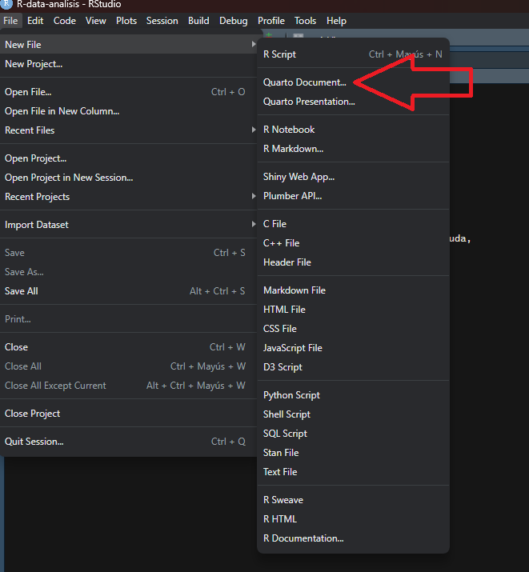
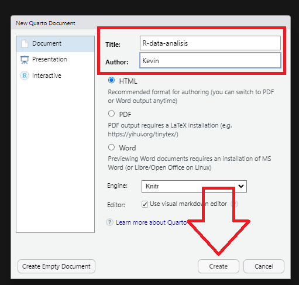
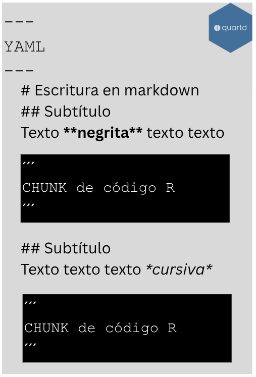
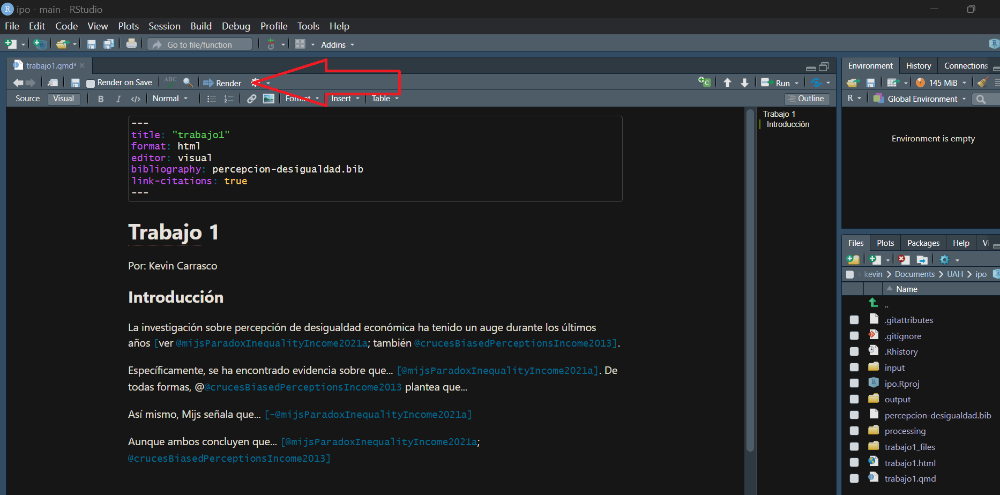
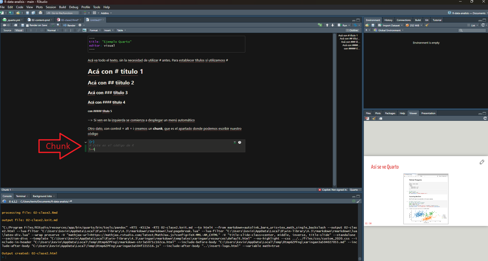
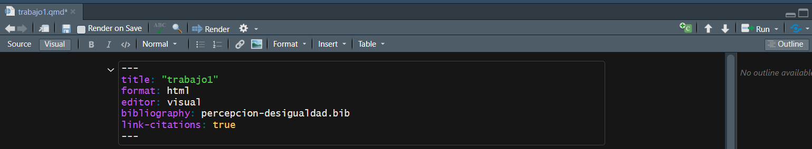
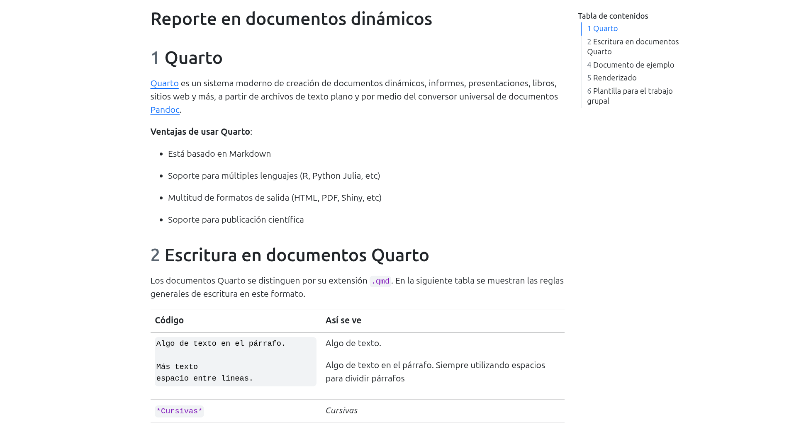
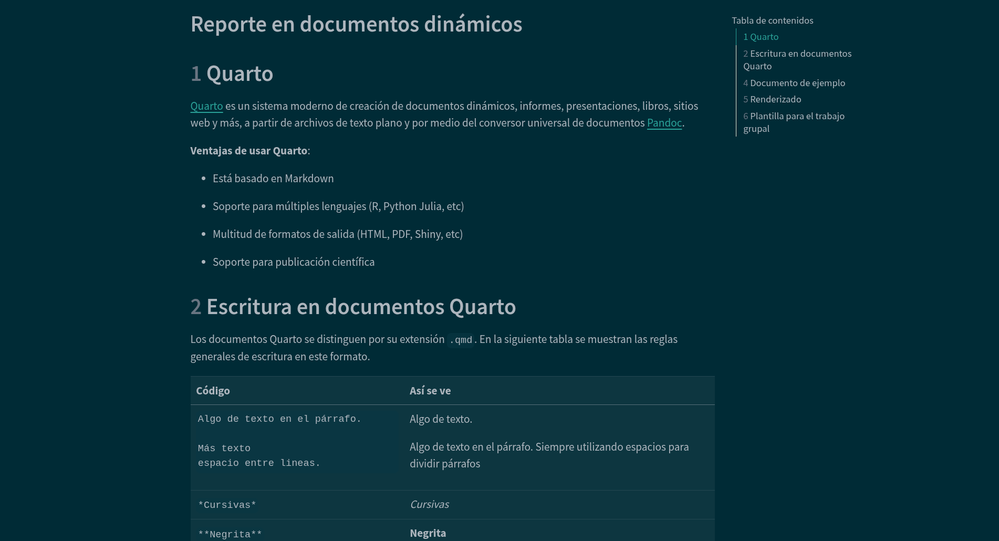

```{r setup}
#| include: false
knitr::opts_chunk$set(echo = TRUE,
                      message = FALSE,
                      warning = FALSE)
```

# Presentación

## Objetivo de la práctica

Esta guía introduce **Quarto**, el sistema que permite escribir en un mismo archivo el texto, el código y los resultados de un análisis.

El objetivo es práctico: que puedan elaborar el informe del curso en Quarto, de modo que las tablas y gráficos que aparecen en el documento sean exactamente los que produce su código. Su uso en el informe es opcional, pero recomendable, porque elimina de raíz el problema de copiar resultados a mano y olvidar actualizarlos cuando el análisis cambia.

Al terminar, usted debería ser capaz de:

1. Crear un documento Quarto y renderizarlo a HTML o PDF
2. Escribir texto con formato utilizando Markdown
3. Insertar código en bloques y controlar qué se muestra de cada uno
4. Incluir resultados numéricos directamente en el texto
5. Elaborar tablas y figuras con títulos y referencias cruzadas
6. Configurar el documento mediante el YAML

Trabajaremos con la misma base de datos de los prácticos anteriores, de modo que el ejercicio sea directamente trasladable al informe.

# Documentos dinámicos

Los documentos dinámicos integran en un solo archivo el texto, el código y los resultados de un análisis, lo que permite que cualquier cambio en los datos se actualice automáticamente en el documento final. Este formato permite disminuir errores manuales, reduce el tiempo de edición y asegura la reproducibilidad, ya que el documento no solo muestra resultados, sino que los genera directamente. Por eso se ha vuelto fundamental en contextos como la ciencia abierta, la docencia, los reportes periódicos y el trabajo colaborativo.

La base de este tipo de documentos es [**Markdown**](https://www.markdownguide.org/), un lenguaje de texto plano con marcas mínimas de edición que, al estar en código simple, puede ampliarse para incluir código ejecutable, como R. Esto permite crear documentos que son legibles para humanos, procesables por máquinas y exportables a múltiples formatos. El principio es simple: escribir en texto plano y dejar que el documento se encargue de automatizar el resto.

<iframe src=https://kevin-carrasco.github.io/presentacion-quarto/presentacion-quarto.html#/por-qu%C3%A9-utilizar-documentos-din%C3%A1micos height="550" width=100% allowfullscreen="true">
</iframe>

::: {.callout-note}
## Un problema que todos conocen
Usted estima un modelo, copia la tabla al documento de texto y escribe la interpretación. Dos días después detecta un error en la recodificación de una variable, corrige el código y vuelve a estimar. Ahora debe recordar cada tabla, cada gráfico y cada número mencionado en el texto para actualizarlos uno a uno.

Con un documento dinámico, basta con volver a renderizar.
:::

# Quarto

[Quarto](https://quarto.org/) es un sistema para crear informes, presentaciones, libros y sitios web a partir de archivos de **texto plano** que combinan Markdown y código ejecutable. Su funcionamiento se basa en el conversor universal de documentos [Pandoc](https://pandoc.org/), que permite transformar un mismo archivo fuente en múltiples formatos de salida.

**Ventajas de usar Quarto**:

- Está basado en Markdown: conserva la lógica de texto plano con marcas mínimas

- Soporte para múltiples lenguajes (R, Python, Julia, entre otros)

- Multitud de formatos de salida (HTML, PDF, Word, presentaciones)

- Permite integrar en un mismo archivo el procesamiento, el análisis y la redacción

## Crear un documento Quarto

Quarto ya se encuentra integrado en RStudio. Abrimos nuestro proyecto y seleccionamos: File → New File → Quarto Document.





Los documentos Quarto se distinguen por su extensión `.qmd`.

::: {.callout-tip}
## Trabajen siempre dentro de un proyecto
Antes de crear el documento, asegúrese de estar dentro de un proyecto de RStudio (`File → New Project`). Esto fija la carpeta de trabajo y permite usar rutas relativas como `input/data/elsoc.RData`, que funcionan en cualquier computador. Las rutas absolutas del tipo `C:/Users/.../Escritorio/...` solo funcionan en el suyo, y son la causa más frecuente de que el documento de una pareja no compile en el computador de la otra.
:::

## Cómo funciona


El documento `.qmd` contiene texto y código. Para transformarse en un documento final debe ser **renderizado**. Ese proceso convierte primero todo a Markdown mediante la librería `knitr`, ejecutando el código en el camino, y luego Pandoc transforma ese archivo intermedio al formato de salida. Todo ocurre automáticamente: ustedes solo ven el `.qmd` y el documento final.

## Estructura del documento

Un documento Quarto tiene tres partes:

1. **YAML**: metadatos y configuración del documento
2. **Cuerpo**: el texto escrito en Markdown
3. **Chunks de código**: bloques ejecutables cuyos resultados se incorporan al documento

{width="70%" style="display:block;margin-left:auto;margin-right:auto;"}

Comenzaremos por el cuerpo, luego veremos los chunks y finalmente el YAML.

# Escritura en Markdown

| Código | Así se ve |
|:-------|:----------|
| `*Cursivas*` | *Cursivas* |
| `**Negrita**` | **Negrita** |
| `# Título 1` | Título de primer nivel |
| `## Título 2` | Título de segundo nivel |
| `### Título 3` | Título de tercer nivel |
| `[Texto enlace](https://quarto.org/)` | [Texto enlace](https://quarto.org/) |
| `` | Inserta una imagen |
| `> Cita` | Bloque de cita |
| `1. Primero` | Lista ordenada |
| `- Elemento` | Lista no ordenada |

Se puede llegar hasta un título de sexto nivel con `######`. La jerarquía de títulos organiza el documento y, como veremos, permite generar automáticamente un índice.

::: {.callout-warning}
## Los párrafos se separan con una línea en blanco
Un salto de línea simple no crea un párrafo nuevo. Si escribe dos líneas seguidas sin dejar una línea en blanco entre ellas, Markdown las unirá en un solo párrafo.
:::

## Notas al pie

Para insertar una nota al pie[^1] se escribe `[^1]` en el lugar correspondiente, y en otra línea del documento:

`[^1]: Este es el texto de la nota.`

[^1]: Este es el texto de la nota al pie.

# Actividad 1

Antes de continuar, deténgase y realice lo siguiente:

1. Cree un proyecto de RStudio llamado `taller-quarto` y, dentro de él, un documento Quarto
2. Escriba un título de primer nivel y dos secciones de segundo nivel
3. Redacte un párrafo de aproximadamente cien palabras en cada sección, utilizando negrita, cursiva y al menos una lista
4. Inserte un enlace y una nota al pie
5. Renderice el documento y verifique que el formato se aplica correctamente

# Renderizado

Renderizar es el proceso que genera el documento final a partir del `.qmd`. Se ejecuta con el botón **Render** de RStudio o con el atajo `Ctrl + Shift + K`.



::: {.callout-important}
## El documento se ejecuta desde cero
Al renderizar, Quarto abre una sesión de R nueva y ejecuta todo el documento desde la primera línea. Esto significa que **no sirve** lo que usted tenga cargado en memoria: si un objeto se creó en la consola y no aparece en ningún chunk, el documento no compilará.

Esa exigencia es una ventaja: garantiza que el documento sea reproducible por cualquier persona que tenga el archivo y los datos.
:::

# Código: chunks y sus opciones

Para incluir código se utiliza un bloque llamado **chunk**, que se crea con `Ctrl + Alt + I` o desde el menú Code → Insert Chunk.



Carguemos las librerías y la base de datos del curso:

```{r}
pacman::p_load(dplyr, sjmisc, sjPlot, knitr, kableExtra,
               summarytools, ggeffects, ggplot2)

load(url("https://github.com/Kevin-carrasco/metod3-unab/raw/refs/heads/main/files/data/elsoc16-22.RData"))
```

Al renderizar, ese chunk muestra el código, los mensajes de carga de los paquetes y cualquier advertencia. Para un informe, esa salida sobra.

## Opciones de chunk

Las opciones se escriben al comienzo del chunk, precedidas de `#|`:

| Opción | Descripción |
|:-------|:------------|
| `eval` | Evalúa el bloque de código. Si es `false`, muestra el código sin ejecutarlo |
| `echo` | Incluye el código en la salida. Si es `false`, muestra solo el resultado |
| `output` | Incluye los resultados de la ejecución (`true`, `false` o `asis`) |
| `warning` | Incluye las advertencias en la salida |
| `message` | Incluye los mensajes en la salida |
| `error` | Incluye los errores en la salida, sin detener la compilación |
| `include` | Control general: `include: false` ejecuta el código pero no muestra nada |
| `label` | Asigna un nombre al chunk, necesario para las referencias cruzadas |

El procesamiento de las variables es un buen ejemplo de código que conviene ejecutar sin mostrar. Usamos `include: false`:

```{r}
#| include: false

proc_data <- elsoc_long_2016_2022.2 %>%
  filter(ola == 1) %>%
  select(d01_01, m01, m29, m0_edad) %>%
  set_na(., na = c(-999, -888, -777, -666)) %>%
  rename("estatus" = d01_01, "educacion" = m01,
         "ingreso" = m29, "edad" = m0_edad) %>%
  na.omit() %>%
  filter(ingreso >= 50000, ingreso <= 5000000) %>%
  mutate(ing100 = ingreso / 100000) %>%
  select(estatus, educacion, ing100, edad)
```

El código se ejecutó y el objeto `proc_data` ya existe, pero nada apareció en el documento.

::: {.callout-tip}
## Una configuración global
Si quiere aplicar las mismas opciones a todo el documento, agréguelas en el YAML:

```
execute:
  warning: false
  message: false
  echo: true
```

Y modifique solo los chunks que requieran otro comportamiento.
:::

## Código en línea

Esta es una de las funciones más útiles para un informe. Se puede insertar un resultado directamente en medio del texto, escribiendo el código entre comillas invertidas y precedido de `r`.

Por ejemplo: la base procesada contiene `r nrow(proc_data)` casos, y el promedio de estatus social subjetivo es de `r round(mean(proc_data$estatus), 2)` puntos en una escala de 0 a 10.

Esos dos números no fueron escritos a mano: se calcularon al renderizar. Si ustedes cambian el criterio de limpieza del ingreso, o eligen otra ola, el texto se actualiza solo.

::: {.callout-important}
## Por qué importa para el informe
Escribir en el texto "el coeficiente de educación es 0,161" obliga a corregir esa cifra cada vez que el modelo cambie. Escribirla como código en línea elimina el riesgo de que el texto contradiga la tabla, que es uno de los errores más frecuentes al redactar resultados.
:::

# Tablas y figuras

## Referencias cruzadas

Para poder referenciar una tabla o un gráfico desde el texto, el chunk necesita dos opciones: una etiqueta y un título.

::: {.callout-note}
## La regla de los prefijos
La etiqueta debe comenzar con `tbl-` si el chunk produce una tabla, y con `fig-` si produce un gráfico. Sin ese prefijo, la referencia no funciona.

Además, dos chunks **no pueden tener la misma etiqueta**.
:::

## Una tabla de descriptivos

El chunk lleva dos opciones adicionales, `label` y `tbl-cap`:

```{r}
#| label: tbl-descriptivos
#| tbl-cap: "Descriptivos de las variables"

descr(proc_data,
      stats = c("mean", "sd", "min", "med", "max", "n.valid"),
      transpose = TRUE,
      order = "preserve") %>%
  kable(digits = 2) %>%
  kable_styling(bootstrap_options = c("striped", "hover"),
                full_width = FALSE)
```

Para referenciarla en el texto se escribe `@tbl-descriptivos`, lo que se renderiza así: los descriptivos de las variables se presentan en la @tbl-descriptivos.

## Una tabla de regresión

Las tablas de `tab_model` funcionan igual:

```{r}
#| label: tbl-regresion
#| tbl-cap: "Modelos de regresión para el estatus social subjetivo"

modelo1 <- lm(estatus ~ educacion, data = proc_data)
modelo2 <- lm(estatus ~ educacion + ing100 + edad, data = proc_data)

tab_model(list(modelo1, modelo2),
          show.se = TRUE,
          show.ci = FALSE,
          digits = 3,
          p.style = "stars",
          dv.labels = c("Modelo 1", "Modelo 2"),
          pred.labels = c("(Intercepto)", "Nivel educacional",
                          "Ingreso (cientos de miles)", "Edad"),
          string.pred = "Predictores",
          string.est = "β")
```

Los resultados se presentan en la @tbl-regresion. El coeficiente de educación en el modelo completo es de `r round(coef(modelo2)[2], 3)`, y el modelo explica un `r round(summary(modelo2)$r.squared * 100, 1)`% de la varianza.

Observe que esas dos cifras también están escritas como código en línea.

## Una figura

```{r}
#| label: fig-predichos
#| fig-cap: "Estatus subjetivo predicho según nivel educacional"
#| echo: false

ggpredict(modelo2, terms = "educacion") %>%
  ggplot(aes(x = x, y = predicted)) +
  geom_line(color = "#04245f", linewidth = 1.2) +
  geom_ribbon(aes(ymin = conf.low, ymax = conf.high),
              alpha = 0.2, fill = "#04245f") +
  scale_x_continuous(breaks = 1:10) +
  scale_y_continuous(limits = c(0, 10), breaks = 0:10) +
  labs(x = "Nivel educacional", y = "Estatus subjetivo predicho") +
  theme_minimal()
```

Y se referencia igual: los valores predichos se presentan en la @fig-predichos.

Note que en este chunk usamos `echo: false`, de modo que el gráfico aparece sin el código que lo genera. Es lo habitual en un informe.

## Opciones útiles para figuras

| Opción | Para qué sirve |
|:-------|:---------------|
| `fig-cap` | Título de la figura |
| `fig-cap-location` | Ubicación del título (`top`, `bottom`) |
| `fig-align` | Alineación (`left`, `center`, `right`) |
| `fig-width`, `fig-height` | Dimensiones en pulgadas |
| `out-width` | Ancho de la imagen en el documento (por ejemplo, `"80%"`) |

# El YAML

Va al inicio del documento, delimitado por tres guiones, y cumple la función de **identificar y configurar** el documento antes de su ejecución.

```
---
title: "Estatus social subjetivo en Chile"
author: "Nombre y Nombre"
date: "2026-10-09"
lang: es
format:
  html:
    toc: true
    number-sections: true
---
```

::: {.callout-warning}
## El YAML es sensible a la sintaxis
Un espacio de más, un dos puntos sin espacio después, o una indentación inconsistente impiden que el documento compile. Es la causa más común de errores al comenzar.
:::



## Opciones frecuentes

| Opción | Qué hace |
|:-------|:---------|
| `toc: true` | Genera un índice automático a partir de los títulos |
| `toc-depth: 3` | Define hasta qué nivel de título incluir en el índice |
| `number-sections: true` | Numera automáticamente las secciones |
| `code-fold: true` | Oculta los bloques de código, con un botón para desplegarlos |
| `title-block-banner: true` | Agrega un banner al bloque de título |
| `theme: united` | Aplica un tema visual |
| `embed-resources: true` | Genera un HTML autocontenido, en un solo archivo |

::: {.callout-tip}
## Para entregar el informe en HTML
La opción `embed-resources: true` incrusta imágenes y estilos dentro del propio archivo `.html`. Sin ella, el documento depende de una carpeta auxiliar que suele olvidarse al momento de subir la entrega.
:::

## Indentación

La indentación organiza las opciones jerárquicamente. Las opciones que dependen de otra se escriben con sangría debajo de ella:

```
---
title: "Mi informe"
format:
  html:
    theme:
      - united
      - estilos.scss
    toc: true
---
```

Aquí `html` depende de `format`, y `theme` y `toc` dependen de `html`. Una indentación incorrecta hace que Quarto no reconozca la opción, o que el documento no compile.

## Formatos de salida

```
format: html      # página web
format: pdf       # requiere una instalación de LaTeX
format: docx      # documento Word
```

::: {.callout-warning}
## Sobre el formato PDF
Renderizar a PDF requiere LaTeX instalado. Si no lo tiene, ejecute una sola vez en la consola:

`quarto::quarto_install_tinytex()`

Si el plazo de entrega está próximo y surge algún problema con la instalación, la alternativa segura es renderizar a HTML y exportar a PDF desde el navegador.
:::

## Temas

Quarto incluye varios temas que modifican la apariencia del documento. Se aplican con el argumento `theme` en el YAML.

```{r}
#| label: fig-normal
#| fig-cap: "Estilo base de Quarto"
#| fig-align: center
#| out-width: "100%"
#| echo: false


```

```{r}
#| label: fig-solar
#| fig-cap: "Estilo Solar de Quarto"
#| fig-align: center
#| out-width: "100%"
#| echo: false


```

El listado completo está disponible en la [documentación de temas de Quarto](https://quarto.org/docs/output-formats/html-themes.html). También es posible personalizar la apariencia con un archivo `.scss` propio.

# Errores frecuentes

| Mensaje o síntoma | Causa habitual |
|:------------------|:---------------|
| `object 'x' not found` | El objeto se creó en la consola, no en un chunk |
| `could not find function` | Falta cargar el paquete dentro del documento |
| `cannot open file` | Ruta incorrecta, o se usó una ruta absoluta |
| `duplicate label` | Dos chunks tienen la misma etiqueta |
| El YAML no se reconoce | Falta un espacio después de los dos puntos, o la indentación es inconsistente |
| La referencia aparece como `?@fig-x` | La etiqueta no lleva el prefijo correcto, o está mal escrita |
| El documento compila pero falta una figura | El chunk tiene `include: false` o `eval: false` |

::: {.callout-tip}
## Renderice seguido
No espere a terminar el informe para compilar por primera vez. Renderice después de cada sección: así, cuando aparezca un error, sabrá exactamente en qué parte se produjo.
:::

# Actividad 2

En el sitio del curso encontrarán el archivo **`plantilla-informe.qmd`**, que contiene la estructura completa del informe: el YAML configurado, las secciones de la rúbrica como títulos y los chunks preparados para cargar, procesar y analizar los datos.

Descárguenlo, ábranlo en su proyecto de RStudio y realicen lo siguiente:

1. Renderícenlo tal como viene, para comprobar que funciona en su computador

2. Reemplacen las variables de ejemplo por **las cinco variables que eligieron para su informe**: una dependiente continua y cuatro independientes, de las cuales al menos una debe ser categórica

3. Ajusten el procesamiento: recodificación de casos perdidos, nombres de variables y cualquier transformación que requieran

4. Verifiquen que la tabla de descriptivos, la matriz de correlaciones, la tabla de regresión y el gráfico de valores predichos se generan correctamente con sus variables

5. Reemplacen al menos tres cifras del texto por **código en línea**, de modo que se actualicen solas

6. Completen el YAML con el título de su investigación, los nombres de la pareja y la fecha

7. Agreguen un tema a elección y la opción `embed-resources: true`

8. Rendericen y revisen que todas las referencias cruzadas funcionan

Al terminar tendrán el esqueleto del informe funcionando con sus propios datos, y solo les restará escribir el contenido.

# Recursos

- [Documentación oficial de Quarto](https://quarto.org)
- [Guía de Markdown](https://www.markdownguide.org/)
- [Creación de documentos científicos con Quarto](https://aprendeconalf.es/quarto-textos-cientificos/)
- [Temas disponibles en Quarto](https://quarto.org/docs/output-formats/html-themes.html)
- [Tutorial Quarto for academics](https://youtu.be/EbAAmrB0luA)
