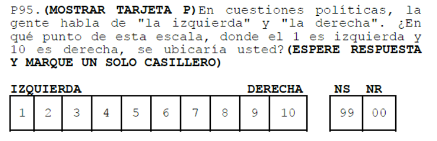
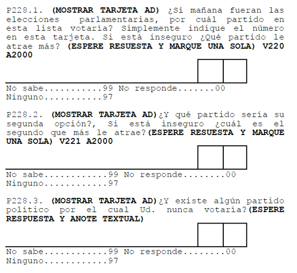
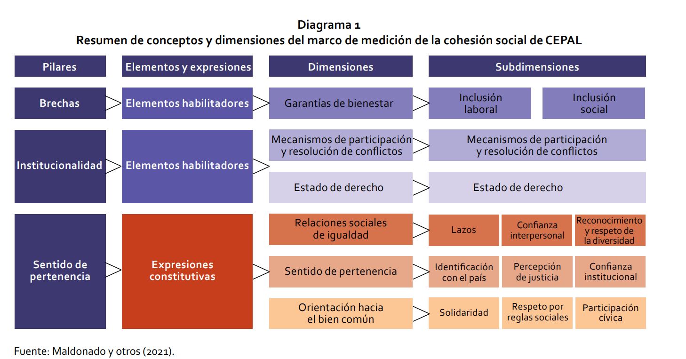
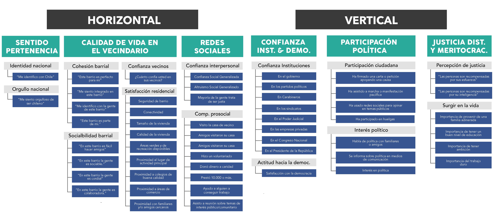
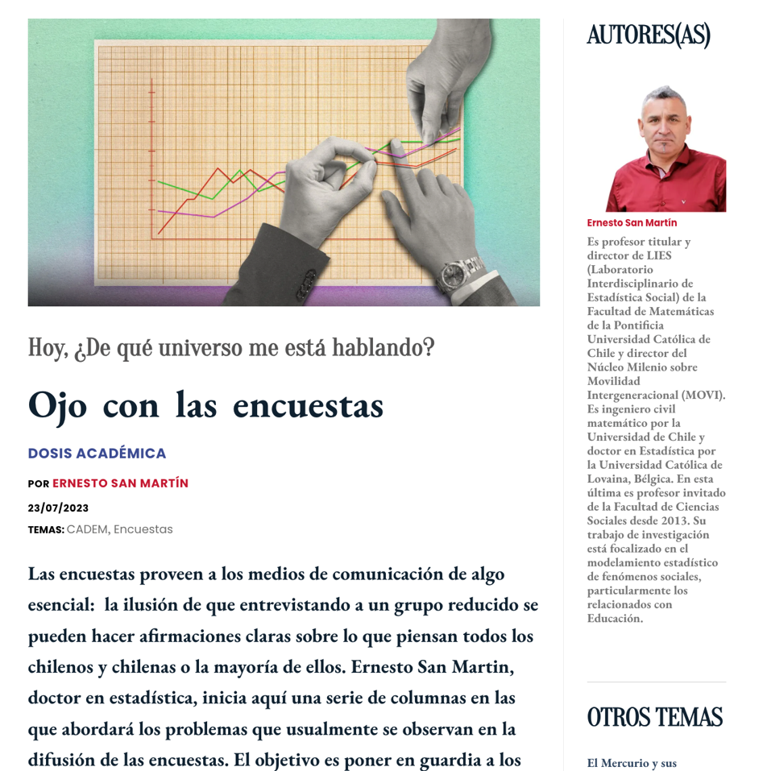
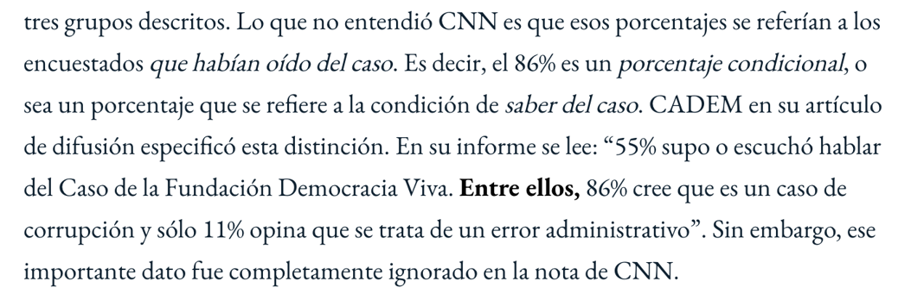
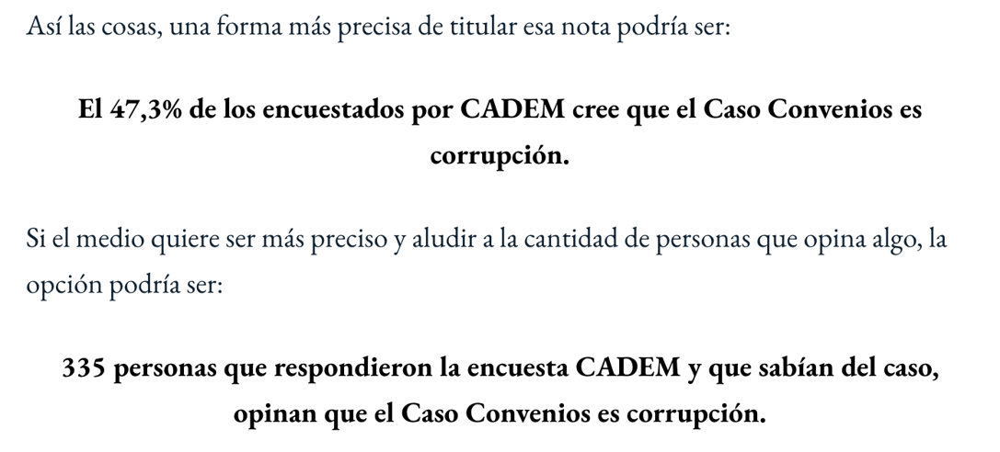
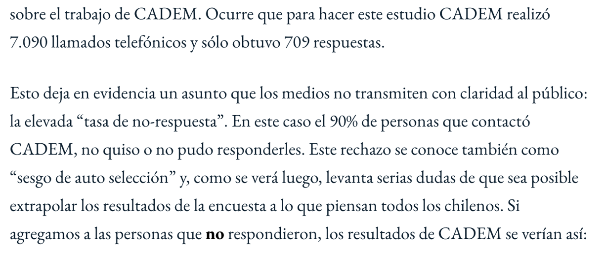
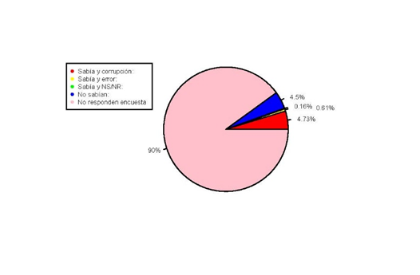
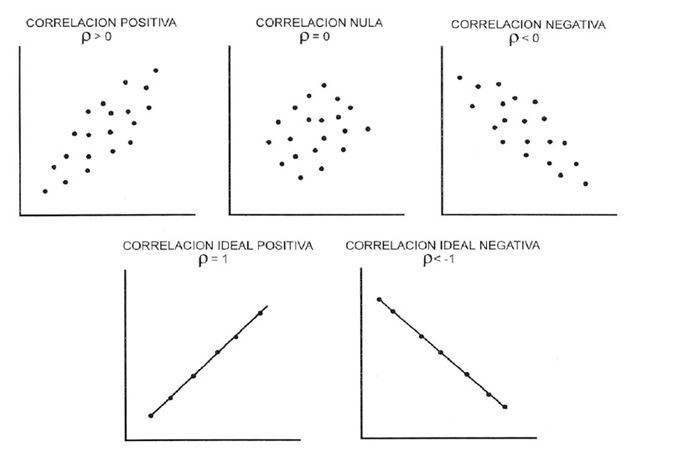

```{r}
#| label: setup
#| include: false
library(ggplot2)

azul <- "#04245f"
azul_claro <- "#4f97ff"
rojo <- "#c0392b"

theme_set(theme_minimal(base_size = 16))
```

##  {data-background-color="black"}

::: {.columns .v-center-container}
::: {.column width="20%"}
{width="100%" fig-align="center"}
:::

::: {.column width="80%"}
### Métodos estadísticos para 
### Ciencias Sociales III

------------------------------------------------------------------------

### **Kevin Carrasco**
### Sociología - UNAB
### 2do Sem 2026
### [https://metod3-unab.netlify.app/](https://metod3-unab.netlify.app/)
:::
:::

# Presentación

## Este curso

::: {.incremental}

* Unidad 1: El modelo de regresión lineal

* Unidad 2: Supuestos del modelo de regresión lineal

* Unidad 3: Introducción a los modelos lineales generalizados (GLM)

:::

## Evaluación

::: {.incremental}

- **Prueba 1** (25%): 07 de septiembre

- **Trabajo 1** (25%): 09 de octubre

- **Prueba 2** (25%): 09 de noviembre

- **Trabajo 2** (25%): 27 de noviembre

- **Examen** (30% de la nota final): fecha por definir. Eximición con nota de presentación igual o superior a 5,0


:::

## Sitio web del curso

### [**Enlace directo**](https://metod3-unab.netlify.app/)

* Ventajas: todo en un mismo lugar, permite combinar texto y código, reproducible, gratis, acceso abierto, etc.

# Sesión 1 {data-background-color="black"}

Introducción y bases de la investigación cuantitativa

Introducción a la estadística multivariada

## Introducción y bases de la investigación cuantitativa

::: {.incremental}

* En la investigación cuantitativa se asume que hay una realidad "allá afuera" que quien investiga puede conocer a través de su **cuantificación**

* Permite lidiar con la **incertidumbre**

* Foco en la teoría (*generalmente* se enfatiza el **método hipotético-deductivo**, buscando probar hipótesis de teorías previamente estudiadas)

:::

## Introducción y bases de la investigación cuantitativa

::: {.incremental}

* Explicar lo que es, no lo que debería ser

* Conocer y explicar grupos de personas de manera general, no individuos por sí solos

:::

## Proceso de investigación cuantitativo (D'Ancona 2001)

1. Formulación de un problema de investigación
2. Operacionalización del problema
    - Hipótesis
    - Operacionalización de conceptos teóricos
    - Delimitación de la unidad de análisis
3. Diseño de la investigación: cómo se realizará la investigación (diseños transversales, longitudinales, experimentales)
4. Factibilidad de la investigación: cronología de tareas, recursos disponibles (materiales y humanos), etc.

## Proceso de investigación cuantitativo (D'Ancona 2001)

1. Formulación de un problema de investigación
2. Operacionalización del problema
    - Hipótesis
    - [Operacionalización de conceptos teóricos]{style="color:#c0392b;"}
    - Delimitación de la unidad de análisis
3. Diseño de la investigación: cómo se realizará la investigación (diseños transversales, longitudinales, experimentales)
4. Factibilidad de la investigación: cronología de tareas, recursos disponibles (materiales y humanos), etc.

# Medición y operacionalización {data-background-color="black"}

## Medición y operacionalización

- Operacionalización = "codificación" de un fenómeno con el fin de hacerlo **medible**

- Hay muchas formas de "codificar" un mismo concepto

- ¿Por qué es importante definir operacionalmente los conceptos?

## Medición y operacionalización

### ¿Qué concepto se pretende medir con esta pregunta?

{width="95%" fig-align="center"}

## Medición y operacionalización

### ¿Y con estas preguntas?

{width="60%" fig-align="center"}

## Medición y operacionalización

::: {.incremental}

### ¿Y si quisiéramos medir un concepto más complejo?

### ¿Cómo se puede medir cohesión social?

:::

## Medición y operacionalización

- Cohesión social según CEPAL (2021)

{width="75%" fig-align="center"}

## Medición y operacionalización

- Cohesión social según el Observatorio de Cohesión Social (OCS-COES, 2020)

{width="75%" fig-align="center"}

## Medición y operacionalización

¿Por qué es importante definir operacionalmente los conceptos?

1. Claridad conceptual (clave para el testeo de hipótesis)

2. Control del "error de medición"
    - Inexactitudes derivadas de problemas con el instrumento de medición
    - ¿Ejemplos?

## Medición y operacionalización

3. Error de muestreo
    - Inexactitud en la elección de los casos
    - Problema de representatividad

## Un ejemplo: encuesta CADEM

::: {.columns}
::: {.column width="60%"}

{width="100%"}

:::
::: {.column width="40%"}

Fuente: [Hoy, ¿de qué universo me está hablando? Ojo con las encuestas - Tercera Dosis (2023)](https://terceradosis.cl/2023/07/23/hoy-de-que-universo-me-esta-hablando-ojo-con-las-encuestas/)

:::
:::

## Un ejemplo: encuesta CADEM

Al difundir la encuesta CADEM, CNN tituló de la siguiente forma:

### 86% cree que el Caso Convenios es **"corrupción"**

::: {.fragment .fade-up}

### [Sin embargo, hay un problema]{style="color:#c0392b;"}

:::

::: {.fragment .fade-up}

{width="90%" fig-align="center"}

:::

## Un ejemplo: encuesta CADEM

{width="90%" fig-align="center"}

## Un ejemplo: encuesta CADEM

### [Otro problema: la no respuesta]{style="color:#c0392b;"}

::: {.fragment .fade-up}

{width="90%" fig-align="center"}

:::

## Un ejemplo: encuesta CADEM

{width="80%" fig-align="center"}

# Datos y variables {data-background-color="black"}

Introducción y bases de la investigación cuantitativa

## Datos y variables

::: {.incremental}

* Los datos miden al menos una *característica* de al menos una *unidad* en al menos *un punto en el tiempo*

* Ejemplo: la esperanza de vida en Chile el 2017 fue de 79,9 años

    - Característica (variable): esperanza de vida
    - Unidad: años
    - Punto en el tiempo: 2017

:::

## Datos y variables

* Base de datos

* Forma "rectangular" de almacenamiento de datos:

{width="60%" fig-align="center"}

## Datos y variables

- Cada [fila]{style="color:#0f5fe6;"} representa una unidad o caso (ej: una persona entrevistada)

- Cada [columna]{style="color:#d35400;"} una variable (ej: edad)

- Cada [variable]{style="color:#6c3483;"} posee valores numéricos

- Los valores numéricos pueden estar asociados a una etiqueta (ej: 1 = Mujer)

## Datos y variables

### Ejemplos de estudios y bases de datos

1. [Encuesta Centro de Estudios Públicos](https://www.cepchile.cl/cep/site/edic/base/port/encuestacep.html)

2. [Encuesta CASEN](http://observatorio.ministeriodesarrollosocial.gob.cl/casen-multidimensional/casen/casen_2017.php)

3. [Encuesta LAPOP](https://www.vanderbilt.edu/lapop-espanol/)

4. [ELSOC](https://coes.cl/encuesta-panel/)

## Datos y variables

- Una variable representa cualquier cosa o propiedad que varía y a la cual se le asigna un valor. Es decir:

- $Variable \neq Constante$

- Pueden ser visibles o no visibles/latentes (ej: peso / inteligencia)

## Datos y variables

- Discretas (rango finito de valores):

    - Dicotómicas
    - Politómicas

- Continuas:

    - Rango (teóricamente) infinito de valores

## Escalas de medición de variables

- NOIR: Nominal, Ordinal, Intervalar, Razón

| Tipo | Características | Propiedad de números | Ejemplo |
|------|-----------------|----------------------|---------|
| *Nominal* | Uso de números en lugar de palabras | Identidad | Nacionalidad |
| *Ordinal* | Números se usan para ordenar series | + ranking | Nivel educacional |
| *Intervalar* | Intervalos iguales entre números | + igualdad | Temperatura |
| *Razón* | Cero real | + aditividad | Distancia |

# Introducción a la estadística multivariada {data-background-color="black"}

## Asociación: covarianza y correlación

::: {.columns}
::: {.column width="50%"}

*¿Se relaciona la variación de una variable con la variación de otra variable?*

:::
::: {.column width="50%"}

{width="100%"}

:::
:::

## Correlación

::: {.incremental}

- Medida de co-variación lineal estandarizada

### ¿En qué rango varía una correlación?

- Varía entre -1 y +1

- Gráficamente se expresa en *nubes de puntos*

:::

## Correlación

{width="80%" fig-align="center"}

## Correlación y causalidad

::: {.columns}
::: {.column width="50%"}

- Pero atención: **correlación no implica causalidad**

:::
::: {.column width="50%"}

{width="100%"}

:::
:::

# De la correlación a la recta de regresión {data-background-color="black"}

## ¿Por qué no basta con la correlación?

::: {.incremental}

- La correlación resume la **fuerza** y la **dirección** de una relación lineal, pero no permite:

    - predecir el valor de una variable a partir de otra
    - cuantificar **cuánto** cambia una variable cuando la otra aumenta en una unidad
    - distinguir entre variable dependiente e independiente

- La regresión sí lo permite: describe la relación mediante una **función**

:::

## Variable dependiente e independiente

::: {.incremental}

- $Y$: variable **dependiente** o explicada. Es la que queremos comprender

- $X$: variable **independiente**, explicativa o predictora

- La distinción no proviene de los datos, sino de la **teoría** y del diseño de investigación

- La correlación entre $X$ e $Y$ es simétrica; la regresión de $Y$ sobre $X$ no lo es

:::

## Un ejemplo

```{r}
#| label: fig-nube
#| echo: false
#| fig-width: 9
#| fig-height: 4.5
#| fig-align: center

set.seed(2026)
n <- 200
datos <- data.frame(educacion = round(rnorm(n, mean = 12, sd = 3)))
datos$ingreso <- 180 + 42 * datos$educacion + rnorm(n, mean = 0, sd = 130)

ggplot(datos, aes(x = educacion, y = ingreso)) +
  geom_point(color = azul_claro, alpha = 0.7, size = 2) +
  labs(x = "Años de escolaridad", y = "Ingreso (miles de pesos)")
```

::: {.small}
Datos simulados con fines ilustrativos
:::

## Un ejemplo

```{r}
#| label: fig-nube-recta
#| echo: false
#| fig-width: 9
#| fig-height: 4.5
#| fig-align: center

ggplot(datos, aes(x = educacion, y = ingreso)) +
  geom_point(color = azul_claro, alpha = 0.7, size = 2) +
  geom_smooth(method = "lm", se = FALSE, color = azul, linewidth = 1.2) +
  labs(x = "Años de escolaridad", y = "Ingreso (miles de pesos)")
```

::: {.small}
La recta resume la relación entre ambas variables
:::

## La ecuación de la recta

$$Y_i = \beta_0 + \beta_1 X_i + \epsilon_i$$

::: {.incremental}

- $\beta_0$ (**intercepto**): valor esperado de $Y$ cuando $X = 0$

- $\beta_1$ (**pendiente**): cambio esperado en $Y$ ante un aumento de **una unidad** en $X$

- $\epsilon_i$ (**error**): lo que el modelo no logra explicar para cada caso

:::

## Intercepto y pendiente

```{r}
#| label: fig-pendiente
#| echo: false
#| fig-width: 9
#| fig-height: 4.5
#| fig-align: center

modelo <- lm(ingreso ~ educacion, data = datos)
b0 <- coef(modelo)[1]
b1 <- coef(modelo)[2]

ggplot(datos, aes(x = educacion, y = ingreso)) +
  geom_point(color = "grey75", alpha = 0.6, size = 2) +
  geom_abline(intercept = b0, slope = b1, color = azul, linewidth = 1.2) +
  annotate("segment", x = 10, xend = 11, y = b0 + b1 * 10, yend = b0 + b1 * 10,
           color = rojo, linewidth = 1) +
  annotate("segment", x = 11, xend = 11, y = b0 + b1 * 10, yend = b0 + b1 * 11,
           color = rojo, linewidth = 1) +
  annotate("text", x = 12.4, y = b0 + b1 * 10.2,
           label = paste0("1 año más de escolaridad\n≈ ", round(b1), " mil pesos"),
           color = rojo, size = 5, hjust = 0) +
  labs(x = "Años de escolaridad", y = "Ingreso (miles de pesos)")
```

## Valores observados y valores predichos

::: {.incremental}

- Para cada caso tenemos un valor **observado** ($Y_i$) y un valor **predicho** por la recta ($\hat{Y}_i$)

- La diferencia entre ambos es el **residuo**:

$$e_i = Y_i - \hat{Y}_i$$

- Ningún caso se ubica exactamente sobre la recta: el modelo describe una tendencia, no cada observación

:::

## Los residuos

```{r}
#| label: fig-residuos
#| echo: false
#| fig-width: 9
#| fig-height: 4.5
#| fig-align: center

set.seed(11)
sub <- datos[sample(nrow(datos), 20), ]
sub$predicho <- predict(modelo, newdata = sub)

ggplot(sub, aes(x = educacion, y = ingreso)) +
  geom_abline(intercept = b0, slope = b1, color = azul, linewidth = 1.2) +
  geom_segment(aes(xend = educacion, yend = predicho),
               color = rojo, linetype = "dashed") +
  geom_point(color = azul_claro, size = 3) +
  labs(x = "Años de escolaridad", y = "Ingreso (miles de pesos)")
```

::: {.small}
Cada línea segmentada representa un residuo
:::

## ¿Cuál de todas las rectas posibles?

::: {.incremental}

- Por una misma nube de puntos pueden trazarse infinitas rectas

- El criterio de los **mínimos cuadrados ordinarios** (MCO) selecciona aquella que hace **mínima la suma de los residuos elevados al cuadrado**:

$$\sum_{i=1}^{n} e_i^2 = \sum_{i=1}^{n} (Y_i - \hat{Y}_i)^2$$

- Se elevan al cuadrado para que los residuos positivos y negativos no se anulen entre sí, y para penalizar más los errores grandes

:::

## Lo que viene en el curso

::: {.incremental}

- ¿Cómo se estiman $\beta_0$ y $\beta_1$? (unidad 1)

- ¿Qué tan bien se ajusta la recta a los datos? (bondad de ajuste)

- ¿Podemos generalizar el resultado más allá de la muestra? (inferencia)

- ¿Qué ocurre con más de una variable independiente? (regresión múltiple)

- ¿Qué condiciones debe cumplir el modelo para ser confiable? (unidad 2)

- ¿Y si la variable dependiente es categórica? (regresión logística)

:::

## Para esta semana

- Lectura: Moore, *Estadística aplicada básica*, secciones 1.1 y 1.2

    - Presentación de datos mediante gráficos
    - Descripción de distribuciones con números

- Revisar el programa del curso y la planificación de sesiones


##  {data-background-color="black"}

::: {.columns .v-center-container}
::: {.column width="20%"}
{width="80%" fig-align="right"}
:::

::: {.column width="80%"}
### Métodos estadísticos para Ciencias Sociales III

------------------------------------------------------------------------

### **Kevin Carrasco**
### Sociología - UNAB
### 2do Sem 2026
### [Sitio web del curso](https://metod3-unab.netlify.app/)
:::
:::
