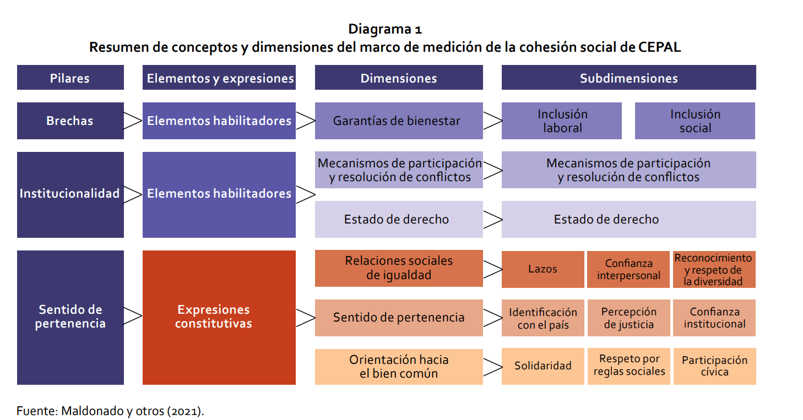
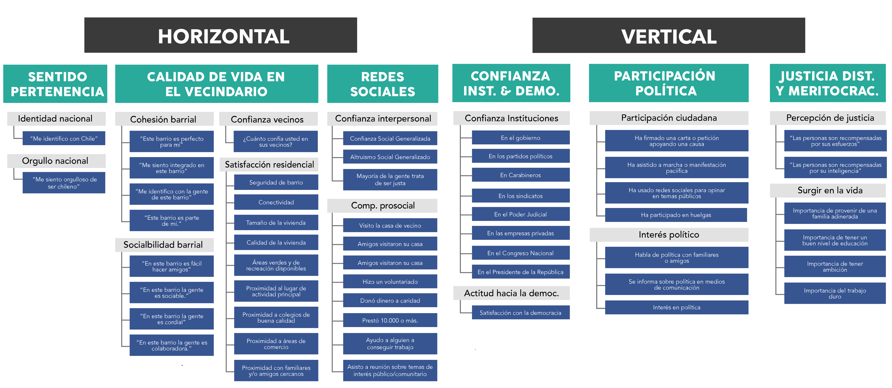
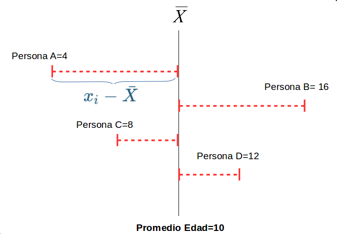
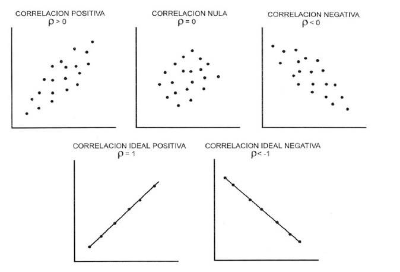
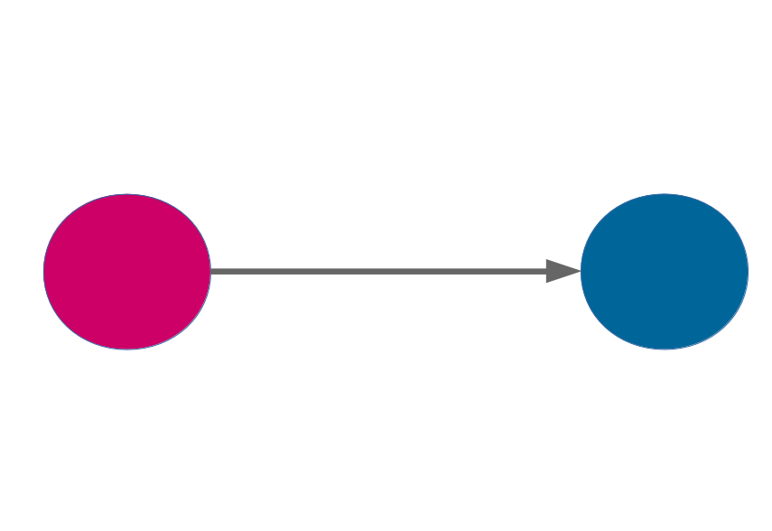
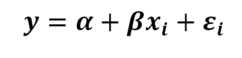
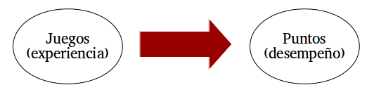
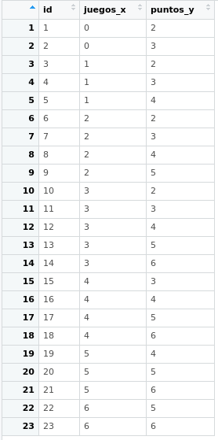

class: front

```{r eval=FALSE, include=FALSE}
# Correr esto para que funcione el infinite moonreader, el root folder debe ser static para si dirigir solo "bajndo" en directorios hacia el bib y otros

xaringan::inf_mr('/static/docpres/02_bases/2mlmbases.Rmd')

o en RStudio:
  - abrir desde carpeta root del proyecto
  - Addins-> infinite moon reader
```


```{r setup, include=FALSE, cache = FALSE}
require("knitr")
options(htmltools.dir.version = FALSE)
pacman::p_load(RefManageR)
# bib <- ReadBib("../../bib/electivomultinivel.bib", check = FALSE)
opts_chunk$set(warning=FALSE,
             message=FALSE,
             echo=FALSE,
             cache = FALSE, fig.width=7, fig.height=5.2)
pacman::p_load(flipbookr, tidyverse)
```


```{r xaringanExtra, include=FALSE}
xaringanExtra::use_xaringan_extra(c("tile_view", "animate_css"))
xaringanExtra::use_scribble()
```


<!---
Para correr en ATOM
- open terminal, abrir R (simplemente, R y enter)
- rmarkdown::render('static/docpres/07_interacciones/7interacciones.Rmd', 'xaringan::moon_reader')

About macros.js: permite escalar las imágenes como [scale 50%](path to image), hay si que grabar ese archivo js en el directorio.
--->


.pull-left[
# Métodos estadísticos para Ciencias Sociales III
## **Kevin Carrasco**
## Sociología - Universidad Andrés Bello
## 2do semestre 2025
## [.green[Sitio web pendinete]](Sitio web pendiente)
] 
    

.pull-right[
.right[
<br>
## .yellow[Sesión 2: Bases]


]

]
---

layout: true
class: animated, fadeIn

---
class: inverse, bottom, right, animated, slideInRight


# .red[Sesión 2]
<br>

Repaso sesión anterior

Estadística multivariada

<br>
<br>
<br>
<br>
---
class: inverse, bottom, right


# .red[Sesión 2]
<br>

.yellow[Repaso sesión anterior]

Estadística multivariada

<br>
<br>
<br>
<br>
---

# Introducción y bases de la investigación cuantitativa

* Explicar lo que es, no lo que debería ser

--

* Conocer y explicar grupos de personas de manera general, no individuos por sí solos

---

# Proceso de investigación cuantitativo (D'Ancona 2001)

1. Formulación de un problema de investigación
2. Operacionalización del problema
  - Hipótesis
  - Operacionalización de conceptos teóricos
  - Delimitación de unidad de análisis
3. Diseño de la investigación: cómo se realizará la investigación (diseños transversales, longitudinales, experimentales)
4. Factibilidad de la investigación: Cronología de tareas; recursos disponibles (materiales y humanos); etc.

---

# Proceso de investigación cuantitativo (D'Ancona 2001)

1. Formulación de un problema de investigación
2. Operacionalización del problema
  - Hipótesis
  - .red[Operacionalización de conceptos teóricos]
  - Delimitación de unidad de análisis
3. Diseño de la investigación: cómo se realizará la investigación (diseños transversales, longitudinales, experimentales)
4. Factibilidad de la investigación: Cronología de tareas; recursos disponibles (materiales y humanos); etc.

---
class: roja, center, middle

# Medición y operacionalización

---

# Medición y operacionalización

- Cohesión social según CEPAL (2021)

.center[]

---

# Medición y operacionalización

- Cohesión social según Observatorio de cohesión social (ocs-coes) (2020)

.center[]

---
## Datos y variables

- discretas (Rango finito de valores):

      - Dicotómicas
      - Politómicas

- continuas:

      - Rango (teóricamente) infinito de valores.

---
## Escalas de medición de variables

- NOIR: Nominal, Ordinal, Intervalar, Razón

.small[
| Tipo       	| Características                     	        | Propiedad de números 	| Ejemplo|
|------------	|----------------------------------------------|---------------	|-----------	|
| *Nominal*    	| Uso de números en lugar de palabras 	| Identidad            	| Nacionalidad      	|
| *Ordinal*    	| Números se usan para ordenar series 	| + ranking            	| Nivel educacional 	|
| *Intervalar* 	| Intervalos iguales entre números    	| + igualdad           	| Temperatura       	|
| *Razón*      	| Cero real                           	| + aditividad         	| Distancia         	|
]

---

## Tipos de datos en relación a escalas de medición.

* **Datos categóricos**:

    - pueden ser medidos sólo mediante escalas nominales, u ordinales en caso de orden de rango

* **Datos continuos**:
    - Medidos en escalas intervalares o de razón
    - Pueden ser transformados a datos categóricos

???
Conversión de continuo a categórico: estatura (cm) a categorías bajo – mediano – alto


---
## Descriptivos según tipo de variable

<br>
.small[
|             	| Categórica                      	| Continua                      	| Categ.(y)/Categ.(x)                    	| Cont.(y)/Categ.(x)                	|
|-------------	|---------------------------------	|-------------------------	|------------------------------------------------	|------------------------------------------	|
| **Ejemplo**     	| **Estatus Ocupacional**             	| **Ingreso**                       	| **Estatus Ocupacional (Y) / Género (X)**           	| **Ingreso (Y) / Género (X)**                 	|
| Tabla       	| Frecuencias / porcentajes                  	| $\bar{X}$/sd ... o recodificar en categorías      	| Tabla de Contingencia                          	| Clasificar Y                             	|
| Gráfico     	| Barras                          	| Histograma / boxplot          	| Gráfico de barras condicionado                 	| Histograma, box plot condicionado        	|
]

---
## Tipos de análisis estadístico bivariado

- Variable dependiente (y) : lo que quiero explicar

- Variable independiente (x): lo que me permite explicar la dependiente

.small[
| Variable independiente x 	| Variable dependiente Categórica   	| Variable dependiente Continua        	|
|--------------------------	|-----------------------------------	|--------------------------------------	|
| Categórica               	| Análisis de tabla de Contigencia, Chi2	| Análisis de Varianza ANOVA, Prueba T 	|
| Continua                 	| Regresión Logística 	| Correlación / Regresión Lineal                     	|
]

---

## Tendencia Central

* **Moda**: valor que ocurre más frecuentemente

* **Mediana**: valor medio de la distribución ordenada. Si N es par, entonces es el promedio de los valores medios

* **Media** o promedio aritmético: suma de los valores dividido por el total de casos

---
.pull-left-narrow[
## Dispersión:
### Varianza
]

.pull-right-wide[


]

---
.pull-left-narrow[
## Dispersión:
### Varianza
]

.pull-right-wide[


]


---
.pull-left-narrow[
## Dispersión:
### Varianza
]

.pull-right-wide[


]

---
## Dispersión:


---
class: inverse, middle, center

#La VARIANZA equivale al promedio de la suma de las diferencias del promedio al cuadrado

---
##  Desviación Estándar

.pull-left-narrow[

]

.pull-right-wide[
  - Raiz Cuadrada de la varianza.


  - Expresada  en la mismas unidades que los puntajes de la escala original
]


---
class: middle, center

# Más sobre datos, variables y varianza en:

##-  [Moore: 1.Comprensión de los datos (1-54)](/docs/lecturas/moore_comprensiondelosdatos.pdf)


---

# Asociación: covarianza / correlación

.pull-left[
  _¿Se relaciona la variación de una variable, con la variación de otra variable?_
]
.pull-right[
.center[]
]

---
# Correlación

- Medida de co-variación lineal estandarizada

--

<br>
<br>
.center[¿En qué rango varía una correlación?]

--

- Varía entre -1 y +1

--

- Gráficamente se expresa en *nubes de puntos*

---

.center[]

---

.pull-left[* Pero ojo, 
**correlación no implica causalidad**]

.pull-right[]

---

class: inverse, bottom, right


# .red[Sesión 2]
<br>

Repaso sesión anterior

.yellow[Estadística multivariada]
<br>
<br>
<br>
<br>


---
## Estadística multivariada

- Hacia la **explicación** de los fenómenos sociales



---
## Estadística multivariada

- Hechos sociales: **multicausales**


---

## Estadística multivariada

- Intentando dar cuenta de la complejidad: **modelos matemáticos**

--

.center[

]
- A partir de un modelo matemático denominado **regresión**, este curso busca entregar **herramientas** de análisis de datos que permitan aproximarse a la **explicación** de fenómenos sociales **multicausales**.

---
# Objetivos centrales del modelo de regresión:


1. **Conocer**: la variación de la variable dependiente de acuerdo a la variación de otra(s) variable(s) independiente(s)

2. **Predecir**: estimar el valor de una variable (dependiente) de acuerdo al valor de otra(s)

3. **Inferir**: Establecer en que medida esta asociación es estadísticamente significativa


---
# Objetivos centrales del modelo de regresión: Ejemplo

1. *Conocer*: Ej: En qué medida el puntaje PSU influye en el éxito académico en la universidad?

--

2. *Predecir*: Ej: Si una persona obtiene 600 puntos en la PSU, que promedio de notas en la universidad es probable que obtenga? (Atención: predicción no implica explicación)

--

3. *Inferir*: ¿Se puede generalizar a la población? ¿Con qué nivel de confianza?


---
# Terminología variables

.center[]

---
# Ejemplo

### _¿En qué medida la experiencia previa jugando un juego predice el número de puntos obtenidos (en juego posterior)?_


.center[]

```{r echo=FALSE, include=FALSE}
datos<- read.csv("tacataca.txt", sep="")
library(stargazer)
```

---
.left-column[
  # Datos
]
.pull-left-narrow[

]

.pull-right[
.small[
  
  ```{r, echo=FALSE}
  pacman::p_load(ggplot2,plotly)
  ```
  
  ```{r, fig.height = 5.5, fig.width = 5.5}
  ggplotly(ggplot(datos, aes(x=juegos_x, y=puntos_y)) +
             geom_point() +
             expand_limits(x=c(0,6), y=c(0,7)) + coord_fixed() +
             scale_x_continuous(breaks = seq(min(0), max(6), by = 1)) +
             scale_y_continuous(breaks = seq(min(0), max(6), by = 1)) )
  ```
]
]

---
# Descriptivos

```{r results='asis'}
stargazer(datos, type = "html")
```


---
.left-column[
  # **Medias condicionales**
]
.center[]

???
Ejemplo para los sujetos con 1 en X hay 3 valores de Y: 2, 3 y 4. Por lo tanto, la media condicional de Y dado X=1 es 3

---
.left-column[
  # Idea de distribución condicional
]
.center[]

---
.left-column[
  # La recta de regresión
]

.right-column[
.center[]

.small[
  La (co) variación general de Y respecto a X se puede expresar en una  ecuación de la recta = **modelo de regresión**
]
]
---
class: inverse, right

## Para obtener la “mejor recta” se utiliza la estimación de mínimos cuadrados (EMC, o **OLS** – Ordinary Least Squares)

--

## OLS minimiza la suma de los **residuos** = distancias entre las observaciones y la recta en el eje vertical

---
# Componentes de la ecuación de la recta de regresión

$$\widehat{Y}=b_{0} +b_{1}X$$

Donde

- $\widehat{Y}$ es el valor estimado de $Y$

- $b_{0}$ es el intercepto de la recta (el valor de Y cuando X es 0)

- $b_{1}$ es el coeficiente de regresión, que nos dice cuánto aumenta Y por cada punto que aumenta X

---
# Estimación de los coeficientes de la ecuación:

$$b_{1}=\frac{Cov(XY)}{VarX}$$

$$b_{1}=\frac{\frac{\sum_{i=1}^{n}(x_i - \bar{x})(y_i - \bar{y})} {n-1}}{\frac{\sum_{i=1}^{n}(x_i - \bar{x})(x_i - \bar{x})} {n-1}}$$

Y simplificando

$$b_{1}=\frac{\sum_{i=1}^{n}(x_i - \bar{x})(y_i - \bar{y})} {\sum_{i=1}^{n}(x_i - \bar{x})(x_i - \bar{x})}$$

---
# Estimación de los coeficientes de la ecuación:

Luego despejando el valor de $b_{0}$

$$b_{0}=\bar{Y}-b_{1}\bar{X}$$

---
# Cálculo de coeficientes

La base para todos estos calculos es la diferencia de cada valor menos su promedio. Para ello:

1. Vamos a crear los siguientes vectores (variables) en nuestra base de datos $$difx=x-\bar{x}$$ $$dify=y-\bar{y}$$


---
# Cálculo basado en el ejemplo

2.Con la información anterior podemos obtener la diferencia de productos cruzados
$$difcru=(x-\bar{x})*(y-\bar{y})$$
3.También obtenemos las diferencias del promedio al cuadrado de X= $$difx2=(x-\bar{x})^2$$

---

`r chunk_reveal(chunk_name="ejemplo", 
#  break_type = "auto",
#  display_type = "both", 
  left_assign = TRUE)`


```{r ejemplo, echo=FALSE}
datos_b <-datos
datos$p_x <- mean(datos$juegos_x)
datos$difx <-datos$juegos_x-datos$p_x
datos$p_y <- mean(datos$puntos_y)
datos$dify <-datos$puntos_y-datos$p_y
datos$dif_cru <-datos$difx*datos$dify
datos$difx2 <-datos$difx^2
datos$difx2 <-datos$difx^2
```

---
# Cálculo basado en el ejemplo


Y con esto podemos obtener la suma de productos cruzados y la suma de cuadrados de X

```{r}
sum(datos$dif_cru)
sum(datos$difx2)
```

---
# Reemplazando en la fórmula

$$b_{1}=\frac{\sum_{i=1}^{n}(x_i - \bar{x})(y_i - \bar{y})} {\sum_{i=1}^{n}(x_i - \bar{x})(x_i - \bar{x})}=\frac{34}{68}=0.5$$

---
# Cálculo basado en el ejemplo

Reemplazando podemos obtener el valor de $b_{0}$

$$b_{0}=\bar{Y}-b_{1}\bar{X}$$
$$b_{0}=4-(3 * 0.5)=2.5$$

Completando la ecuación:

$$\widehat{Y}=2.5+0.5X$$
Por cada unidad que aumenta la experiencia en juego (x), los puntos obtenidos(y) aumentan en 0.5.

---
# Cálculo basado en el ejemplo


$$\widehat{Y}=2.5+0.5X$$


Esto nos permite estimar el valor de $Y$ (o su media condicional) basado en el puntaje $X$.
Por ejemplo, cuál es el valor estimado de $Y$ dado $X=3$?


$$\widehat{Y}=2.5+(0.5*3)$$


$$\widehat{Y}=2.5+(3*0.5)=4$$

El valor estimado de puntos para una persona que ha jugado 3 veces es 4.

---

.left-column[
  ## Cálculo basado en el ejemplo
]
.small[
.center[
  ```{r, fig.height = 7, fig.width = 7}
  ggplot(datos, aes(x=juegos_x, y=puntos_y)) + geom_point() +
    geom_smooth(method=lm, se=FALSE)
  ```
]
]

---
# En resumen: ¿qué gano con el modelo de regresión?

Al igual que en correlación
- intensidad de la relación entre variables
- dirección de la relación

Y además:
- predicción en el puntaje real de la variable dependiente
- estimación del ajuste o cantidad de error en la estimación (próxima clase)
- incluir más de una variable predictora (en 2 clases más)


---

class: front

.pull-left[
# Métodos estadísticos para ciencias sociales III
## **Kevin Carrasco**
## Sociología - Universidad de Chile
## 2do Semestre 2025
## [.green[metod1-mcs.netlify.com]](https://metod1-mcs.netlify.com)
] 
    

.pull-right[
.right[
<br>
## .yellow[Sesión 2: Bases]


]

]


