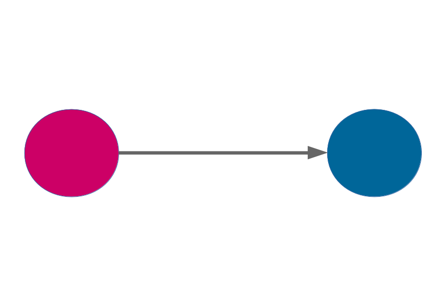
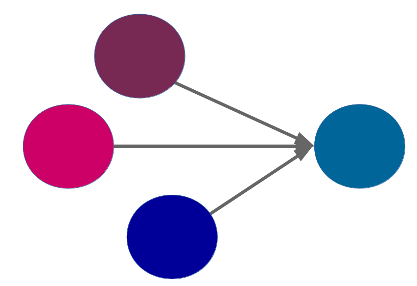
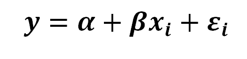
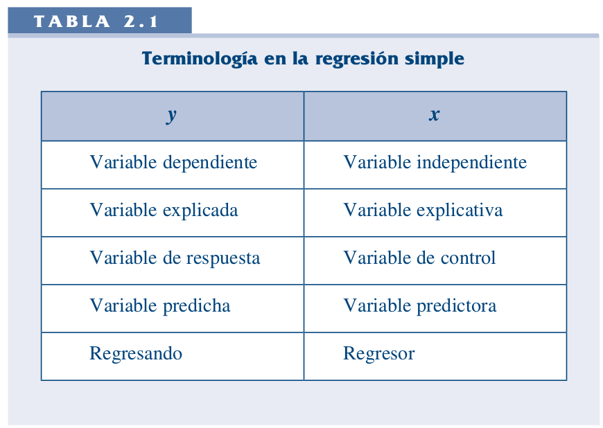
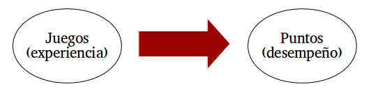
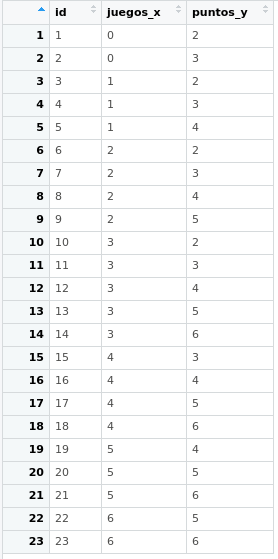
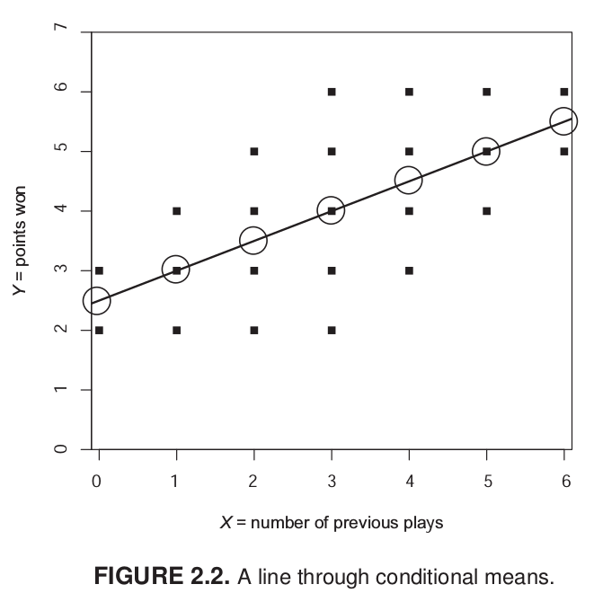
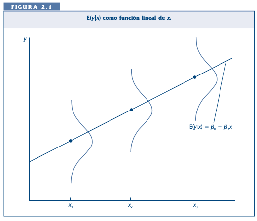
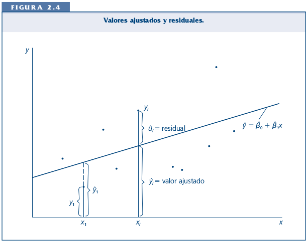

```{r}
#| label: setup
#| include: false
library(ggplot2)
library(knitr)

azul <- "#04245f"
azul_claro <- "#4f97ff"
rojo <- "#c0392b"

theme_set(theme_minimal(base_size = 16))
```

##  {data-background-color="black"}

::: {.columns .v-center-container}
::: {.column width="20%"}
{width="100%" fig-align="center"}
:::

::: {.column width="80%"}
### Métodos estadísticos para 
### Ciencias Sociales III

------------------------------------------------------------------------

### **Kevin Carrasco**
### Sociología - UNAB
### 2do Sem 2026
### [https://metod3-unab.netlify.app/](https://metod3-unab.netlify.app/)
:::
:::

# Sesión 2 {data-background-color="black"}

Repaso y descripción de datos

Estadística multivariada

Estimación de la recta de regresión

## ¿Dónde quedamos?

::: {.incremental}

- La investigación cuantitativa requiere **operacionalizar** conceptos para hacerlos medibles

- Los datos se organizan en **casos** (filas) y **variables** (columnas), con distintas escalas de medición

- La **correlación** resume la fuerza y dirección de una relación lineal, pero no permite predecir ni distinguir entre variable dependiente e independiente

- La **regresión** describe esa relación mediante una función: $Y_i = \beta_0 + \beta_1 X_i + \epsilon_i$

:::

## Hoy

::: {.incremental}

- Antes de explicar, necesitamos **describir**: medidas de tendencia central y de dispersión

- ¿Por qué la **varianza** es la pieza central del modelo de regresión?

- ¿Cómo se **estiman** concretamente $b_0$ y $b_1$?

:::

# Antes de explicar: describir {data-background-color="black"}

## Tipos de datos y escalas de medición

::: {.incremental}

* **Datos categóricos**:

    - Pueden ser medidos sólo mediante escalas nominales, u ordinales en caso de orden de rango

* **Datos continuos**:

    - Medidos en escalas intervalares o de razón
    - Pueden ser transformados a datos categóricos (ej: estatura en centímetros a categorías bajo, mediano y alto)

:::

## Descriptivos según tipo de variable

::: {.small}

| | Categórica | Continua | Categ.(y)/Categ.(x) | Cont.(y)/Categ.(x) |
|---|---|---|---|---|
| **Ejemplo** | **Estatus ocupacional** | **Ingreso** | **Estatus ocupacional (Y) / Género (X)** | **Ingreso (Y) / Género (X)** |
| Tabla | Frecuencias / porcentajes | $\bar{X}$ / sd, o recodificar en categorías | Tabla de contingencia | Clasificar Y |
| Gráfico | Barras | Histograma / boxplot | Gráfico de barras condicionado | Histograma o boxplot condicionado |

:::

## Tipos de análisis estadístico bivariado

- Variable dependiente (y): lo que quiero explicar

- Variable independiente (x): lo que me permite explicar la dependiente

::: {.small}

| Variable independiente (x) | Variable dependiente categórica | Variable dependiente continua |
|---|---|---|
| Categórica | Análisis de tabla de contingencia, Chi<sup>2</sup> | Análisis de varianza (ANOVA), prueba t |
| Continua | Regresión logística | Correlación / regresión lineal |

:::

## Tendencia central

::: {.incremental}

* **Moda**: valor que ocurre más frecuentemente

* **Mediana**: valor medio de la distribución ordenada. Si N es par, es el promedio de los dos valores medios

* **Media** o promedio aritmético: suma de los valores dividida por el total de casos

$$\bar{X} = \frac{\sum_{i=1}^{n} x_i}{n}$$

:::

## Dispersión: varianza

::: {.columns}
::: {.column width="30%"}

### La media no basta

:::
::: {.column width="70%"}

{width="100%"}

:::
:::

## Dispersión: varianza

::: {.columns}
::: {.column width="30%"}

### La media no basta

:::
::: {.column width="70%"}

{width="100%"}

:::
:::

## Dispersión: varianza

::: {.columns}
::: {.column width="30%"}

### La media no basta

:::
::: {.column width="70%"}

{width="100%"}

:::
:::

## Dispersión: varianza

{width="60%" fig-align="center"}

##  {data-background-color="black"}

### La **varianza** equivale al promedio de la suma de las diferencias respecto del promedio, elevadas al cuadrado

## Desviación estándar

::: {.columns}
::: {.column width="40%"}

{width="100%"}

:::
::: {.column width="60%"}

- Raíz cuadrada de la varianza

- Se expresa en las **mismas unidades** que los puntajes de la escala original

:::
:::

## ¿Por qué importa la varianza?

::: {.incremental}

- Sin variación no hay nada que explicar: si todas las personas tuvieran el mismo ingreso, no tendría sentido preguntarse qué lo determina

- El modelo de regresión trabaja precisamente sobre la **variación** de la variable dependiente

- Como veremos, el coeficiente de regresión se construye a partir de la varianza de $X$ y de su covariación con $Y$

:::

##  {data-background-color="black"}

### Más sobre datos, variables y varianza en:

### [Moore: 1. Comprensión de los datos (pp. 1-54)](/docs/lecturas/moore_comprensiondelosdatos.pdf)

# Estadística multivariada {data-background-color="black"}

## Estadística multivariada

- Hacia la **explicación** de los fenómenos sociales

{width="45%" fig-align="center"}

## Estadística multivariada

- Hechos sociales: **multicausales**

{width="45%" fig-align="center"}

## Estadística multivariada

- Intentando dar cuenta de la complejidad: **modelos matemáticos**

::: {.fragment .fade-up}

{fig-align="center"}

- A partir de un modelo matemático denominado **regresión**, este curso busca entregar **herramientas** de análisis de datos que permitan aproximarse a la **explicación** de fenómenos sociales **multicausales**

:::

## Objetivos centrales del modelo de regresión

::: {.incremental}

1. **Conocer**: la variación de la variable dependiente de acuerdo a la variación de otra(s) variable(s) independiente(s)

2. **Predecir**: estimar el valor de una variable (dependiente) de acuerdo al valor de otra(s)

3. **Inferir**: establecer en qué medida esta asociación es estadísticamente significativa

:::

## Objetivos centrales: un ejemplo

::: {.incremental}

1. *Conocer*: ¿en qué medida el puntaje de la PAES influye en el éxito académico en la universidad?

2. *Predecir*: si una persona obtiene 600 puntos en la PAES, ¿qué promedio de notas es probable que obtenga en la universidad? (atención: predicción no implica explicación)

3. *Inferir*: ¿se puede generalizar a la población? ¿Con qué nivel de confianza?

:::

## Terminología de variables

{width="60%" fig-align="center"}

# Repaso: la función lineal {data-background-color="black"}

## La recta como función

$$Y = a + bX$$

::: {.incremental}

- Una **función** asigna a cada valor de $X$ un único valor de $Y$

- $a$: valor de $Y$ cuando $X = 0$ (**intercepto** u ordenada en el origen)

- $b$: cuánto cambia $Y$ cuando $X$ aumenta en una unidad (**pendiente**)

- En regresión escribimos $\widehat{Y} = b_0 + b_1X$, pero la lógica es exactamente la misma

:::

## El intercepto desplaza la recta

```{r}
#| label: fig-intercepto
#| echo: false
#| fig-width: 9
#| fig-height: 4.5
#| fig-align: center

rectas <- expand.grid(x = seq(0, 10, 0.5), a = c(0, 2, 4))
rectas$y <- rectas$a + 0.5 * rectas$x
rectas$recta <- factor(rectas$a, labels = c("a = 0", "a = 2", "a = 4"))

ggplot(rectas, aes(x = x, y = y, color = recta)) +
  geom_line(linewidth = 1.2) +
  scale_color_manual(values = c(azul, azul_claro, rojo)) +
  labs(x = "X", y = "Y", color = NULL, subtitle = "Misma pendiente (b = 0,5), distinto intercepto")
```

## La pendiente inclina la recta

```{r}
#| label: fig-pendiente-func
#| echo: false
#| fig-width: 9
#| fig-height: 4.5
#| fig-align: center

rectas2 <- expand.grid(x = seq(0, 10, 0.5), b = c(-0.5, 0, 1))
rectas2$y <- 4 + rectas2$b * rectas2$x
rectas2$recta <- factor(rectas2$b,
                        labels = c("b = -0,5 (negativa)", "b = 0 (nula)", "b = 1 (positiva)"))

ggplot(rectas2, aes(x = x, y = y, color = recta)) +
  geom_line(linewidth = 1.2) +
  scale_color_manual(values = c(rojo, "grey50", azul)) +
  labs(x = "X", y = "Y", color = NULL, subtitle = "Mismo intercepto (a = 4), distinta pendiente")
```

# De las medias condicionales a la recta {data-background-color="black"}

## Un ejemplo

### *¿En qué medida la experiencia previa jugando un juego predice el número de puntos obtenidos en un juego posterior?*

{width="90%" fig-align="center"}

## Los datos

::: {.columns}
::: {.column width="40%"}

{width="80%" fig-align="center"}

- $X$: número de juegos previos
- $Y$: puntos obtenidos
- 23 casos

:::
::: {.column width="60%"}

```{r}
#| label: datos
#| echo: true
#| code-fold: true
#| code-summary: "Ver los datos"

datos <- data.frame(
  juegos_x = c(rep(1, 8), rep(2, 2), rep(3, 3), rep(4, 2), rep(5, 8)),
  puntos_y = c(2, 2, 3, 3, 3, 3, 4, 4,
               3, 4,
               3, 4, 5,
               4, 5,
               4, 4, 5, 5, 5, 5, 6, 6)
)
```

```{r}
#| label: fig-datos
#| echo: false
#| fig-width: 5.5
#| fig-height: 5

ggplot(datos, aes(x = juegos_x, y = puntos_y)) +
  geom_count(color = azul_claro) +
  expand_limits(x = c(0, 6), y = c(0, 7)) +
  scale_x_continuous(breaks = 0:6) +
  scale_y_continuous(breaks = 0:7) +
  labs(x = "Juegos previos (X)", y = "Puntos obtenidos (Y)", size = "Casos")
```

:::
:::

## Descriptivos

```{r}
#| label: descriptivos
#| echo: true

descriptivos <- data.frame(
  Variable = c("Juegos previos (X)", "Puntos obtenidos (Y)"),
  N = c(nrow(datos), nrow(datos)),
  Media = c(mean(datos$juegos_x), mean(datos$puntos_y)),
  DE = c(sd(datos$juegos_x), sd(datos$puntos_y)),
  Min = c(min(datos$juegos_x), min(datos$puntos_y)),
  Max = c(max(datos$juegos_x), max(datos$puntos_y))
)
```

```{r}
#| label: tab-descriptivos
#| echo: false
kable(descriptivos, digits = 2)
```

## Medias condicionales

{width="55%" fig-align="center"}

::: {.small}
Para los casos con $X = 1$ hay tres valores distintos de $Y$: 2, 3 y 4. La media condicional de $Y$ dado $X = 1$ es 3
:::

## La idea de distribución condicional

{width="70%" fig-align="center"}

## La recta de regresión

{width="70%" fig-align="center"}

::: {.small}
La (co)variación general de $Y$ respecto de $X$ se puede expresar en una ecuación de la recta = **modelo de regresión**
:::

##  {data-background-color="black"}

### Para obtener la "mejor recta" se utiliza la estimación de mínimos cuadrados (OLS, *Ordinary Least Squares*)

::: {.fragment .fade-up}

### OLS minimiza la suma de los **residuos** al cuadrado, es decir, las distancias entre las observaciones y la recta en el eje vertical

:::

# Estimación de los coeficientes {data-background-color="black"}

## Componentes de la ecuación

$$\widehat{Y} = b_{0} + b_{1}X$$

Donde:

::: {.incremental}

- $\widehat{Y}$ es el valor estimado de $Y$

- $b_{0}$ es el intercepto de la recta (el valor de $Y$ cuando $X$ es 0)

- $b_{1}$ es el coeficiente de regresión, que indica cuánto aumenta $Y$ por cada unidad que aumenta $X$

:::

## Estimación de $b_1$

$$b_{1}=\frac{Cov(XY)}{Var(X)}$$

$$b_{1}=\frac{\frac{\sum_{i=1}^{n}(x_i - \bar{x})(y_i - \bar{y})} {n-1}}{\frac{\sum_{i=1}^{n}(x_i - \bar{x})(x_i - \bar{x})} {n-1}}$$

Y simplificando:

$$b_{1}=\frac{\sum_{i=1}^{n}(x_i - \bar{x})(y_i - \bar{y})} {\sum_{i=1}^{n}(x_i - \bar{x})^2}$$

## Estimación de $b_0$

Una vez estimada la pendiente, se despeja el intercepto:

$$b_{0}=\bar{Y}-b_{1}\bar{X}$$

::: {.fragment .fade-up}

Esto implica que la recta de regresión **siempre pasa por el punto** $(\bar{X}, \bar{Y})$

:::

## Cálculo paso a paso

La base de todos estos cálculos es la diferencia de cada valor respecto de su promedio:

$$difx = x-\bar{x} \qquad dify = y-\bar{y}$$

Con ellas construimos los productos cruzados y las diferencias al cuadrado:

$$difcru = (x-\bar{x})(y-\bar{y}) \qquad difx2 = (x-\bar{x})^2$$

## Cálculo paso a paso en R

```{r}
#| label: calculo
#| echo: true
#| code-line-numbers: "|1|2|3|4|5|6"

datos$p_x <- mean(datos$juegos_x)
datos$difx <- datos$juegos_x - datos$p_x
datos$p_y <- mean(datos$puntos_y)
datos$dify <- datos$puntos_y - datos$p_y
datos$dif_cru <- datos$difx * datos$dify
datos$difx2 <- datos$difx^2
```

## Cálculo paso a paso

::: {.small}

```{r}
#| label: tab-calculo
#| echo: false
kable(head(datos[, c("juegos_x", "puntos_y", "difx", "dify", "dif_cru", "difx2")], 10),
      digits = 2, row.names = FALSE)
```

:::

::: {.small}
Primeros 10 casos de 23
:::

## Las sumas que necesitamos

```{r}
#| label: sumas
#| echo: true

sum(datos$dif_cru)
sum(datos$difx2)
```

## Reemplazando en la fórmula

$$b_{1}=\frac{\sum_{i=1}^{n}(x_i - \bar{x})(y_i - \bar{y})} {\sum_{i=1}^{n}(x_i - \bar{x})^2}=\frac{34}{68}=0.5$$

::: {.fragment .fade-up}

Y con la pendiente ya estimada:

$$b_{0}=\bar{Y}-b_{1}\bar{X} = 4-(0.5 \times 3)=2.5$$

:::

## La ecuación completa

$$\widehat{Y}=2.5+0.5X$$

::: {.incremental}

- **Intercepto**: una persona sin juegos previos obtiene, en promedio, 2,5 puntos

- **Pendiente**: por cada juego previo adicional, los puntos obtenidos aumentan en 0,5

:::

## Predicción

$$\widehat{Y}=2.5+0.5X$$

La ecuación permite estimar el valor de $Y$ (o su media condicional) para un valor dado de $X$. Por ejemplo, ¿cuál es el valor estimado de $Y$ dado $X=3$?

::: {.fragment .fade-up}

$$\widehat{Y}=2.5+(0.5 \times 3)=4$$

El valor estimado de puntos para una persona que ha jugado 3 veces es 4

:::

## Comprobación en R

```{r}
#| label: modelo-lm
#| echo: true

modelo <- lm(puntos_y ~ juegos_x, data = datos)
coef(modelo)
```

::: {.fragment .fade-up}

Los mismos valores que calculamos a mano

:::

## El resultado

```{r}
#| label: fig-recta-final
#| echo: false
#| fig-width: 8
#| fig-height: 4.5
#| fig-align: center

ggplot(datos, aes(x = juegos_x, y = puntos_y)) +
  geom_count(color = azul_claro) +
  geom_smooth(method = "lm", se = FALSE, color = azul, linewidth = 1.2) +
  expand_limits(x = c(0, 6), y = c(0, 7)) +
  scale_x_continuous(breaks = 0:6) +
  scale_y_continuous(breaks = 0:7) +
  labs(x = "Juegos previos (X)", y = "Puntos obtenidos (Y)", size = "Casos")
```

## En resumen: ¿qué gano con el modelo de regresión?

Al igual que con la correlación:

- Intensidad de la relación entre variables
- Dirección de la relación

::: {.fragment .fade-up}

Y además:

- Predicción del puntaje real de la variable dependiente
- Estimación del ajuste o cantidad de error en la estimación (próxima clase)
- Posibilidad de incluir más de una variable predictora (en dos clases más)

:::

## Para la próxima sesión

- Wooldridge, *Introducción a la econometría*: apéndices A1 y A2, y sección 2.1

- Moore, *Estadística aplicada básica*: sección 2.4.1

##  {data-background-color="black"}

::: {.columns .v-center-container}
::: {.column width="20%"}
{width="80%" fig-align="right"}
:::

::: {.column width="80%"}
### Métodos estadísticos para Ciencias Sociales III

------------------------------------------------------------------------

### **Kevin Carrasco**
### Sociología - UNAB
### 2do Sem 2026
### [https://metod3-unab.netlify.app/](https://metod3-unab.netlify.app/)
:::
:::
