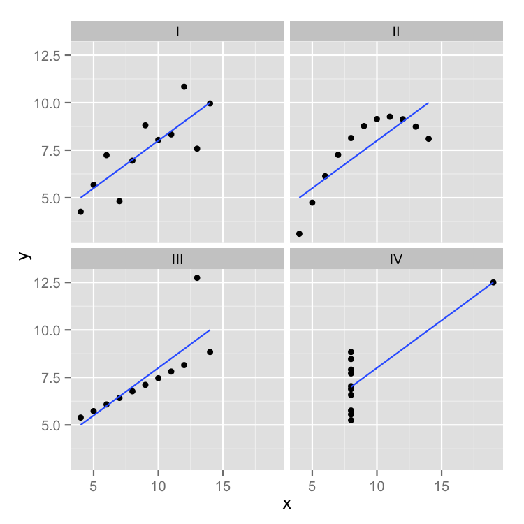

class: front

```{r eval=FALSE, include=FALSE}
# Correr esto para que funcione el infinite moonreader, el root folder debe ser static para si dirigir solo "bajndo" en directorios hacia el bib y otros

xaringan::inf_mr('/static/docpres/02_bases/2mlmbases.Rmd')

o en RStudio:
  - abrir desde carpeta root del proyecto
  - Addins-> infinite moon reader
```


```{r setup, include=FALSE, cache = FALSE}
require("knitr")
options(htmltools.dir.version = FALSE)
pacman::p_load(RefManageR)
# bib <- ReadBib("../../bib/electivomultinivel.bib", check = FALSE)
opts_chunk$set(warning=FALSE,
             message=FALSE,
             echo=FALSE,
             cache = FALSE, fig.width=7, fig.height=5.2)
pacman::p_load(flipbookr, tidyverse)
```


```{r xaringanExtra, include=FALSE}
xaringanExtra::use_xaringan_extra(c("tile_view", "animate_css"))
xaringanExtra::use_scribble()
```


<!---
Para correr en ATOM
- open terminal, abrir R (simplemente, R y enter)
- rmarkdown::render('static/docpres/07_interacciones/7interacciones.Rmd', 'xaringan::moon_reader')

About macros.js: permite escalar las imágenes como [scale 50%](path to image), hay si que grabar ese archivo js en el directorio.
--->


.pull-left[
# Métodos estadísticos para Ciencias Sociales III
## **Kevin Carrasco**
## Sociología - UNAB
## 2do semestre 2025
## .green[[metod3-unab.netlify.app](metod3-unab.netlify.app)] 
]

.pull-right[
.right[
<br>
## .yellow[Sesión 3: Regresión lineal, R2 e inferencia]


]

]
---

layout: true
class: animated, fadeIn

---
class: inverse, bottom, right, animated, slideInRight


# .red[Sesión 3]
<br>

Repaso sesión anterior

R2

Inferencia

<br>
<br>
<br>
<br>
---
class: inverse, bottom, right


# .red[Sesión 3]
<br>

.yellow[Repaso sesión anterior]

R2

Inferencia

<br>
<br>
<br>
<br>
---
class: inverse, center

# .yellow[¿Qué buscamos?]
--
.content-box-red[
## .red[Contrastar empíricamente teorías sociológicas
]
]
.medium[(con datos cuantitativos)]


---
# Hechos sociales son multideterminados

.pull-left[
.center[

]]

.pull-right[
- Limitaciones de herramientas bivariadas (tablas de contingencia, coeficiente de correlación)

- Necesidad de contar con herramientas más eficientes que incluyan múltiples determinantes

- -> .red[MODELO DE REGRESIÓN]

]
???

- por qué "modelo"
- por qué "regresión"
- partir por un determinante y luego se expande a múltiples determinantes

---
# ¿MODELO?= representación simplificada


.pull-left[

]

.pull-right[
.center[
<br>

]]
---
# ¿Regresión?


.pull-left[

- el **modelo de regresión** busca representar matemáticamente la relación entre una variable dependiente (Y) y una o más independientes (X)
]

.pull-right[

]

---
# ¿Regresión?


.pull-left[

- el **modelo de regresión** busca representar matemáticamente la relación entre una variable dependiente (Y) y una o más independientes (X)

- esta relación se expresa en un parámetro $\beta$  o "beta de regresión"
]

.pull-right[

]

---
# Regresión simple

- esta primera parte del curso veremos modelos con solo 1 variable independiente (X) o .red[regresión simple]
.center[

]

$$\widehat{Y}=\beta_{0} +\beta_{1}X_{1}$$
- con este modelo podemos saber el valor de $Y$ si conocemos el valor de $X$ usando el valor de los parámetros $\beta_{0}$ y $\beta_{1}$

---
# Componentes de la ecuación de la recta de regresión

.pull-left-narrow[

$$\widehat{Y}=\beta_{0} +\beta_{1}X_{1}$$


]

.pull-right-wide[


Donde

- $\widehat{Y}$ es el valor estimado de $Y$

- $\beta_{0}$ es el intercepto de la recta (el valor de Y cuando X es 0)

- $\beta_{1}$ es el coeficiente de regresión, que nos dice .red[cuánto aumenta Y por cada punto que aumenta X]
]
---
# Estimación de los coeficientes de la ecuación:

$$b_{1}=\frac{Cov(XY)}{VarX}$$

$$b_{1}=\frac{\frac{\sum_{i=1}^{n}(x_i - \bar{x})(y_i - \bar{y})} {n-1}}{\frac{\sum_{i=1}^{n}(x_i - \bar{x})(x_i - \bar{x})} {n-1}}$$

Y simplificando

$$b_{1}=\frac{\sum_{i=1}^{n}(x_i - \bar{x})(y_i - \bar{y})} {\sum_{i=1}^{n}(x_i - \bar{x})(x_i - \bar{x})}$$

---
# Estimación de los coeficientes de la ecuación: 

Luego despejando el valor de $b_{0}$

$$b_{0}=\bar{Y}-b_{1}\bar{X}$$
---

.pull-left-narrow[
**Ejemplo**: 
¿Cuántos pasos da un hijo (Y) por cada paso que da su mamá (x)?


]

.pull-right-wide[

.small[
```{r echo=FALSE}
pasos_mama_x=c(3,5,7,9)
pasos_hijo_y=c(2,3,2,4)
datos1 <-as.data.frame(cbind(pasos_mama_x,pasos_hijo_y))
options(scipen=3)
```

```{r echo=FALSE, results='markup'}
print(datos1)
```

]

```{r echo=FALSE}
names(datos1)
plot_walk1<-ggplot(datos1, aes(pasos_mama_x, pasos_hijo_y)) + geom_point()+   ylim(0, 5) +
  scale_x_continuous(limits = c(0,10),
                     breaks = seq(0,10,1))
ggsave(plot_walk1, file="../../files/img/plot_walk1.png")
```


]

---
class: middle center

$$b_{1}=\frac{\sum_{i=1}^{n}(x_i - \bar{x})(y_i - \bar{y})} {\sum_{i=1}^{n}(x_i - \bar{x})(x_i - \bar{x})};b_{0}=\bar{Y}-b_{1}\bar{X}$$


---

$$\widehat{Y}=\beta_{0} +\beta_{1}X_{1}$$
Reemplazando:

$$\widehat{Y}=1.25 +0.25X$$
Entonces:

- por cada paso que da la mamá (X), un hij_ (Y) avanza en promedio 0.25 pasos

- si una mamá da (por ej) .blue[4] pasos, entonces la cantidad de pasos estimada para su hijo sería 1.25+0.25*.blue[4]=.red[2.25]

---

.pull-left[

$$\widehat{Y}=1.25 +0.25X$$

```{r echo=FALSE}
plot_walk2<-ggplot(datos1, aes(pasos_mama_x, pasos_hijo_y)) + 
  geom_point() +
  ylim(0, 5) +
  scale_x_continuous(limits = c(0,10),
                     breaks = seq(0,10,1)) +
  stat_smooth(method = "lm", se = FALSE, fullrange = T)

ggsave(plot_walk2, file="../../files/img/plot_walk2.png")
```


]

.pull-right[
<br>
- la ecuación del modelo de regresión se puede expresar en una .red[recta de regresión]

- esta recta representa la predicción de los valores de $Y$ a partir de $X$
]


---
class: inverse, middle, center
# INTERPRETACIÓN

#por cada unidad que aumenta .red[X], .yellow[Y] aumenta en .orange[*Beta*]


---
.pull-left[
# Ejemplo

<br>
Si tenemos

- Y = ingreso al egresar de la universidad  

- X = puntaje PAES

<br>
$$Ingreso=200.000+400(puntajePAES)$$
<br>
<br>

]

--

.pull-right[
**1 - ¿Cuál es el valor estimado de Ingreso para un puntaje PAES de 500?**
{{content}}
]

--

- 400.000
{{content}}

--

**2 - ¿Cuál es el valor estimado de Ingreso para un puntaje (hipotético) de PAES=0?**
{{content}}

--

- 200.000
{{content}}

---

### Otro ejemplo
.small[

| Caso    | X (años educación)  | Y (nivel de ingresos)    | X - X̄ | Y - Ȳ  | (X - X̄) * (Y - Ȳ) |  (X - X̄)² |
|---------|---------------------|--------------------------|--------|--------|--------------------|------------|
| Caso 1  | 1                   | 250                      |    |   |              |     |
| Caso 2  | 2                   | 200                      |    |  |              |        |
| Caso 3  | 3                   | 250                      |    |   |              |        |
| Caso 4  | 4                   | 300                      |    |   |               |        |
| Caso 5  | 5                   | 400                      |    |    |               |        |
| Caso 6  | 6                   | 350                      |     |   |               |        |
| Caso 7  | 7                   | 400                      |     |    |              |        |
| Caso 8  | 8                   | 350                      |     |    |              |       |
| **Promedios / Sumas** | **X̄ = **| **Ȳ = **      |        |        | **Σ = **       | **Σ = ** |

]

---

### Otro ejemplo
.small[

| Caso    | X (años educación)  | Y (nivel de ingresos)    | X - X̄ | Y - Ȳ  | (X - X̄) * (Y - Ȳ) |  (X - X̄)² |
|---------|---------------------|--------------------------|--------|--------|--------------------|------------|
| Caso 1  | 1                   | 250                      | -3.5   | -62.5  | 218.75             | 12.25      |
| Caso 2  | 2                   | 200                      | -2.5   | -112.5 | 281.25             | 6.25       |
| Caso 3  | 3                   | 250                      | -1.5   | -62.5  | 93.75              | 2.25       |
| Caso 4  | 4                   | 300                      | -0.5   | -12.5  | 6.25               | 0.25       |
| Caso 5  | 5                   | 400                      | 0.5    | 87.5   | 43.75              | 0.25       |
| Caso 6  | 6                   | 350                      | 1.5    | 37.5   | 56.25              | 2.25       |
| Caso 7  | 7                   | 400                      | 2.5    | 87.5   | 218.75             | 6.25       |
| Caso 8  | 8                   | 350                      | 3.5    | 37.5   | 131.25             | 12.25      |
| **Promedios / Sumas** | **X̄ = 4.5**| **Ȳ = 312.5**      |        |        | **Σ = 1050**       | **Σ = 42** |

]
---

### Cálculo de coeficiente de regresión

$$b_{1}=\frac{\sum_{i=1}^{n}(x_i - \bar{x})(y_i - \bar{y})} {\sum_{i=1}^{n}(x_i - \bar{x})(x_i - \bar{x})}=\frac{1050} {42}=25$$

---
### Estimación de los coeficientes de la ecuación:

$$\bar{Y}=b_{0}+b_{1}\bar{X}$$
Reemplazando:

$$\bar{Y}=b_{0}+25\bar{X}$$

Despejando el valor de $b_{0}$

$$b_{0}=312.5-25*4.5=200$$
  - Una propiedad de la recta de regresión es que siempre pasa por las coordenadas X̄Ȳ. Esto es, pasa por los valores promedios de X e Y 
---

.pull-left-narrow[
### Ejemplo 


*Por cada unidad que aumenta educación, ingreso aumenta en 25 unidades*
]

.pull-right-wide[
```{r warning=FALSE, message=FALSE}
ggplot2::ggplot(data, aes(x=Educacion, y=Ingreso))+
  geom_point(size=3)+
  geom_smooth(method = "lm", se=FALSE)+
  scale_x_continuous(breaks = seq(0, 8, by = 1)) +
  scale_y_continuous(breaks = seq(0, 700, by = 100))+
  ylim(0,700)+
  xlim(0,8)
```

.pull-right-wide[]
]

---
class: inverse

## Hasta ahora deberíamos saber:

--

1- Modelo de regresión como una **representación simplificada** de la relación compleja entre variables

--

2- El $\beta$ de regresión nos dice **cuanto aumenta $Y$ ** (variable dependiente) *en promedio* por ** cada punto que aumenta** $X$ (variable independiente).

--

3- El modelo nos permite **estimar** el puntaje de $Y$ para cada valor de $X$

---
class: roja, bottom, right

# .red[Sesión 3]
<br>

Repaso sesión anterior

.yellow[R2: ajuste y residuos]

Inferencia

---
.pull-left-wide[

]


.pull-right-narrow[
<br>
# El cuarteto de Anscombe (1973)
.small[
Podemos tener un mismo modelo de regresión para relaciones distintas entre datos
]
]

---
# ¿Qué tan bueno es nuestro modelo?

- El cálculo del $\beta$ busca minimizar los residuos (de ahí "mínimos cuadrados ordinarios")

- Una vez minimizados los residuos, se puede evaluar el ajuste
  - qué tan bien representa nuestro modelo la realidad
  
  - cuánto error (de predicción) estamos cometiendo con nuestro modelo


---
class: inverse, right

## Un modelo es mejor mientras **mejor refleje** lo que sucede con los datos

--

## En otras palabras, cuando se parece o **ajusta** mejor a los datos

--

## ... y en otras: cuando los **residuos** son menores
---
# Observado, estimado & residuo

.pull-left-wide[

]

.pull-right-narrow[


- observado: $Y$  

- estimado: $\widehat{Y}$

- residuo: $Y-\widehat{Y}$
]

---
# Varianza explicada de Y

¿Qué parte de la varianza de ingreso (Y) se asocia a educación? 

.center[]

---
# Varianza explicada de Y: $R^2$

- ¿Cuánto de los ingresos puedo predecir con educación (regresión) y cuánto me estoy equivocando (residuos)?

--

- el $R^2$
  - es la proporción de la varianza de Y que se asocia a X
  - varía entre 0 y 1, y se puede expresar en porcentaje

--

- Entonces, podemos descomponer la varianza de Y en 2: aquella asociada a X (regresión) y la que no se asocia a X (residuos) 


---
# ¿Cómo se calcula el $R^2$? 

- para saber qué porcentaje de $Y$ se asocia a $X$ vamos a considerar los siguientes valores de $Y$: 


$Y$ = Valor observado de Y

$\widehat{Y}$ = estimación de Y a partir de X

$\bar{Y}$ = promedio de Y

---
# Descomponiendo Y

Conceptualmente:

$$SS_{tot}=SS_{reg} + SS_{error}$$
.center[

]


---
.pull-left-wide[
]

.pull-right-narrow[
.right[
## Descomponiendo Y
]]

.pull-left-wide[
$$Y=\bar{Y}+(\widehat{Y}-\bar{Y}) + (Y-\widehat{Y})$$

$$ \Sigma(y_i - \bar{y})^2=\Sigma (\hat{y}_i-\bar{y})^2 +\Sigma(y_i-\hat{y}_i)^2$$
]

---
# Varianza explicada

Por lo tanto:

$$SS_{tot}=SS_{reg} + SS_{error}$$

--

$$\frac{SS_{tot}}{SS_{tot}}=\frac{SS_{reg}}{SS_{tot}} + \frac{SS_{error}}{SS_{tot}}$$

--

$$1=\frac{SS_{reg}}{SS_{tot}}+\frac{SS_{error}}{SS_{tot}}$$

$$\frac{SS_{reg}}{SS_{tot}}= 1- \frac{SS_{error}}{SS_{tot}}=R^2$$

<br>

### .center[¿Qué quiere decir esto?]


---
# Directamente en R

.pull-left[

.medium[
```{r}
reg1 <-lm(pasos_hijo_y ~ 
              pasos_mama_x, 
              data = datos1)
```
]
]


.pull-right[
.medium[
```{r, echo=FALSE}
sjPlot::tab_model(reg1,
        show.se=FALSE,
        show.ci=FALSE,
        digits=3,
        dv.labels = c("Modelo 1"),
        string.pred = "Predictores",
        string.est = "β")
```
]

Un 45.5% de la varianza de Y se relaciona con X
]

---

class: inverse, bottom, right

# .red[Sesión 3]
<br>

Repaso sesión anterior

R2: ajuste y residuos

.yellow[Inferencia]

<br>
<br>
<br>


---

## Inferencia estadística

* ¿Cómo sabemos si $b_{1}$ es estadísticamente significativo?

--

* ¿Nuestros datos se pueden extrapolar a la población?

---

## Inferencia estadística

- Según criterios muestrales:
  * Distribución normal
  * Desviación estándar
  
- Error estándar

---

### Ejemplo tabla de regresión

```{r}
data <- cbind(Educacion=c(1,2,3,4,5,6,7,8),
              Ingreso=c(250,200,250,300,400,350,400,350))
data <- as.data.frame(data)
reg1<-lm(Ingreso~Educacion, data=data)
```

```{r results='asis'}
texreg::htmlreg(reg1, caption="")
```

---

## Regresión múltiple

- Ahora el efecto de una variable X (expresado en el coeficiente de regresión) se interpreta de modo similar a una **correlación parcial** - es decir, **manteniendo controladas las otras variables del modelo**.

- Formas comunes de interpretar esto:

  - El impacto de X sobre Y, **manteniendo constante el efecto de las otras variables**, es de...
  - *Ceteris paribus*, la relación entre X e Y es...
  - El efecto **neto** de X sobre Y es de...


---

## Parcialización

.center[]

---


### Regresión múltiple

```{r echo=FALSE}
data <- as.data.frame(cbind(data,
              edad=c(25,20,20,30,45,30,45,40)))
```


```{r results='asis'}
reg2 <- lm(Ingreso~Educacion+edad, data = data)
texreg::htmlreg(reg2, caption="")
```


---

class: front

.pull-left[
# Métodos estadísticos para ciencias sociales III
## **Kevin Carrasco**
## Sociología - UNAB
## 2do Semestre 2025
## .green[[metod3-unab.netlify.com](metod3-unab.netlify.com)]
] 
    

.pull-right[
.right[
<br>
## .yellow[Sesión 3: Regresión lineal, R2 e inferencia]


]

]


