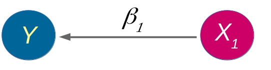
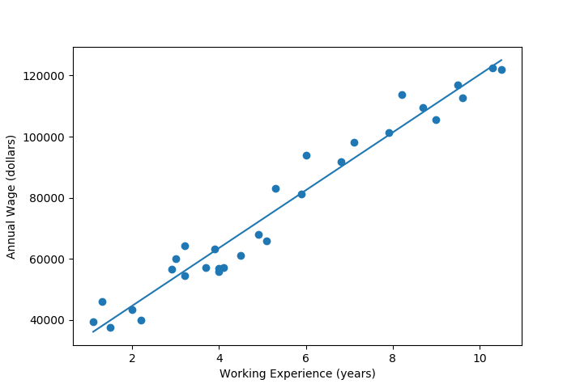
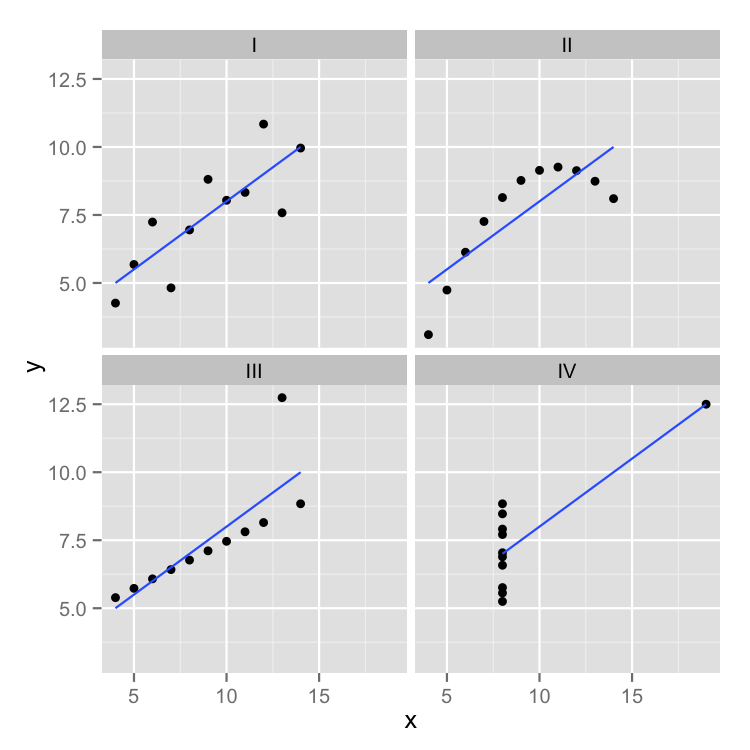
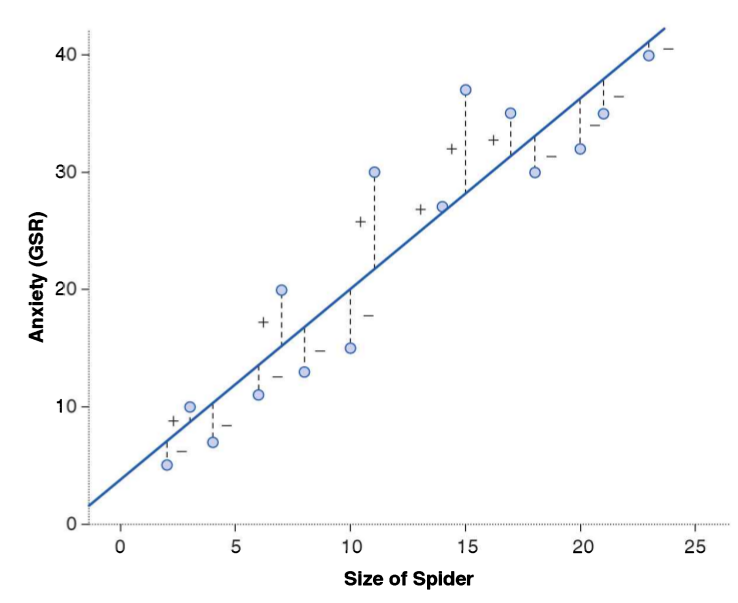
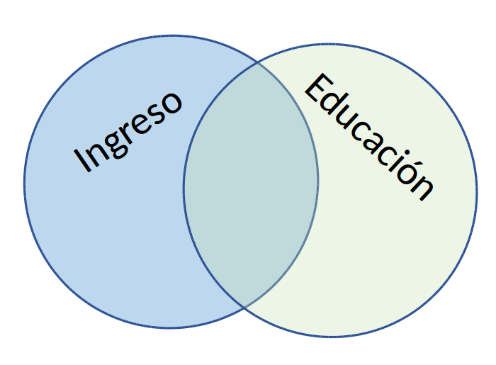
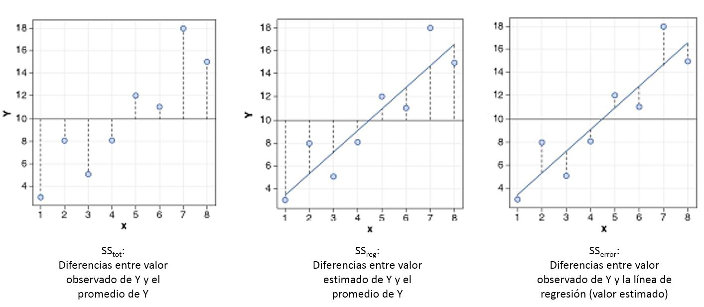
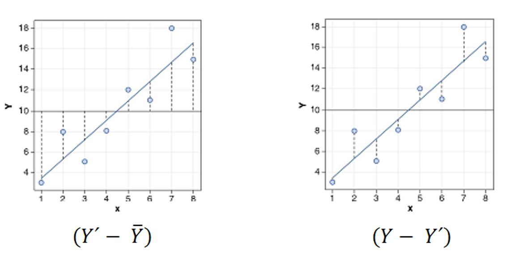

```{r}
#| label: setup
#| include: false
library(ggplot2)
library(knitr)
library(sjPlot)

azul <- "#04245f"
azul_claro <- "#4f97ff"
rojo <- "#c0392b"

theme_set(theme_minimal(base_size = 16))

datos <- data.frame(
  educacion = c(1, 2, 3, 4, 5, 6, 7, 8),
  ingreso   = c(250, 200, 250, 300, 400, 350, 400, 350)
)
```

##  {data-background-color="black"}

::: {.columns .v-center-container}
::: {.column width="20%"}
{width="100%" fig-align="center"}
:::

::: {.column width="80%"}
### Métodos estadísticos para 
### Ciencias Sociales III

------------------------------------------------------------------------

### **Kevin Carrasco**
### Sociología - UNAB
### 2do Sem 2026
### [https://metod3-unab.netlify.app/](https://metod3-unab.netlify.app/)
:::
:::

# Sesión 3 {data-background-color="black"}

Repaso sesión anterior

R2: ajuste y residuos

Inferencia

## ¿Dónde quedamos?

::: {.incremental}

- La recta de regresión se estima con **mínimos cuadrados ordinarios** (OLS), el criterio que minimiza la suma de los residuos al cuadrado

- La pendiente se obtiene a partir de la covariación entre $X$ e $Y$, y de la varianza de $X$: $b_{1}=\frac{Cov(XY)}{Var(X)}$

- Con el ejemplo de la clase pasada llegamos a $\widehat{Y}=2.5+0.5X$: por cada juego previo adicional, los puntos aumentan en 0,5

- La ecuación permite **predecir**: para $X=3$, el valor estimado era $\widehat{Y}=4$

:::

## Hoy

::: {.incremental}

- Ya sabemos estimar la recta. Pero, ¿**qué tan buena** es esa recta?

- ¿Cuánto de la variación de $Y$ logramos explicar y cuánto queda como error? ($R^2$)

- ¿Podemos **generalizar** este resultado más allá de nuestra muestra? (inferencia)

:::

# Repaso: el modelo de regresión {data-background-color="black"}

##  {data-background-color="black"}

### ¿Qué buscamos?

::: {.fragment .fade-up}

### Contrastar empíricamente teorías sociológicas

(con datos cuantitativos)

:::

## Hechos sociales multideterminados

::: {.columns}
::: {.column width="50%"}

{width="100%"}

:::
::: {.column width="50%"}

- Limitaciones de las herramientas bivariadas (tablas de contingencia, coeficiente de correlación)

- Necesidad de contar con herramientas más eficientes que incluyan múltiples determinantes

- Por eso: el **modelo de regresión**

:::
:::

## ¿Modelo? = representación simplificada

::: {.columns}
::: {.column width="50%"}

{width="80%"}

:::
::: {.column width="50%"}

{width="80%"}

:::
:::

::: {.small}
Un modelo no pretende reproducir la realidad, sino representar sus rasgos relevantes de forma simplificada
:::

## ¿Regresión?

::: {.columns}
::: {.column width="50%"}

- El **modelo de regresión** busca representar matemáticamente la relación entre una variable dependiente ($Y$) y una o más independientes ($X$)

- Esta relación se expresa en un parámetro $\beta$ o "beta de regresión"

:::
::: {.column width="50%"}

{width="100%"}

:::
:::

## Regresión simple

En esta primera parte del curso veremos modelos con una sola variable independiente, o **regresión simple**

{width="55%" fig-align="center"}

$$\widehat{Y}=\beta_{0} +\beta_{1}X_{1}$$

## Componentes de la ecuación

::: {.columns}
::: {.column width="40%"}

{width="100%"}

:::
::: {.column width="60%"}

- $\widehat{Y}$ es el valor estimado de $Y$

- $\beta_{0}$ es el intercepto de la recta (el valor de $Y$ cuando $X$ es 0)

- $\beta_{1}$ es el coeficiente de regresión, que indica **cuánto aumenta $Y$ por cada punto que aumenta $X$**

:::
:::

## Recordatorio: cómo se estiman

$$b_{1}=\frac{\sum_{i=1}^{n}(x_i - \bar{x})(y_i - \bar{y})} {\sum_{i=1}^{n}(x_i - \bar{x})^2} \qquad b_{0}=\bar{Y}-b_{1}\bar{X}$$

::: {.incremental}

- El numerador de $b_1$ recoge la **covariación**: cuánto se mueven juntas $X$ e $Y$

- El denominador la **varianza de X**: cuánto se mueve $X$ por sí sola

- Practiquemos el procedimiento con un ejemplo nuevo

:::

## Ejercicio: educación e ingresos

::: {.small}

| Caso | X (años educación) | Y (nivel de ingresos) | X - X̄ | Y - Ȳ | (X - X̄)(Y - Ȳ) | (X - X̄)² |
|---|---|---|---|---|---|---|
| Caso 1 | 1 | 250 | | | | |
| Caso 2 | 2 | 200 | | | | |
| Caso 3 | 3 | 250 | | | | |
| Caso 4 | 4 | 300 | | | | |
| Caso 5 | 5 | 400 | | | | |
| Caso 6 | 6 | 350 | | | | |
| Caso 7 | 7 | 400 | | | | |
| Caso 8 | 8 | 350 | | | | |
| **Promedios / Sumas** | **X̄ =** | **Ȳ =** | | | **Σ =** | **Σ =** |

:::

## Ejercicio: educación e ingresos

::: {.small}

| Caso | X (años educación) | Y (nivel de ingresos) | X - X̄ | Y - Ȳ | (X - X̄)(Y - Ȳ) | (X - X̄)² |
|---|---|---|---|---|---|---|
| Caso 1 | 1 | 250 | -3,5 | -62,5 | 218,75 | 12,25 |
| Caso 2 | 2 | 200 | -2,5 | -112,5 | 281,25 | 6,25 |
| Caso 3 | 3 | 250 | -1,5 | -62,5 | 93,75 | 2,25 |
| Caso 4 | 4 | 300 | -0,5 | -12,5 | 6,25 | 0,25 |
| Caso 5 | 5 | 400 | 0,5 | 87,5 | 43,75 | 0,25 |
| Caso 6 | 6 | 350 | 1,5 | 37,5 | 56,25 | 2,25 |
| Caso 7 | 7 | 400 | 2,5 | 87,5 | 218,75 | 6,25 |
| Caso 8 | 8 | 350 | 3,5 | 37,5 | 131,25 | 12,25 |
| **Promedios / Sumas** | **X̄ = 4,5** | **Ȳ = 312,5** | | | **Σ = 1050** | **Σ = 42** |

:::

## Cálculo del coeficiente de regresión

$$b_{1}=\frac{\sum_{i=1}^{n}(x_i - \bar{x})(y_i - \bar{y})} {\sum_{i=1}^{n}(x_i - \bar{x})^2}=\frac{1050} {42}=25$$

::: {.fragment .fade-up}

Y despejando el intercepto:

$$b_{0}=\bar{Y}-b_{1}\bar{X} = 312.5-(25 \times 4.5)=200$$

Recuerde que la recta de regresión **siempre pasa por el punto** $(\bar{X}, \bar{Y})$

:::

## El resultado

::: {.columns}
::: {.column width="40%"}

$$\widehat{Y}=200+25X$$

*Por cada año adicional de educación, el ingreso aumenta en 25 unidades*

:::
::: {.column width="60%"}

```{r}
#| label: fig-recta
#| echo: false
#| fig-width: 6
#| fig-height: 5

ggplot(datos, aes(x = educacion, y = ingreso)) +
  geom_point(size = 3, color = azul_claro) +
  geom_smooth(method = "lm", se = FALSE, color = azul, linewidth = 1.2) +
  scale_x_continuous(breaks = 0:8, limits = c(0, 8)) +
  scale_y_continuous(breaks = seq(0, 700, 100), limits = c(0, 700)) +
  labs(x = "Años de educación", y = "Ingreso")
```

:::
:::

##  {data-background-color="black"}

### INTERPRETACIÓN

### Por cada unidad que aumenta X, Y aumenta en *Beta*

## Ejemplo

::: {.columns}
::: {.column width="45%"}

Si tenemos:

- $Y$ = ingreso al egresar de la universidad
- $X$ = puntaje PAES

$$Ingreso=200.000+400(PAES)$$

:::
::: {.column width="55%"}

::: {.incremental}

**1. ¿Cuál es el valor estimado de ingreso para un puntaje PAES de 500?**

- 400.000

**2. ¿Cuál es el valor estimado de ingreso para un puntaje (hipotético) de PAES = 0?**

- 200.000

:::

:::
:::

##  {data-background-color="black"}

### Hasta ahora deberíamos saber

::: {.incremental}

1. El modelo de regresión es una **representación simplificada** de la relación compleja entre variables

2. El $\beta$ de regresión indica **cuánto aumenta $Y$** *en promedio* **por cada punto que aumenta** $X$

3. El modelo permite **estimar** el puntaje de $Y$ para cada valor de $X$

:::

# R2: ajuste y residuos {data-background-color="black"}

## El cuarteto de Anscombe (1973)

::: {.columns}
::: {.column width="65%"}

{width="100%"}

:::
::: {.column width="35%"}

Podemos tener un mismo modelo de regresión para relaciones muy distintas entre los datos

:::
:::

## ¿Qué tan bueno es nuestro modelo?

::: {.incremental}

- El cálculo del $\beta$ busca minimizar los residuos (de ahí "mínimos cuadrados ordinarios")

- Una vez minimizados los residuos, se puede evaluar el **ajuste**:

    - qué tan bien representa nuestro modelo la realidad
    - cuánto error (de predicción) estamos cometiendo

:::

##  {data-background-color="black"}

### Un modelo es mejor mientras **mejor refleje** lo que sucede con los datos

::: {.fragment .fade-up}

### En otras palabras, cuando se parece o **ajusta** mejor a los datos

:::

::: {.fragment .fade-up}

### ... y en otras: cuando los **residuos** son menores

:::

## Observado, estimado y residuo

::: {.columns}
::: {.column width="65%"}

{width="100%"}

:::
::: {.column width="35%"}

- observado: $Y$

- estimado: $\widehat{Y}$

- residuo: $Y-\widehat{Y}$

:::
:::

## Varianza explicada de Y

¿Qué parte de la varianza del ingreso ($Y$) se asocia a educación?

{width="45%" fig-align="center"}

## Varianza explicada de Y: $R^2$

::: {.incremental}

- ¿Cuánto de los ingresos puedo predecir con educación (regresión) y cuánto me estoy equivocando (residuos)?

- El $R^2$:

    - es la proporción de la varianza de $Y$ que se asocia a $X$
    - varía entre 0 y 1, y se puede expresar en porcentaje

- Entonces, podemos descomponer la varianza de $Y$ en dos: aquella asociada a $X$ (regresión) y la que no se asocia a $X$ (residuos)

:::

## ¿Cómo se calcula el $R^2$?

Para saber qué porcentaje de $Y$ se asocia a $X$ vamos a considerar los siguientes valores de $Y$:

- $Y$ = valor observado de $Y$

- $\widehat{Y}$ = estimación de $Y$ a partir de $X$

- $\bar{Y}$ = promedio de $Y$

## Descomponiendo Y

Conceptualmente:

$$SS_{tot}=SS_{reg} + SS_{error}$$

{width="60%" fig-align="center"}

## Descomponiendo Y

::: {.columns}
::: {.column width="60%"}

{width="100%"}

:::
::: {.column width="40%"}

$$Y=\bar{Y}+(\widehat{Y}-\bar{Y}) + (Y-\widehat{Y})$$

$$\Sigma(y_i - \bar{y})^2=\Sigma (\hat{y}_i-\bar{y})^2 +\Sigma(y_i-\hat{y}_i)^2$$

:::
:::

## Varianza explicada

Por lo tanto:

$$SS_{tot}=SS_{reg} + SS_{error}$$

::: {.fragment .fade-up}

$$\frac{SS_{tot}}{SS_{tot}}=\frac{SS_{reg}}{SS_{tot}} + \frac{SS_{error}}{SS_{tot}}$$

:::

::: {.fragment .fade-up}

$$1=\frac{SS_{reg}}{SS_{tot}}+\frac{SS_{error}}{SS_{tot}}$$

$$\frac{SS_{reg}}{SS_{tot}}= 1- \frac{SS_{error}}{SS_{tot}}=R^2$$

:::

## En nuestro ejemplo

```{r}
#| label: descomposicion
#| echo: true

modelo <- lm(ingreso ~ educacion, data = datos)

ss_tot <- sum((datos$ingreso - mean(datos$ingreso))^2)
ss_reg <- sum((fitted(modelo) - mean(datos$ingreso))^2)
ss_err <- sum(residuals(modelo)^2)

c(SS_tot = ss_tot, SS_reg = ss_reg, SS_error = ss_err)
```

::: {.fragment .fade-up}

```{r}
#| label: r2-manual
#| echo: true

ss_reg / ss_tot
```

:::

## Directamente en R

::: {.columns}
::: {.column width="45%"}

```{r}
#| label: modelo
#| echo: true
#| eval: false

modelo <- lm(ingreso ~ educacion,
             data = datos)

summary(modelo)$r.squared
```

:::
::: {.column width="55%"}

```{r}
#| label: tab-modelo
#| echo: false
#| results: asis

tab_model(modelo,
          show.se = FALSE,
          show.ci = FALSE,
          digits = 3,
          dv.labels = c("Ingreso"),
          string.pred = "Predictores",
          string.est = "β")
```

:::
:::

Un 67,7% de la varianza del ingreso se relaciona con la educación

## Una advertencia sobre el $R^2$

::: {.incremental}

- Un $R^2$ alto **no significa** que el modelo sea correcto: el cuarteto de Anscombe muestra que un mismo ajuste puede corresponder a relaciones muy distintas

- Un $R^2$ bajo **no significa** que el hallazgo carezca de interés: en ciencias sociales es habitual explicar una fracción modesta de la varianza

- El $R^2$ tampoco dice nada sobre causalidad, ni sobre si las variables relevantes están en el modelo

:::

# Inferencia {data-background-color="black"}

## Inferencia estadística

::: {.incremental}

- Hasta aquí hemos descrito la relación **en nuestros datos**

- Pero nuestros datos son (habitualmente) una **muestra** de una población mayor

- ¿Nuestros resultados se pueden extrapolar a la población?

- ¿Cómo sabemos si $b_{1}$ es estadísticamente significativo?

:::

## De la muestra a la población

::: {.incremental}

- Si extrajéramos muchas muestras distintas de la misma población, obtendríamos un $b_1$ algo distinto en cada una

- Esos valores se distribuyen alrededor del parámetro poblacional $\beta_1$: es la **distribución muestral** del coeficiente

- El **error estándar** mide cuánto varía el coeficiente de una muestra a otra

:::

## Error estándar

$$se(b_1)=\sqrt{\frac{\sum(y_i-\hat{y}_i)^2 / (n-2)}{\sum(x_i-\bar{x})^2}}$$

::: {.incremental}

- Aumenta cuando los **residuos** son grandes: si el modelo predice mal, la estimación es menos precisa

- Disminuye cuando la **varianza de X** es grande y cuando aumenta el **número de casos**

:::

## El estadístico t

$$t=\frac{b_{1}}{se(b_{1})}$$

::: {.incremental}

- Compara el tamaño del coeficiente con su propia imprecisión

- La hipótesis nula es que en la población $\beta_1 = 0$, es decir, que **no hay relación** entre $X$ e $Y$

- Como regla aproximada, valores de $t$ superiores a 2 (en valor absoluto) permiten rechazar esa hipótesis al 95% de confianza

:::

## El valor p

::: {.incremental}

- Probabilidad de observar un coeficiente como el nuestro (o mayor) **si la hipótesis nula fuera verdadera**

- Por convención, se considera estadísticamente significativo cuando $p < 0.05$

- En las tablas suele indicarse con asteriscos: \* $p<0.05$, \*\* $p<0.01$, \*\*\* $p<0.001$

- Atención: el valor p **no** indica la magnitud ni la importancia sustantiva del efecto

:::

## Intervalos de confianza

$$IC_{95\%} = b_1 \pm 1.96 \times se(b_1)$$

::: {.incremental}

- Rango de valores plausibles para el parámetro poblacional

- Si el intervalo **no contiene el cero**, el coeficiente es estadísticamente significativo al 95%

- Suele ser más informativo que el valor p, porque comunica también la **precisión** de la estimación

:::

## Ejemplo: tabla de regresión

```{r}
#| label: tab-inferencia
#| echo: false
#| results: asis

tab_model(modelo,
          show.se = TRUE,
          show.ci = 0.95,
          show.stat = TRUE,
          digits = 2,
          dv.labels = c("Ingreso"),
          string.pred = "Predictores",
          string.est = "β")
```

## Leyendo la tabla

::: {.incremental}

- $b_1 = 25$: por cada año adicional de educación, el ingreso aumenta en 25 unidades

- $se(b_1) = 7{,}04$: esa es la imprecisión de la estimación

- $t = 25 / 7{,}04 = 3{,}55$, con $p = 0{,}012$: rechazamos la hipótesis nula

- El intervalo de confianza no contiene el cero

- $R^2 = 0{,}677$: el modelo da cuenta del 67,7% de la varianza del ingreso

:::

## Un problema pendiente

::: {.incremental}

- Sabemos estimar la recta, evaluar su ajuste y decidir si el resultado es generalizable

- Pero seguimos con **una sola** variable independiente

- Los hechos sociales son multideterminados: ¿qué pasa si el efecto de la educación sobre el ingreso se debe, en parte, a la edad?

- La próxima sesión: **regresión múltiple** y parcialización

:::

## Adelanto: parcialización

{width="50%" fig-align="center"}

::: {.small}
El coeficiente de cada variable se interpreta *manteniendo constantes* las demás variables del modelo
:::

## Para la próxima sesión

- Wooldridge, *Introducción a la econometría*: sección 2.2

- Moore, *Estadística aplicada básica*: sección 2.4.1

##  {data-background-color="black"}

::: {.columns .v-center-container}
::: {.column width="20%"}
{width="80%" fig-align="right"}
:::

::: {.column width="80%"}
### Métodos estadísticos para Ciencias Sociales III

------------------------------------------------------------------------

### **Kevin Carrasco**
### Sociología - UNAB
### 2do Sem 2026
### [https://metod3-unab.netlify.app/](https://metod3-unab.netlify.app/)
:::
:::
