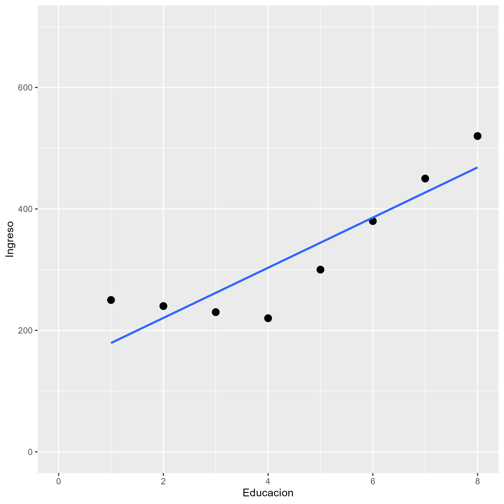
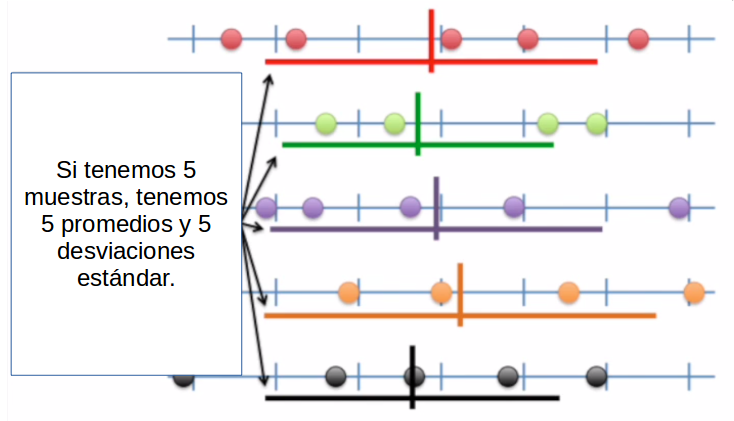

class: front

```{r eval=FALSE, include=FALSE}
# Correr esto para que funcione el infinite moonreader, el root folder debe ser static para si dirigir solo "bajndo" en directorios hacia el bib y otros

xaringan::inf_mr('/static/docpres/02_bases/2mlmbases.Rmd')

o en RStudio:
  - abrir desde carpeta root del proyecto
  - Addins-> infinite moon reader
```


```{r setup, include=FALSE, cache = FALSE}
require("knitr")
options(htmltools.dir.version = FALSE)
pacman::p_load(RefManageR)
# bib <- ReadBib("../../bib/electivomultinivel.bib", check = FALSE)
opts_chunk$set(warning=FALSE,
             message=FALSE,
             echo=FALSE,
             cache = FALSE, fig.width=7, fig.height=5.2)
pacman::p_load(flipbookr, tidyverse)
```


```{r xaringanExtra, include=FALSE}
xaringanExtra::use_xaringan_extra(c("tile_view", "animate_css"))
xaringanExtra::use_scribble()
```


<!---
Para correr en ATOM
- open terminal, abrir R (simplemente, R y enter)
- rmarkdown::render('static/docpres/07_interacciones/7interacciones.Rmd', 'xaringan::moon_reader')

About macros.js: permite escalar las imágenes como [scale 50%](path to image), hay si que grabar ese archivo js en el directorio.
--->


.pull-left[
# Métodos estadísticos para Ciencias Sociales III
## **Kevin Carrasco**
## Sociología - UNAB
## 2do semestre 2025
## .green[[metod3-unab.netlify.app](metod3-unab.netlify.app)] 
]

.pull-right[
.right[
<br>
## .yellow[Sesión 4: Regresión múltiple e inferencia]


]

]
---

layout: true
class: animated, fadeIn

---
class: inverse, bottom, right, animated, slideInRight


# .red[Sesión 4]
<br>

Repaso sesión anterior

Inferencia

<br>
<br>
<br>
<br>
---
class: inverse, bottom, right


# .red[Sesión 4]
<br>

.yellow[Repaso sesión anterior]

Inferencia

<br>
<br>
<br>
<br>
---
class: inverse, center

# .yellow[¿Qué buscamos?]
--
.content-box-red[
## .red[Contrastar empíricamente teorías sociológicas
]
]
.medium[(con datos cuantitativos)]


---
# Hechos sociales son multideterminados

.pull-left[
.center[

]]

.pull-right[
- Limitaciones de herramientas bivariadas (tablas de contingencia, coeficiente de correlación)

- Necesidad de contar con herramientas más eficientes que incluyan múltiples determinantes

- -> .red[MODELO DE REGRESIÓN]

]
???

- por qué "modelo"
- por qué "regresión"
- partir por un determinante y luego se expande a múltiples determinantes

---
# ¿MODELO?= representación simplificada


.pull-left[

]

.pull-right[
.center[
<br>

]]
---
# ¿Regresión?


.pull-left[

- el **modelo de regresión** busca representar matemáticamente la relación entre una variable dependiente (Y) y una o más independientes (X)
]

.pull-right[

]

---
# ¿Regresión?


.pull-left[

- el **modelo de regresión** busca representar matemáticamente la relación entre una variable dependiente (Y) y una o más independientes (X)

- esta relación se expresa en un parámetro $\beta$  o "beta de regresión"
]

.pull-right[

]

---
# Regresión simple

- esta primera parte del curso veremos modelos con solo 1 variable independiente (X) o .red[regresión simple]
.center[

]

$$\widehat{Y}=\beta_{0} +\beta_{1}X_{1}$$
- con este modelo podemos saber el valor de $Y$ si conocemos el valor de $X$ usando el valor de los parámetros $\beta_{0}$ y $\beta_{1}$

---


# Regresión múltiple: más de 1 predictor


.pull-left[
.center[]
.small[
$$\widehat{Ingreso}=b_0+b_1(Educ)$$
]
]

--

.pull-right[
.center[]
.small[
$$\widehat{Ingreso}=b_0+b_1(Educ)+b_2(Int)$$
]]


---
# Control estadístico

- Característico de análisis de datos secundarios (ej: encuestas)

- Se incluyen en el modelo variables que teóricamente podrían dar cuenta o afectar la relación entre X e Y.

- Esto despeja o "controla" la asociación de $X_1$ e $Y$, aislando el efecto conjunto de $X_1$ y $X_2$ (... y $X_n$)


---
# Regresión simple vs múltiple

```{r echo=FALSE, results='hide'}
pacman::p_load(dplyr,
               corrplot,
               ggplot2,
               scatterplot3d,
               texreg,
              stargazer
)
datos=read.csv("ingedexp.csv", sep=",")
```

.small[
```{r}
reg_y_x1=lm(ingr ~ educ, data=datos)
reg_y_x2=lm(ingr ~ intelig, data=datos)
reg_y_x1_x2=lm(ingr ~ educ + intelig , data=datos)
```
]
.small[
```{r echo=FALSE, results='asis'}
htmlreg(list(reg_y_x1,reg_y_x2,reg_y_x1_x2), booktabs = TRUE, dcolumn = TRUE, doctype = FALSE, caption=" ")
```
]


---
# Parcialización

_¿Cómo se despeja la regresión de $Y$ en $X_1$ del efecto de $X_2$?_

.pull-left[
.center[]
]

--

.pull-right[
.center[]
]

---
.pull-left[
# Parcialización

.medium[
¿Como obtenemos una variable $X_1$ parcializada de $X_2$?
]

.center[
]
]
--

.pull-right[

<br>
<br>

.medium[
- Pensemos en que $X_1$ parcializada (de $X_2$ ) es todo lo de $X_1$ (varianza) que no tiene que ver con $X_2$

- En otras palabras, en un modelo donde $X_1$ es la variable dependiente y $X_2$ la independiente, $X_1$ parcializada equivale al **residuo** de esta regresión
]
]

---
class: inverse

## RESUMEN

- Si hay correlación entre predictores, el valor de los coeficientes de regresión será **distinto** en modelos simples y en modelos múltiples

- Esta diferencia se relaciona con el concepto de  **parcialización**: se extrae la varianza común entre predictores

- La parcialización permite el **control estadístico**: *limpiar* o despejar los efectos de la influencia de otras variables

---
.pull-left[
# Ejemplo

<br>
Si tenemos

- Y = ingreso al egresar de la universidad  

- X = puntaje PAES

<br>
$$Ingreso=200.000+400(puntajePAES)$$
<br>
<br>

]

--

.pull-right[
**1 - ¿Cuál es el valor estimado de Ingreso para un puntaje PAES de 500?**
{{content}}
]

--

- 400.000
{{content}}

--

**2 - ¿Cuál es el valor estimado de Ingreso para un puntaje (hipotético) de PAES=0?**
{{content}}

--

- 200.000
{{content}}

---

### Otro ejemplo
.small[

| Caso    | X (años educación)  | Y (nivel de ingresos)    | X - X̄ | Y - Ȳ  | (X - X̄) * (Y - Ȳ) |  (X - X̄)² |
|---------|---------------------|--------------------------|--------|--------|--------------------|------------|
| Caso 1  | 1                   | 250                      |    |   |              |     |
| Caso 2  | 2                   | 200                      |    |  |              |        |
| Caso 3  | 3                   | 250                      |    |   |              |        |
| Caso 4  | 4                   | 300                      |    |   |               |        |
| Caso 5  | 5                   | 400                      |    |    |               |        |
| Caso 6  | 6                   | 350                      |     |   |               |        |
| Caso 7  | 7                   | 400                      |     |    |              |        |
| Caso 8  | 8                   | 350                      |     |    |              |       |
| **Promedios / Sumas** | **X̄ = **| **Ȳ = **      |        |        | **Σ = **       | **Σ = ** |

]

---

### Otro ejemplo
.small[

| Caso    | X (años educación)  | Y (nivel de ingresos)    | X - X̄ | Y - Ȳ  | (X - X̄) * (Y - Ȳ) |  (X - X̄)² |
|---------|---------------------|--------------------------|--------|--------|--------------------|------------|
| Caso 1  | 1                   | 250                      | -3.5   | -62.5  | 218.75             | 12.25      |
| Caso 2  | 2                   | 200                      | -2.5   | -112.5 | 281.25             | 6.25       |
| Caso 3  | 3                   | 250                      | -1.5   | -62.5  | 93.75              | 2.25       |
| Caso 4  | 4                   | 300                      | -0.5   | -12.5  | 6.25               | 0.25       |
| Caso 5  | 5                   | 400                      | 0.5    | 87.5   | 43.75              | 0.25       |
| Caso 6  | 6                   | 350                      | 1.5    | 37.5   | 56.25              | 2.25       |
| Caso 7  | 7                   | 400                      | 2.5    | 87.5   | 218.75             | 6.25       |
| Caso 8  | 8                   | 350                      | 3.5    | 37.5   | 131.25             | 12.25      |
| **Promedios / Sumas** | **X̄ = 4.5**| **Ȳ = 312.5**      |        |        | **Σ = 1050**       | **Σ = 42** |

]
---

### Cálculo de coeficiente de regresión

$$b_{1}=\frac{\sum_{i=1}^{n}(x_i - \bar{x})(y_i - \bar{y})} {\sum_{i=1}^{n}(x_i - \bar{x})(x_i - \bar{x})}=\frac{1050} {42}=25$$

---
### Estimación de los coeficientes de la ecuación:

$$\bar{Y}=b_{0}+b_{1}\bar{X}$$
Reemplazando:

$$\bar{Y}=b_{0}+25\bar{X}$$

Despejando el valor de $b_{0}$

$$b_{0}=312.5-25*4.5=200$$
  - Una propiedad de la recta de regresión es que siempre pasa por las coordenadas X̄Ȳ. Esto es, pasa por los valores promedios de X e Y 
---

.pull-left-narrow[
### Ejemplo 


*Por cada unidad que aumenta educación, ingreso aumenta en 25 unidades*
]

.pull-right-wide[
```{r warning=FALSE, message=FALSE}
data <- cbind(Educacion=c(1,2,3,4,5,6,7,8),
              Ingreso=c(250,200,250,300,400,350,400,350))
data <- as.data.frame(data)

ggplot2::ggplot(data, aes(x=Educacion, y=Ingreso))+
  geom_point(size=3)+
  geom_smooth(method = "lm", se=FALSE)+
  scale_x_continuous(breaks = seq(0, 8, by = 1)) +
  scale_y_continuous(breaks = seq(0, 700, by = 100))+
  ylim(0,700)+
  xlim(0,8)
```

.pull-right-wide[]
]

---
class: inverse

## Hasta ahora deberíamos saber:

--

1- Modelo de regresión como una **representación simplificada** de la relación compleja entre variables

--

2- El $\beta$ de regresión nos dice **cuanto aumenta $Y$ ** (variable dependiente) *en promedio* por ** cada punto que aumenta** $X$ (variable independiente).

--

3- El modelo nos permite **estimar** el puntaje de $Y$ para cada valor de $X$

---

# ¿Qué tan bueno es nuestro modelo?

- El cálculo del $\beta$ busca minimizar los residuos (de ahí "mínimos cuadrados ordinarios")

- Una vez minimizados los residuos, se puede evaluar el ajuste
  - qué tan bien representa nuestro modelo la realidad
  
  - cuánto error (de predicción) estamos cometiendo con nuestro modelo


---
class: inverse, right

## Un modelo es mejor mientras **mejor refleje** lo que sucede con los datos

--

## En otras palabras, cuando se parece o **ajusta** mejor a los datos

--

## ... y en otras: cuando los **residuos** son menores

---

# Varianza explicada de Y

¿Qué parte de la varianza de ingreso (Y) se asocia a educación? 

.center[]

---
# Varianza explicada de Y: $R^2$

- ¿Cuánto de los ingresos puedo predecir con educación (regresión) y cuánto me estoy equivocando (residuos)?

--

- el $R^2$
  - es la proporción de la varianza de Y que se asocia a X
  - varía entre 0 y 1, y se puede expresar en porcentaje

--

- Entonces, podemos descomponer la varianza de Y en 2: aquella asociada a X (regresión) y la que no se asocia a X (residuos) 


---
class: inverse, bottom, right

# .red[Sesión 4]
<br>

Repaso sesión anterior


.yellow[Inferencia]

---

# Inferencia: la otra mitad de la regresión


- hasta ahora hemos interpretado solo la magnitud de los $\beta$ de regresión. Pero,

  - ¿son estos $\beta$ **_estadísticamente_** significativos?

  - es algo que podemos extrapolar de nuestra muestra a la población?

  - ... o es algo que se debe simplemente al azar?

---
# Inferencia y tablas de regresión

.content-box-red[
- las tablas de regresión tienen información sobre inferencia reportada de manera automática (errores estándar, niveles de probabilidad de error, etc)
]

--
.content-box-purple[

- sin embargo, antes de interpretar directamente esta información, es conveniente ahondar en cómo se obtiene esa información y cuál es su sentido
]
---
.pull-left-narrow[


]
.pull-right-wide[

## Conceptos claves de inferencia
- La **inferencia** en estadística se refiere a la relación que existe entre los resultados obtenidos basados en nuestra muestra y la población


]

--

- **¿En qué medida podemos hacer inferencias desde nuestra muestra a la población?**


--

- Un concepto central es la probabilidad de **ERROR**


---
# Parámetros y estadísticos

<br>

|                     	| Población (parámetro)  	| Muestra (estadístico)  	|
|---------------------	|------------------------	|------------------------	|
| Promedio            	|       $\mu$           	|   $\bar{x}$           	|
| Varianza            	|        $\sigma²$      	|  $s²$                  	|
| Desviación estándar 	|        $\sigma$        	| $s$                    	|

---
# Bases de inferencia:

- dispersión: varianza y desviación estandar

- curva normal

- error estándar

---
.pull-left-narrow[
# Dispersión:
## Varianza
]

.pull-right-wide[


]


---
# Medidas de Dispersión

.pull-left[

## Varianza
<br>

<br>

## Desviación estándar
]

.pull-right[

$$s^2=\frac{\Sigma(x-\bar{x})²}{N-1}$$

<br>

$$s=\sqrt \frac{\Sigma(x-\bar{x})²}{N-1}$$]
---
.content-box-yellow[
## Desviación estándar y curva normal]

.center[]

---

.pull-left-narrow[


]

.pull-right-wide[
.content-box-purple[

## Desviación estándar y error estándar]
- más que el promedio de la variable en nuestra **muestra**, en inferencia nos interesa estimar en qué medida ese promedio da cuenta del promedio de la **población**


]

--

- contamos con **una muestra**, pero sabemos que otras muestras podrían haber sido extraídas, probablemente con distintos resultados.

---
# Error estándar


---
# Error estándar


---
# Error estándar


---

# Error estándar

- ¿Cómo calculamos el error estándar a partir de **una** muestra?

- Basados en el **teorema del límite central**, en muestras mayores a 30 la desviación estándar de los promedios (error estándar) equivale a:

$$\sigma_{\bar{X}}=SE(error estándar)=\frac{s}{\sqrt{N}}$$


---
# Error, rangos y probabilidad


.pull-left[
.medium[

- Nuestro promedio muestral $\bar{x}$ posee una distribución normal con una desviación estandar = SE (error estándar)

- Esto nos permite calcular una probabilidad de error basados en los valores de la curva normal

]
]
.pull-right[
.center[]]

---
# Error, rangos y probabilidad


.pull-left[
.medium[

- Por ejemplo, $\bar{x}$ +/- 2 SE abarca aproximadamente el 95% de los valores probables

- De otra manera, puedo dar un rango de valores donde se encuentra el promedio(+- 2 SE), con un nivel de confianza de 95%

- ... o con una probabilidad de error p<0.05

]
]
.pull-right[
.center[]]

---
# Inferencia y significación estadística

- ¿Con qué nivel de **probabilidad** estamos dispuest_s a aceptar que las diferencias (entre promedios) son distintas de 0?

- Por convención, una probabilidad de error (o valor *p*) de menos de 0.05 (1 de 20 veces)

- Esto significa una probabilidad de acierto/nivel de confianza de 95% (2 SE)

---

.center[]

---

## Volviendo a regresión

- el error estándar del promedio nos sirve como referencia cálculo de significación estadística de los coeficientes de regresión

--

- en regresión, las variables independientes poseen distintos niveles/valores, y queremos saber si las diferencias en Y de los valores de X son significativas = **estadísticamente distintas de 0**.

  - Ej: diferencias de ingreso (Y) entre hombres y mujeres (X)

---
# Inferencia y prueba de hipótesis

- La hipótesis nula (o $H_0$ ) se refiere a que las diferencias son = 0

- En regresión, $H_0$ dice que nuestro beta no es distinto de cero

- Por eso, queremos rechazar $H_0$ y para eso tenemos que establecer un nivel de probabilidad aceptable (al menos p<0.05)

---
## Prueba de hipótesis en regresión

Contrastamos la *hipótesis nula* (no hay asociación entre el predictor y la variable dependiente):

$$H_{0}: \beta_{j} = 0$$

En relación a la siguiente hipótesis alternativa:

$$H_{a}: \beta_{j} \neq 0$$

---
# Prueba T

- para **mayor precisión**, la prueba T nos permite establecer el nivel de error que estamos cometiendo al rechazar $H_0$

- para ello, T se ajusta por la cantidad de sujetos en la muestra (N), pero para un N>120 se aproxima a la distribución normal.


---
## Inferencia, diferencias y prueba _t_

.medium[
- La prueba _t_ se utiliza para inferencias sobre $\beta$  y básicamente es una razón entre

.center[]

- Ya que la diferencia esperada si $H_0$ es verdadera es 0, entonces:

$$t=\frac{b_j}{SE(b_j)}$$
]


---
# Pasos

1. obtener $\beta$

2. obtener SE (error estándar) de $\beta$

3.  calcular t: $t=\frac{b_j}{SE(b_j)}$

4. determinar la probabilidad de error asociada al valor t

---
## $SE(b_j)$

- Ej: para el caso simple de una variable dicotómica:

$$SE=\sqrt{\frac{\sigma_{diff}}{n_a}+\frac{\sigma_{diff}}{n_b}}$$

- Para lo cual se requiere calcular la desviación estandar de la diferencia:

$$\sigma_{diff}=\frac{\sigma^2_{a}(n_a-1)+\sigma^2_{b}(n_b-1)}{n_a+n_b-2}$$

---
# ¿Cómo utilizamos el valor T?

- T ( $\beta/SE$ ) se compara con un  **valor crítico**

- El valor crítico se obtiene de una tabla según el nivel de probabilidad de error $\alpha$ y los **grados de libertad** N-k-1 (siendo k el número de regresores)

- Si nuestro T observado > valor crítico de T, entonces rechazamos $H_0$ al nivel de confianza establecido

---
# Valor crítico de T


---
class: inverse

## Resumen: inferencia en regresión

- conceptos centrales: error estándar del $\beta$ y **valor T**

- el valor T se obtiene dividiendo el beta por el error estándar

- para muestras grandes, un T > 1.96 permite rechazar $H_0$ a un p<0.05, y T > 2.58 a un p>0.01

---
class: roja, bottom, right, slideInRight

# 4. Tabla de regresión


---
## Reporte de regresión múltiple

- en ocasiones se representa el modelo como una ecuación (opcional), y los resultados en una Tabla de Regresión

- la tabla posee ciertas características y contenidos mínimos que deben ser considerados en el reporte

- en R es posible automatizar el reporte en tablas, pero hay que agregar especificaciones para una visualización adecuada


---
# Ejemplo reporte

- Datos: puntajes en pruebas de logro académico de 200 estudiantes

- Hipótesis: puntaje en ciencia es mayor en quienes obtienen puntajes mayores en matemática y lectura. Se agregan variables control de sexo y estatus socioeconómico

---
# Variables 

.tiny[
```{r}
pacman::p_load(dplyr,readxl, summarytools, stargazer, equatiomatic, jtools)
data <- read.csv("https://multivariada.netlify.app/assignment/data/hsb2.csv")

# remotes::install_github("datalorax/equatiomatic") # una vez


data <- data %>% select (science,math,female, socst, read)
data <- data %>% rename(ciencia=science, matematicas =math, mujer=female, status=socst, lectura=read)
print(dfSummary(data, headings = FALSE), method = "render")
```
]
---
# Modelos y ecuaciones


```{r echo=TRUE}
reg1 <- lm(ciencia ~ matematicas + lectura, data=data)
reg2 <- lm(ciencia ~ matematicas + lectura + mujer + status, data=data)
```


```{r results='asis', echo=TRUE, eval=FALSE}
# librería equatiomatic R
extract_eq(reg1)
extract_eq(reg2)
```

$$\operatorname{ciencia} = \alpha + \beta_{1}(\operatorname{matematicas}) + \beta_{2}(\operatorname{lectura}) + \epsilon$$
$$\operatorname{ciencia} = \alpha + \beta_{1}(\operatorname{matematicas}) + \beta_{2}(\operatorname{lectura}) + \beta_{3}(\operatorname{mujer}) + \beta_{4}(\operatorname{status}) + \epsilon$$
---
.pull-left-narrow[
# Tabla de regresión

## con sjPlot
]

.pull-right-wide[
.smally[
```{r}
sjPlot::tab_model(list(reg1,reg2),
                  show.se=TRUE,
                  show.ci=FALSE,
                  digits=3,
                  p.style = "stars",
                  dv.labels = c("Modelo 1", "Modelo 2"),
                  string.pred = "Predictores",
                  string.est = "β",
                  collapse.se = TRUE,
                  title = "Modelos de regresión para puntaje en ciencia <br> (Errores estándar entre paréntesis)")

```
]]

---


---
## Otras alternativas

.smally[
<br>
```{r}
sjPlot::tab_model(list(reg1,reg2),
                  show.se=TRUE,
                  show.ci=FALSE,
                  digits=3,
                  p.style = "stars",
                  dv.labels = c("Modelo 1", "Modelo 2"),
                  string.pred = "Predictores",
                  string.est = "β",
                  title = "Modelos de regresión para puntaje en ciencia <br> (Errores estándar entre paréntesis)")

```
]


---
## Otras alternativas

.smally[
<br>
```{r}
sjPlot::tab_model(list(reg1,reg2),
                  dv.labels = c("Modelo 1", "Modelo 2"),
                  string.pred = "Predictores",
                  string.est = "β",
                  title = "Modelos de regresión para puntaje en ciencia <br> (Errores estándar entre paréntesis)")

```
]

---
## Información para contraste de hipótesis en tabla de regresión
 
- error estándar

- t

- intervalo de confianza

- p / asteriscos


---
## Beta estandarizado o no estandarizado

- Betas: 
  - pueden aparecer en puntaje bruto (no estandarizado) o estandarizado

  - beta estandarizado: se interpreta como cuantas unidades de desviación estándar aumenta Y por cada aumento de una desviación estándar de X

 - betas estandarizados permiten comparar el efecto de cada variable independiente en una misma escala (desviaciones estándar)


---


.pull-left-narrow[
# Resumen: 
# Tabla de regresión múltiple
]

.pull-right-wide[


.content-box-red[
Modelos se presentan en columnas]


.content-box-purple[
Información principal: beta y significación estadística para cada variable independiente]

.content-box-yellow[
Información secundaria: número de observaciones y varianza explicada]
]

---

.pull-left-narrow[
#Tabla de regresión múltiple:


## Sentido de presentación de modelos
]

.pull-right-wide[


.content-box-gray[
Se comienza ingresando variables de hipótesis principales]


.content-box-purple[
Modelos adicionales ingresan variables de hipótesis secundarias o variables de control]

.content-box-yellow[
La interpretación de la tabla se realiza en general para cada variable independiente a través de los modelos]
]


---
class: roja middle center

# LECTURA

## [Moore 7: Inferencia para medias (482-543)](/docs/lecturas/Moore_inferencia_medias.pdf)

---
class: inverse
## Resumen

- La **inferencia** en estadística se refiere a la relación que existe entre los resultados obtenidos basados en nuestra muestra y la población.

- La inferencia en regresión se asocia a establecer un nivel de probabilidad de error asociado a la estimación de $\beta$

- ¿Qué probabilidad de error estamos asumiendo al decir que nuestro $\beta$ existe en la población (= que es estadísticamente distinto de 0)?

---
class: inverse
## Resumen (II)


- La **prueba T** nos permite establecer de manera exacta el nivel de error que estamos asumiendo para rechazar $H_0$

- Conceptos clave:
  - hipótesis nula
  - hipótesis alternativa
  - nivel de error
  - nivel de significancia
  - intervalo de confianza
  - valor p

---

class: front

.pull-left[
# Métodos estadísticos para ciencias sociales III
## **Kevin Carrasco**
## Sociología - UNAB
## 2do Semestre 2025
## .green[[metod3-unab.netlify.com](metod3-unab.netlify.com)]
] 
    

.pull-right[
.right[
<br>
## .yellow[Sesión 4: Regresión múltiple e inferencia]


]

]


