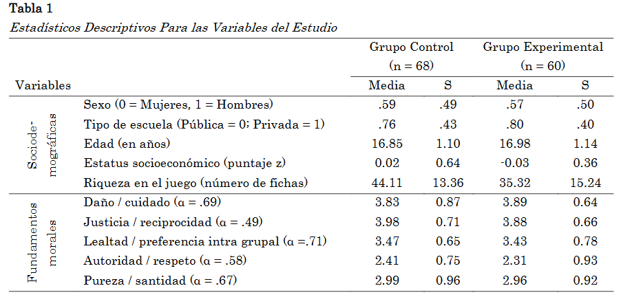

class: front


```{r eval=FALSE, include=FALSE}
# Correr esto para que funcione el infinite moonreader, el root folder debe ser static para si dirigir solo "bajndo" en directorios hacia el bib y otros

xaringan::inf_mr('/static/docpres/02_bases/2mlmbases.Rmd')

o en RStudio:
  - abrir desde carpeta root del proyecto
  - Addins-> infinite moon reader
```


```{r setup, include=FALSE, cache = FALSE}
require("knitr")
options(htmltools.dir.version = FALSE)
pacman::p_load(RefManageR)
# bib <- ReadBib("../../bib/electivomultinivel.bib", check = FALSE)
opts_chunk$set(warning=FALSE,
             message=FALSE,
             echo=FALSE,
             cache = FALSE, fig.width=7, fig.height=5.2)
pacman::p_load(flipbookr, tidyverse)
```


```{r xaringanExtra, include=FALSE}
xaringanExtra::use_xaringan_extra(c("tile_view", "animate_css"))
xaringanExtra::use_scribble()

```

<!---
Para correr en ATOM
- open terminal, abrir R (simplemente, R y enter)
- rmarkdown::render('static/docpres/07_interacciones/7interacciones.Rmd', 'xaringan::moon_reader')

About macros.js: permite escalar las imágenes como [scale 50%](path to image), hay si que grabar ese archivo js en el directorio.
--->

.pull-left[
# Metodología I
## **Kevin Carrasco**
## Magister en Ciencias Sociales FACSO - UChile
## 1er Sem 2025
## [.green[metod1-mcs.netlify.com]](https://metod1-mcs.netlify.com)
] 
    

.pull-right[
.right[
<br>
## .yellow[Sesión 5: Análisis descriptivo de datos]


]

]


---

layout: true
class: animated, fadeIn


---
class: inverse, bottom, right, animated, slideInRight


# .red[Sesión 5]
<br>

Repaso sesión anterior

Análisis descriptivo de datos

<br>
<br>
<br>
<br>
---
class: inverse, bottom, right


# .red[Sesión 5]
<br>

.yellow[Repaso sesión anterior]

Análisis descriptivo de datos
<br>
<br>
<br>
<br>
---

## Variables en una base de datos

- La investigación, usualmente, se centra en definir variables de interés

- Usando una perspectiva cuantitativa podemos **describir, resumir y modelar** el comportamiento de estas variables

- Para realizar estos procedimientos debemos **cuantificar** los fenómenos sociales

- Esto es lo que conocemos como el proceso de **operacionalización**

---

## Variables en una base de datos

- ¿Qué hacer después con estas variables?

--

- El análisis de datos sociales se basa en establecer **relaciones matemáticas** entre las variables.

---
## Operacionalización

* Proceso de definición de la medición de un fenómeno que no se puede medir directamente, aunque su existencia se infiere de otros fenómenos

--

- Las variables pueden ser visibles o no visibles/latentes. (Ej: peso / inteligencia)

---
## Operacionalización

.center[]

---
## Operacionalización

.center[]

---
## Operacionalización

.center[]
---
## Operacionalización

.center[]

---
## Escalas de medición de variables

- NOIR: Nominal, Ordinal, Intervalar, Razón

.small[
| Tipo       	| Características                     	        | Propiedad de números 	| Ejemplo|
|------------	|----------------------------------------------|---------------	|-----------	|
| *Nominal*    	| Uso de números en lugar de palabras 	| Identidad            	| Nacionalidad      	|
| *Ordinal*    	| Números se usan para ordenar series 	| + ranking            	| Nivel educacional 	|
| *Intervalar* 	| Intervalos iguales entre números    	| + igualdad           	| Temperatura       	|
| *Razón*      	| Cero real                           	| + aditividad         	| Distancia         	|
]

---
## Escalas de medición de variables


.small[
| Tipo        	| Operación empírica           	        | Estadísticos permisibles 	| 
|-------------	|----------------------------------------------|---------------	|
| *Nominal*    	| Determinación de igualdad 	| Contar; Moda 	| 
| *Ordinal*    	| Determinación de más o menos 	| Mediana; Percentil      | 
| *Intervalar* 	| Determinación de igualdad de intervalos | Promedio; Desv. Estand. | 
| *Razón*      	| Determinación de igualdad de razones	| Coeficientes de variación	| 
]

---
## Escalas de medición de variables

Siempre tenemos que considerar a qué nivel corresponde el constructo que queremos medir

- Por ejemplo, si bien es posible medir *estado de ánimo* a un nivel nominal u ordinal, una medición a nivel intervalar es más adecuada

- Por lo tanto, esta decisión es teórica. Depende de la operacionalización que hagamos de los fenómenos.

- Conocer los niveles de medición permite saber qué tipos de análisis podemos realizar con los datos

---
class: inverse, bottom, right


# .red[Sesión 5]
<br>

Repaso sesión anterior

.yellow[Análisis descriptivo de datos]
<br>
<br>
<br>
<br>

---
## Análisis descriptivo de datos

- La estadística es el lenguaje para comunicar información basada en datos cuantitativos

- La estadística descriptiva permite sintetizar o resumir los datos obtenidos a partir de un conjunto de observaciones

- Eventualmente, con estadística inferencial se pueden realizar procesos que permiten, dentro de ciertos rangos de confianza, determinar el comportamiento de la población que es representada por la muestra

---
## Análisis descriptivo de datos

Indicadores que describen distintos aspectos de las observaciones realizadas

- Tremendamente importantes para explorar y presentar los resultados de un estudio (describiendo el comportamiento de una muestra)

- Son los indicadores sobre los cuales se realiza estadística inferencial (se infiere a la población)

---

## Análisis descriptivo de datos

- Los análisis estadísticos son estrategias para traducir la información obtenida a un formato que sea interpretable.

- Por mucho que miremos una base de datos, difícilmente vamos a poder entender qué significan esos números.

- La estrategia más sencilla es mostrar la información en un formato visual (gráficos) o en un esquema sintetizado (**tablas**)

---
## Tablas y gráficos

En general, cualquier tabla puede ser presentada en formato gráfico

- ¿Qué elegir?

- La decisión decisión depende de la cantidad de información presentada y el uso que vaya a darse a ella

- Los gráficos permiten una comprensión global más inmediata, las tablas una revisión más detallada

---
## Tablas de síntesis de resultados

- Al reportar los resultados de una investigación, es común construir tablas que resumen el comportamiento de una serie de variables

- La idea general es consensar la mayor cantidad de información evitando la redundancia de información

- Estas tablas se diseñan a partir de distintos análisis realizados sobre los datos, pero que apuntan a un área temática común. Por ejemplo: descripción demográfica de la muestra

---
## Tablas de síntesis de resultados

- Ejemplo:



.small[
.center[Fuente: Salgado, M. (2022) Altruismo y fundamentos morales en adolescentes: Un estudio experimental. Revista de Sociología]
]

---
## Tablas de frecuencia

- La forma más sencilla de presentar la información obtenida en un estudio es contabilizar el número de veces que aparece cada respuesta

- Este indicador se conoce como la frecuencia de aparición de cada respuesta ( $f$ )

- Cuando presentamos una variable indicando la frecuencia de aparición de cada uno de sus valores, tenemos una tabla de frecuencia

---
## Tablas de frecuencia

- Las frecuencias son, sin embargo, datos absolutos. No es fácil comparar los resultados de dos tablas con un N total de respuestas diferente

- Para hacer esas comparaciones, se utilizan medidas estandarizadas, esto es, transformaciones de los puntajes originales a escalas que sean las mismas en todas las tablas (y que permitan comparación)

---
## Tabulación de datos

Estandarizan los puntajes, permitiendo comparación

- Proporción (p)

$$p = \frac{f}{N} $$

- Porcentaje (%)

$$ \% = p \times 100 $$

---
## Tabulación de datos

Permiten analizar el comportamiento de la variable

- Frecuencias acumuladas

- Porcentajes acumulados

---
##  Tablas de frecuencia y datos acumulados 

Grado de Felicidad personas evaluadas

```{r tbl28, echo = FALSE}
tbl28 <- tibble::tribble(
~`Puntaje`, ~`f`, ~`F`, ~`p`, ~`%`, ~`% Ac`,
"Muy poco feliz","160","160","0.10","10.31","10.31",
"Poco feliz","398","558","0.26","25.64","35.95",
"Relativamente feliz","610","1168","0.39","39.30","75.26",
"Bastante feliz","310","1478","0.20","19.97","95.23",
"Muy feliz","74","1552","0.05","4.77","100",
"Total","1552"," ","1.00","100.0%"," "
)

kableExtra::kable_styling(knitr::kable(tbl28), font_size = 18)
```

---

##  Tablas de frecuencia 

¿La democracia es preferible a cualquier otra forma de gobierno?
(1, "completamente en desacuerdo"; a 7, "completamente de acuerdo")

```{r tbl29, echo = FALSE}
tbl29 <- tibble::tribble(
~`Puntaje`, ~`f`, ~`%`, ~`% asc`, ~`% des`,
"1","99","5.0%","5.0%","100.0%",
"2","44","2.2%","7.2%","95.0%",
"3","94","4.7%","11.9%","92.8%",
"4","212","10.7%","22.6%","88.1%",
"5","231","11.6%","34.2%","77.4%",
"6","415","20.9%","55.1%","65.8%",
"7","893","44.9%","100.0%","44.9%",
"Total","1988","100.0%","100.0%","100.0%"
)

kableExtra::kable_styling(knitr::kable(tbl29), font_size = 18)
```

---

## Medidas de tendencia Central

* **Moda**: valor que ocurre más frecuentemente

--

* **Mediana**: valor medio de la distribución ordenada. Si N es par, entonces es el promedio de los valores medios

--
* **Media** o promedio aritmético: suma de los valores dividido por el total de casos

---
## Medidas de tendencia Central

### Dispersión:

* **Varianza**: promedio de la suma de las diferencias del promedio al cuadrado

.center[]

---

.center[]

---

.center[]
---

.center[]

---

* **Desviación Estándar**:
  - Raiz Cuadrada de la varianza.

  - Expresada  en la mismas unidades que los puntajes de la escala original


---
class: middle, center

# Más sobre datos, variables y varianza en:

##-  [Moore: 1.Comprensión de los datos (1-54)](https://multivariada.netlify.app/docs/lecturas/moore_comprensiondelosdatos.pdf)

---
class: front

.pull-left[
# Metodología I
## **Kevin Carrasco**
## Magister en Ciencias Sociales FACSO - UChile
## 1er Sem 2025
## [.green[metod1-mcs.netlify.com]](https://metod1-mcs.netlify.com)
] 
    

.pull-right[
.right[
<br>
## .yellow[Sesión 4: Estadística descriptiva]


]

]
