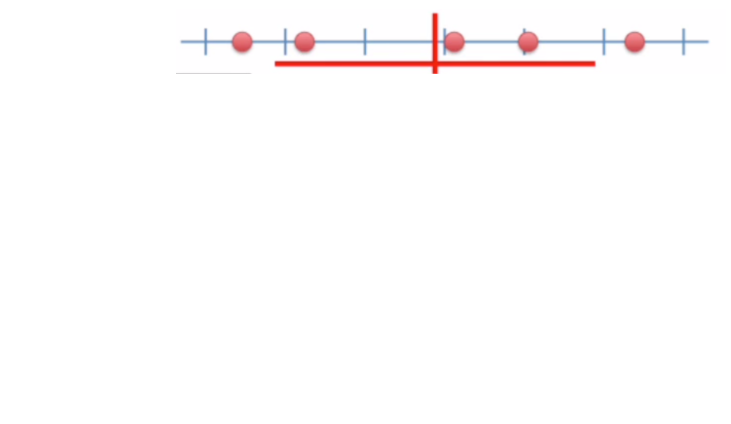

class: front

```{r eval=FALSE, include=FALSE}
# Correr esto para que funcione el infinite moonreader, el root folder debe ser static para si dirigir solo "bajndo" en directorios hacia el bib y otros

xaringan::inf_mr('/static/docpres/02_bases/2mlmbases.Rmd')

o en RStudio:
  - abrir desde carpeta root del proyecto
  - Addins-> infinite moon reader
```


```{r setup, include=FALSE, cache = FALSE}
require("knitr")
options(htmltools.dir.version = FALSE)
pacman::p_load(RefManageR)
# bib <- ReadBib("../../bib/electivomultinivel.bib", check = FALSE)
opts_chunk$set(warning=FALSE,
             message=FALSE,
             echo=FALSE,
             cache = FALSE, fig.width=7, fig.height=5.2)
pacman::p_load(flipbookr, tidyverse)
```


```{r xaringanExtra, include=FALSE}
xaringanExtra::use_xaringan_extra(c("tile_view", "animate_css"))
xaringanExtra::use_scribble()
```


<!---
Para correr en ATOM
- open terminal, abrir R (simplemente, R y enter)
- rmarkdown::render('static/docpres/07_interacciones/7interacciones.Rmd', 'xaringan::moon_reader')

About macros.js: permite escalar las imágenes como [scale 50%](path to image), hay si que grabar ese archivo js en el directorio.
--->


.pull-left[
# Métodos estadísticos para Ciencias Sociales III
## **Kevin Carrasco**
## Sociología - UNAB
## 2do semestre 2025
## .green[[metod3-unab.netlify.app](metod3-unab.netlify.app)] 
]

.pull-right[
.right[
<br>
## .yellow[Sesión 5: Regresión múltiple y estandarización de coeficientes]


]

]
---

layout: true
class: animated, fadeIn

---
class: inverse, bottom, right, animated, slideInRight


# .red[Sesión 5]
<br>

Repaso sesión anterior

Estandarización de coeficientes

<br>
<br>
<br>
<br>
---
class: inverse, bottom, right


# .red[Sesión 5]
<br>

.yellow[Repaso sesión anterior]

Estandarización de coeficientes

<br>
<br>
<br>
<br>

---
# Regresión simple vs múltiple

```{r echo=FALSE, results='hide'}
pacman::p_load(dplyr,
               corrplot,
               ggplot2,
               scatterplot3d,
               texreg,
              stargazer
)
datos=read.csv("ingedexp.csv", sep=",")
```

.small[
```{r}
reg_y_x1=lm(ingr ~ educ, data=datos)
reg_y_x2=lm(ingr ~ intelig, data=datos)
reg_y_x1_x2=lm(ingr ~ educ + intelig , data=datos)
```
]
.small[
```{r echo=FALSE, results='asis'}
htmlreg(list(reg_y_x1,reg_y_x2,reg_y_x1_x2), booktabs = TRUE, dcolumn = TRUE, doctype = FALSE, caption=" ")
```
]


---
# Parcialización

_¿Cómo se despeja la regresión de $Y$ en $X_1$ del efecto de $X_2$?_

.pull-left[
.center[]
]

--

.pull-right[
.center[]
]

---
.pull-left[
# Parcialización

.medium[
¿Como obtenemos una variable $X_1$ parcializada de $X_2$?
]

.center[
]
]
--

.pull-right[

<br>
<br>

.medium[
- Pensemos en que $X_1$ parcializada (de $X_2$ ) es todo lo de $X_1$ (varianza) que no tiene que ver con $X_2$

- En otras palabras, en un modelo donde $X_1$ es la variable dependiente y $X_2$ la independiente, $X_1$ parcializada equivale al **residuo** de esta regresión
]
]

---
class: inverse

## RESUMEN

- Si hay correlación entre predictores, el valor de los coeficientes de regresión será **distinto** en modelos simples y en modelos múltiples

- Esta diferencia se relaciona con el concepto de  **parcialización**: se extrae la varianza común entre predictores

- La parcialización permite el **control estadístico**: *limpiar* o despejar los efectos de la influencia de otras variables

---

### ejemplo
.small[

| Caso    | X (años educación)  | Y (nivel de ingresos)    | X - X̄ | Y - Ȳ  | (X - X̄) * (Y - Ȳ) |  (X - X̄)² |
|---------|---------------------|--------------------------|--------|--------|--------------------|------------|
| Caso 1  | 1                   | 250                      |    |   |              |     |
| Caso 2  | 2                   | 200                      |    |  |              |        |
| Caso 3  | 3                   | 250                      |    |   |              |        |
| Caso 4  | 4                   | 300                      |    |   |               |        |
| Caso 5  | 5                   | 400                      |    |    |               |        |
| Caso 6  | 6                   | 350                      |     |   |               |        |
| Caso 7  | 7                   | 400                      |     |    |              |        |
| Caso 8  | 8                   | 350                      |     |    |              |       |
| **Promedios / Sumas** | **X̄ = **| **Ȳ = **      |        |        | **Σ = **       | **Σ = ** |

]

---

### Otro ejemplo
.small[

| Caso    | X (años educación)  | Y (nivel de ingresos)    | X - X̄ | Y - Ȳ  | (X - X̄) * (Y - Ȳ) |  (X - X̄)² |
|---------|---------------------|--------------------------|--------|--------|--------------------|------------|
| Caso 1  | 1                   | 250                      | -3.5   | -62.5  | 218.75             | 12.25      |
| Caso 2  | 2                   | 200                      | -2.5   | -112.5 | 281.25             | 6.25       |
| Caso 3  | 3                   | 250                      | -1.5   | -62.5  | 93.75              | 2.25       |
| Caso 4  | 4                   | 300                      | -0.5   | -12.5  | 6.25               | 0.25       |
| Caso 5  | 5                   | 400                      | 0.5    | 87.5   | 43.75              | 0.25       |
| Caso 6  | 6                   | 350                      | 1.5    | 37.5   | 56.25              | 2.25       |
| Caso 7  | 7                   | 400                      | 2.5    | 87.5   | 218.75             | 6.25       |
| Caso 8  | 8                   | 350                      | 3.5    | 37.5   | 131.25             | 12.25      |
| **Promedios / Sumas** | **X̄ = 4.5**| **Ȳ = 312.5**      |        |        | **Σ = 1050**       | **Σ = 42** |

]
---

### Cálculo de coeficiente de regresión

$$b_{1}=\frac{\sum_{i=1}^{n}(x_i - \bar{x})(y_i - \bar{y})} {\sum_{i=1}^{n}(x_i - \bar{x})(x_i - \bar{x})}=\frac{1050} {42}=25$$

---
### Estimación de los coeficientes de la ecuación:

$$\bar{Y}=b_{0}+b_{1}\bar{X}$$
Reemplazando:

$$\bar{Y}=b_{0}+25\bar{X}$$

Despejando el valor de $b_{0}$

$$b_{0}=312.5-25*4.5=200$$
  - Una propiedad de la recta de regresión es que siempre pasa por las coordenadas X̄Ȳ. Esto es, pasa por los valores promedios de X e Y 

---
class: inverse

## Hasta ahora deberíamos saber:

--

1- Modelo de regresión como una **representación simplificada** de la relación compleja entre variables

--

2- El $\beta$ de regresión nos dice **cuanto aumenta $Y$ ** (variable dependiente) *en promedio* por ** cada punto que aumenta** $X$ (variable independiente).

--

3- El modelo nos permite **estimar** el puntaje de $Y$ para cada valor de $X$

---

# ¿Qué tan bueno es nuestro modelo?

- El cálculo del $\beta$ busca minimizar los residuos (de ahí "mínimos cuadrados ordinarios")

- Una vez minimizados los residuos, se puede evaluar el ajuste
  - qué tan bien representa nuestro modelo la realidad
  
  - cuánto error (de predicción) estamos cometiendo con nuestro modelo


---
class: inverse, right

## Un modelo es mejor mientras **mejor refleje** lo que sucede con los datos

--

## En otras palabras, cuando se parece o **ajusta** mejor a los datos

--

## ... y en otras: cuando los **residuos** son menores

---

# Varianza explicada de Y

¿Qué parte de la varianza de ingreso (Y) se asocia a educación? 

.center[]

---
# Varianza explicada de Y: $R^2$

- ¿Cuánto de los ingresos puedo predecir con educación (regresión) y cuánto me estoy equivocando (residuos)?

--

- el $R^2$
  - es la proporción de la varianza de Y que se asocia a X
  - varía entre 0 y 1, y se puede expresar en porcentaje

--

- Entonces, podemos descomponer la varianza de Y en 2: aquella asociada a X (regresión) y la que no se asocia a X (residuos) 

---

# Inferencia: la otra mitad de la regresión


- hasta ahora hemos interpretado solo la magnitud de los $\beta$ de regresión. Pero,

  - ¿son estos $\beta$ **_estadísticamente_** significativos?

  - es algo que podemos extrapolar de nuestra muestra a la población?

  - ... o es algo que se debe simplemente al azar?

---
# Inferencia y tablas de regresión

.content-box-red[
- las tablas de regresión tienen información sobre inferencia reportada de manera automática (errores estándar, niveles de probabilidad de error, etc)
]

--
.content-box-purple[

- sin embargo, antes de interpretar directamente esta información, es conveniente ahondar en cómo se obtiene esa información y cuál es su sentido
]
---
.pull-left-narrow[


]
.pull-right-wide[

## Conceptos claves de inferencia
- La **inferencia** en estadística se refiere a la relación que existe entre los resultados obtenidos basados en nuestra muestra y la población


]

--

- **¿En qué medida podemos hacer inferencias desde nuestra muestra a la población?**


--

- Un concepto central es la probabilidad de **ERROR**


---
# Bases de inferencia:

- dispersión: varianza y desviación estandar

- curva normal

- error estándar

---
.pull-left-narrow[
# Dispersión:
## Varianza
]

.pull-right-wide[


]


---
# Medidas de Dispersión

.pull-left[

## Varianza
<br>

<br>

## Desviación estándar
]

.pull-right[

$$s^2=\frac{\Sigma(x-\bar{x})²}{N-1}$$

<br>

$$s=\sqrt \frac{\Sigma(x-\bar{x})²}{N-1}$$]
---
.content-box-yellow[
## Desviación estándar y curva normal]

.center[]

---

.pull-left-narrow[


]

.pull-right-wide[
.content-box-purple[

## Desviación estándar y error estándar]
- más que el promedio de la variable en nuestra **muestra**, en inferencia nos interesa estimar en qué medida ese promedio da cuenta del promedio de la **población**


]

--

- contamos con **una muestra**, pero sabemos que otras muestras podrían haber sido extraídas, probablemente con distintos resultados.

---
# Error estándar


---
# Error estándar


---
# Error estándar


---

# Error estándar

- ¿Cómo calculamos el error estándar a partir de **una** muestra?

- Basados en el **teorema del límite central**, en muestras mayores a 30 la desviación estándar de los promedios (error estándar) equivale a:

$$\sigma_{\bar{X}}=SE(error estándar)=\frac{s}{\sqrt{N}}$$


---
# Error, rangos y probabilidad


.pull-left[
.medium[

- Nuestro promedio muestral $\bar{x}$ posee una distribución normal con una desviación estandar = SE (error estándar)

- Esto nos permite calcular una probabilidad de error basados en los valores de la curva normal

]
]
.pull-right[
.center[]]

---
# Error, rangos y probabilidad


.pull-left[
.medium[

- Por ejemplo, $\bar{x}$ +/- 2 SE abarca aproximadamente el 95% de los valores probables

- De otra manera, puedo dar un rango de valores donde se encuentra el promedio(+- 2 SE), con un nivel de confianza de 95%

- ... o con una probabilidad de error p<0.05

]
]
.pull-right[
.center[]]

---
# Inferencia y significación estadística

- ¿Con qué nivel de **probabilidad** estamos dispuest_s a aceptar que las diferencias (entre promedios) son distintas de 0?

- Por convención, una probabilidad de error (o valor *p*) de menos de 0.05 (1 de 20 veces)

- Esto significa una probabilidad de acierto/nivel de confianza de 95% (2 SE)

---

.center[]

---

## Volviendo a regresión

- el error estándar del promedio nos sirve como referencia cálculo de significación estadística de los coeficientes de regresión

--

- en regresión, las variables independientes poseen distintos niveles/valores, y queremos saber si las diferencias en Y de los valores de X son significativas = **estadísticamente distintas de 0**.

  - Ej: diferencias de ingreso (Y) entre hombres y mujeres (X)

---
# Inferencia y prueba de hipótesis

- La hipótesis nula (o $H_0$ ) se refiere a que las diferencias son = 0

- En regresión, $H_0$ dice que nuestro beta no es distinto de cero

- Por eso, queremos rechazar $H_0$ y para eso tenemos que establecer un nivel de probabilidad aceptable (al menos p<0.05)

---
## Prueba de hipótesis en regresión

Contrastamos la *hipótesis nula* (no hay asociación entre el predictor y la variable dependiente):

$$H_{0}: \beta_{j} = 0$$

En relación a la siguiente hipótesis alternativa:

$$H_{a}: \beta_{j} \neq 0$$

---
# Prueba T

- para **mayor precisión**, la prueba T nos permite establecer el nivel de error que estamos cometiendo al rechazar $H_0$

- para ello, T se ajusta por la cantidad de sujetos en la muestra (N), pero para un N>120 se aproxima a la distribución normal.


---
## Inferencia, diferencias y prueba _t_

.medium[
- La prueba _t_ se utiliza para inferencias sobre $\beta$  y básicamente es una razón entre

.center[]

- Ya que la diferencia esperada si $H_0$ es verdadera es 0, entonces:

$$t=\frac{b_j}{SE(b_j)}$$
]


---
# Pasos

1. obtener $\beta$

2. obtener SE (error estándar) de $\beta$

3.  calcular t: $t=\frac{b_j}{SE(b_j)}$

4. determinar la probabilidad de error asociada al valor t

---
# ¿Cómo utilizamos el valor T?

- T ( $\beta/SE$ ) se compara con un  **valor crítico**

- El valor crítico se obtiene de una tabla según el nivel de probabilidad de error $\alpha$ y los **grados de libertad** N-k-1 (siendo k el número de regresores)

- Si nuestro T observado > valor crítico de T, entonces rechazamos $H_0$ al nivel de confianza establecido

---
# Valor crítico de T


---
class: inverse

## Resumen: inferencia en regresión

- conceptos centrales: error estándar del $\beta$ y **valor T**

- el valor T se obtiene dividiendo el beta por el error estándar

- para muestras grandes, un T > 1.96 permite rechazar $H_0$ a un p<0.05, y T > 2.58 a un p>0.01

---
class: roja, bottom, right, slideInRight

# 4. Tabla de regresión


---
## Reporte de regresión múltiple

- en ocasiones se representa el modelo como una ecuación (opcional), y los resultados en una Tabla de Regresión

- la tabla posee ciertas características y contenidos mínimos que deben ser considerados en el reporte

- en R es posible automatizar el reporte en tablas, pero hay que agregar especificaciones para una visualización adecuada

---
.pull-left-narrow[
# Tabla de regresión

## con sjPlot
]

.pull-right-wide[
.smally[

```{r include=FALSE, echo=FALSE}
pacman::p_load(dplyr,readxl, summarytools, stargazer, equatiomatic, jtools)
data <- read.csv("https://multivariada.netlify.app/assignment/data/hsb2.csv")
data <- data %>% select (science,math,female, socst, read)
data <- data %>% rename(ciencia=science, matematicas =math, mujer=female, status=socst, lectura=read)
reg1 <- lm(ciencia ~ matematicas + lectura, data=data)
reg2 <- lm(ciencia ~ matematicas + lectura + mujer + status, data=data)
```


```{r}
sjPlot::tab_model(list(reg1,reg2),
                  show.se=TRUE,
                  show.ci=FALSE,
                  digits=3,
                  p.style = "stars",
                  dv.labels = c("Modelo 1", "Modelo 2"),
                  string.pred = "Predictores",
                  string.est = "β",
                  collapse.se = TRUE,
                  title = "Modelos de regresión para puntaje en ciencia <br> (Errores estándar entre paréntesis)")

```
]]

---


---
class: inverse, bottom, right

# .red[Sesión 5]
<br>

Repaso sesión anterior


.yellow[estandarización de coeficientes]

---

# Estandarización

## ¿Qué coeficiente es mayor que otro?

- usualmente, los coeficientes se encuentran en escalas diferentes

- para poder comparar la magnitud de un coeficiente en relación a los otros se requiere pasar a una escala común

- esto se efectúa mediante el proceso de **estandarización**

---
## Estandarización de Coeficientes

- Para poder expresar las variables en escalas comparables, sus valores se ponderan respecto de su desviación estándar.

- Para ello, a cada valor de la variable se le resta el promedio y se divide por su desviación estándar, lo que se conoce como **puntaje Z**:

$$z_x=\frac{x-\bar{x}}{sd(x)}$$

- Este procedimiento se aplica tanto a la dependiente como a las independientes

---
## Estandarización: interpretación

- al estandarizar, los coeficientes de regresión reflejan cuantas **desviaciones estándar** cambia _Y_ como consecuencia del cambio en **una desviación estándar** _X_.

- los coeficientes ahora son comparables entre sí en base a su magnitud

---
## Estandarización de Coeficientes

De la [Práctica 2 - regresión multiple](https://metod3-unab.netlify.app/practicos/practico-02):

- *colGPA*: promedio general de calificaciones de la universidad, en escala de 0 a 4 puntos.

- *hsGPA*: promedio general de calificaciones en la enseñanza media, en escala de 0 a 4 puntos

- *ACT* : puntaje en el examen de admisión a la universidad, que va de 16 a 33 puntos

---
## Estandarización de Coeficientes

Función `scale`

```{r echo=TRUE , eval=FALSE}
library(wooldridge)
data('gpa1') # Cargar base de datos
gpa1 <- dplyr::select(gpa1, colGPA, hsGPA, ACT)

col_model <- lm(colGPA ~ ACT + hsGPA, data = gpa1)

gpa1_std = data.frame(scale(gpa1))

col_model_std <- lm(colGPA ~ ACT + hsGPA, data = gpa1_std)

```

---
## Estandarización de Coeficientes

```{r echo=FALSE}
#sjPlot::tab_model(list(col_model,col_model_std),
 #       show.se=TRUE,
  #      show.ci=FALSE,
   #     digits=3,
    #    p.style = "scientific_stars",
     #   dv.labels = c("Modelo 1", "Modelo 2 (std)"),
      #  string.pred = "Predictores",
       # string.est = "β")
```
.center[

]


---
## Estandarización de Coeficientes


En este caso se puede observar que por el aumento en **una desviación estándar** en las calificaciones de enseñanza media (hsGPA), el promedio de notas en la universidad (colGPA) aumenta  **0.39 desviaciones estándar**.

Al estar en una misma unidad de medida, podemos comparar los coeficientes en términos de su tamaño.

En este caso, el coeficiente de hsGPA (0.39) es mayor que el de ACT (0.29), por lo que podemos inferir que las calificaciones de enseñanza media tienen un mayor efecto en el promedio universitario que el puntaje en el examen de admisión.

---
## Beta estandarizado o no estandarizado

- Betas: 
  - pueden aparecer en puntaje bruto (no estandarizado) o estandarizado

  - beta estandarizado: se interpreta como cuantas unidades de desviación estándar aumenta Y por cada aumento de una desviación estándar de X

 - betas estandarizados permiten comparar el efecto de cada variable independiente en una misma escala (desviaciones estándar)


---

.pull-left-narrow[
#Tabla de regresión múltiple:


## Sentido de presentación de modelos
]

.pull-right-wide[


.content-box-gray[
Se comienza ingresando variables de hipótesis principales]


.content-box-purple[
Modelos adicionales ingresan variables de hipótesis secundarias o variables de control]

.content-box-yellow[
La interpretación de la tabla se realiza en general para cada variable independiente a través de los modelos]
]


---

class: front

.pull-left[
# Métodos estadísticos para ciencias sociales III
## **Kevin Carrasco**
## Sociología - UNAB
## 2do Semestre 2025
## .green[[metod3-unab.netlify.com](metod3-unab.netlify.com)]
] 
    

.pull-right[
.right[
<br>
## .yellow[Sesión 5: Regresión múltiple y estandarización de coeficientes]


]

]


