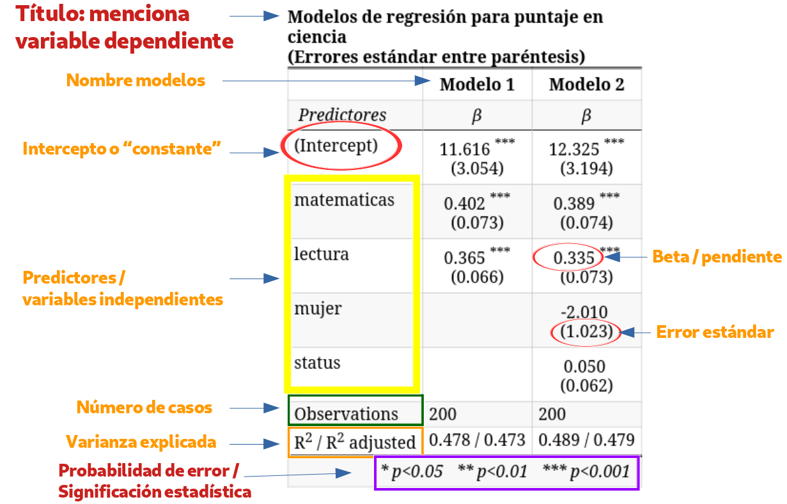

```{r}
#| label: setup
#| include: false
library(ggplot2)
library(knitr)
library(sjPlot)
library(dplyr)
library(sjmisc)

azul <- "#04245f"
azul_claro <- "#4f97ff"
rojo <- "#c0392b"

theme_set(theme_minimal(base_size = 16))

load(url("https://github.com/Kevin-carrasco/metod3-unab/raw/refs/heads/main/files/data/elsoc16-22.RData"))

elsoc <- elsoc_long_2016_2022.2 %>%
  filter(ola == 1) %>%
  select(d01_01, m01, m29, m0_edad) %>%
  set_na(., na = c(-999, -888, -777, -666)) %>%
  rename("estatus" = d01_01,
         "educacion" = m01,
         "ingreso" = m29,
         "edad" = m0_edad) %>%
  na.omit() %>%
  filter(ingreso >= 50000, ingreso <= 5000000) %>%
  mutate(ing100 = ingreso / 100000)

elsoc <- elsoc %>% select(estatus, educacion, ing100, edad)

e1 <- lm(estatus ~ educacion, data = elsoc)
e2 <- lm(estatus ~ educacion + ing100, data = elsoc)
e3 <- lm(estatus ~ educacion + ing100 + edad, data = elsoc)

elsoc_std <- data.frame(scale(elsoc))
e3_std <- lm(estatus ~ educacion + ing100 + edad, data = elsoc_std)

b_ed <- round(coef(e3)[2], 3)
b_in <- round(coef(e3)[3], 3)
b_ea <- round(coef(e3)[4], 4)

z_ed <- round(coef(e3_std)[2], 3)
z_in <- round(coef(e3_std)[3], 3)
z_ea <- round(coef(e3_std)[4], 3)

sd_ed <- round(sd(elsoc$educacion), 2)
sd_in <- round(sd(elsoc$ing100), 2)
sd_ea <- round(sd(elsoc$edad), 2)
sd_es <- round(sd(elsoc$estatus), 2)

n_elsoc <- nrow(elsoc)
r2_e3 <- round(summary(e3)$r.squared, 4)
r2_std <- round(summary(e3_std)$r.squared, 4)

# --- Segundo ejemplo: bienestar anímico ---
items <- paste0("s11_0", 1:9)

animo <- elsoc_long_2016_2022.2 %>%
  filter(ola == 1) %>%
  select(all_of(items), m01, m29, m0_edad) %>%
  set_na(., na = c(-999, -888, -777, -666)) %>%
  na.omit() %>%
  rename("educacion" = m01, "ingreso" = m29, "edad" = m0_edad) %>%
  filter(ingreso >= 50000, ingreso <= 5000000) %>%
  mutate(across(all_of(items), ~ .x - 1),
         ing100 = ingreso / 100000,
         sintomas = rowSums(across(all_of(items))))

animo <- animo %>% select(sintomas, educacion, ing100, edad)

a1 <- lm(sintomas ~ educacion + ing100 + edad, data = animo)
animo_std <- data.frame(scale(animo))
a1_std <- lm(sintomas ~ educacion + ing100 + edad, data = animo_std)

a_ed <- round(coef(a1)[2], 3)
a_in <- round(coef(a1)[3], 3)
a_ea <- round(coef(a1)[4], 4)
az_ed <- round(coef(a1_std)[2], 3)
az_in <- round(coef(a1_std)[3], 3)
az_ea <- round(coef(a1_std)[4], 3)
n_animo <- nrow(animo)
sd_sint <- round(sd(animo$sintomas), 2)
r2_a1 <- round(summary(a1)$r.squared * 100, 1)
p_ea_a <- round(summary(a1)$coefficients[4, 4], 3)
```

##  {data-background-color="black"}

::: {.columns .v-center-container}
::: {.column width="20%"}
{width="100%" fig-align="center"}
:::

::: {.column width="80%"}
### Métodos estadísticos para 
### Ciencias Sociales III

------------------------------------------------------------------------

### **Kevin Carrasco**
### Sociología - UNAB
### 2do Sem 2026
### [https://metod3-unab.netlify.app/](https://metod3-unab.netlify.app/)
:::
:::

# Sesión 5 {data-background-color="black"}

Repaso sesión anterior

Reporte de resultados

Estandarización de coeficientes

Síntesis del curso hasta aquí

## ¿Dónde quedamos?

::: {.incremental}

- La regresión múltiple incorpora varios predictores y **parcializa** cada uno respecto de los demás

- Por eso los coeficientes **cambian** entre modelos: agregar ingreso redujo el coeficiente de educación, agregar edad lo aumentó, y la edad incluso invirtió su signo

- Cada especificación responde a una **pregunta distinta**, y siempre debe explicitarse qué se está controlando

:::

## Inferencia

::: {.incremental}

- Nuestros datos son **una muestra**: la inferencia pregunta si lo observado permite afirmar algo sobre la **población**

- La hipótesis nula sostiene que en la población $\beta = 0$, es decir, que **no hay asociación**

- El **error estándar** mide la imprecisión del coeficiente: aumenta con residuos grandes, disminuye con más casos

- El estadístico $t = \beta / se(\beta)$ compara el coeficiente con su propia imprecisión

:::

## Reglas de decisión

::: {.incremental}

- Para muestras grandes: $t > 1{,}96$ permite rechazar $H_0$ a un $p<0{,}05$, y $t > 2{,}58$ a un $p<0{,}01$

- Equivalente: si el **intervalo de confianza no contiene el cero**, el coeficiente es significativo

- En las tablas: \* $p<0{,}05$, \*\* $p<0{,}01$, \*\*\* $p<0{,}001$

:::

##  {data-background-color="black"}

### Dos advertencias que conviene tener presentes

::: {.fragment .fade-up}

### El valor p **no** indica la magnitud ni la importancia del efecto

:::

::: {.fragment .fade-up}

### Con muestras grandes, coeficientes muy pequeños resultan significativos: significación estadística $\neq$ relevancia

:::


## Hoy

::: {.incremental}

- Ya sabemos estimar e interpretar. Ahora: ¿cómo se **comunican** estos resultados?

- Y una pregunta que quedó pendiente: si los predictores están en escalas distintas, ¿**cuál pesa más**?

- Al final, una síntesis de todo lo visto en estas cinco sesiones

:::


# Reporte de resultados {data-background-color="black"}

## Del output de R al reporte

::: {.incremental}

- La salida de `summary()` sirve para trabajar, no para publicar

- Un artículo, una tesis o un informe presentan los resultados en una **tabla de regresión**

- En R es posible automatizar ese reporte, pero se requieren especificaciones para lograr una presentación adecuada

- En ocasiones se acompaña de la **ecuación** del modelo, aunque esto es opcional

:::

## Contenidos mínimos de una tabla

::: {.incremental}

- Los **coeficientes** de cada predictor

- Una medida de precisión: **error estándar** o intervalo de confianza

- Indicación de **significación estadística** (asteriscos o valores p)

- El **número de casos** (N)

- Medidas de **ajuste**: $R^2$ y $R^2$ ajustado

- Nombres de variables **legibles**, no los códigos del cuestionario

:::

## Un ejemplo

{width="85%" fig-align="center"}

## Sentido de presentación de modelos

::: {.incremental}

- Se comienza ingresando las variables de la **hipótesis principal**

- Los modelos siguientes incorporan hipótesis secundarias o **variables de control**

- La interpretación de la tabla se realiza, en general, **para cada variable independiente a través de los modelos**, no modelo por modelo

- El objetivo es que el lector vea **qué le ocurre** al coeficiente de interés a medida que se agregan controles

:::

## Nuestro ejemplo

```{r}
#| label: modelos
#| echo: true
#| eval: false

e1 <- lm(estatus ~ educacion, data = elsoc)
e2 <- lm(estatus ~ educacion + ing100, data = elsoc)
e3 <- lm(estatus ~ educacion + ing100 + edad, data = elsoc)
```

```{r}
#| label: tab-basica
#| echo: false
#| results: asis

tab_model(list(e1, e2, e3),
          show.se = TRUE,
          show.ci = FALSE,
          digits = 3,
          p.style = "stars",
          dv.labels = c("Modelo 1", "Modelo 2", "Modelo 3"),
          pred.labels = c("(Intercepto)", "Nivel educacional",
                          "Ingreso (cientos de miles)", "Edad"),
          string.pred = "Predictores",
          string.est = "β")
```

## Opciones de `tab_model`

```{r}
#| label: opciones
#| echo: true
#| eval: false

sjPlot::tab_model(list(e1, e2, e3),
                  show.se = TRUE,        # mostrar errores estándar
                  show.ci = FALSE,       # ocultar intervalos de confianza
                  digits = 3,            # decimales
                  p.style = "stars",     # significación con asteriscos
                  collapse.se = TRUE,    # SE bajo el coeficiente
                  dv.labels = c("Modelo 1", "Modelo 2", "Modelo 3"),
                  pred.labels = c("(Intercepto)", "Nivel educacional",
                                  "Ingreso", "Edad"),
                  string.pred = "Predictores",
                  string.est = "β",
                  title = "Modelos de regresión para estatus social subjetivo")
```

::: {.small}
Los argumentos `dv.labels` y `pred.labels` son los que transforman una salida técnica en una tabla presentable
:::

## Errores frecuentes al reportar

::: {.incremental}

- Dejar los **códigos** del cuestionario como nombres de variables (`m01`, `d01_01`)

- Reportar demasiados decimales, o un número distinto en cada columna

- Omitir el N, sobre todo cuando **cambia** entre modelos por casos perdidos

- Interpretar el intercepto cuando el valor 0 no es plausible

- Confundir la significación estadística con la **magnitud** del efecto

:::

## Alternativa: gráfico de coeficientes

```{r}
#| label: fig-coef
#| echo: false
#| fig-width: 9
#| fig-height: 4.2

plot_model(e3,
           show.values = TRUE,
           value.offset = 0.3,
           title = "",
           vline.color = "grey60",
           axis.labels = c("Edad", "Ingreso", "Nivel educacional"))
```

::: {.small}
Útil para presentaciones. No reemplaza a la tabla en un reporte escrito
:::

# Estandarización de coeficientes {data-background-color="black"}

## El problema

Mirando la tabla anterior, ¿cuál de los tres predictores es **más importante**?

::: {.incremental}

- Nivel educacional: `r b_ed`

- Ingreso (cientos de miles): `r b_in`

- Edad: `r b_ea`

- ¿Significa esto que la educación importa 25 veces más que la edad?

:::

##  {data-background-color="black"}

### Los coeficientes están en **escalas distintas** y no son directamente comparables

## Escalas distintas

```{r}
#| label: escalas
#| echo: false

kable(data.frame(
  Variable = c("Estatus subjetivo", "Nivel educacional", "Ingreso (cientos de miles)", "Edad"),
  Unidad = c("peldaño (0-10)", "nivel (1-10)", "cien mil pesos", "año"),
  DE = c(sd_es, sd_ed, sd_in, sd_ea)
), digits = 2)
```

::: {.incremental}

- Un año más de edad es un cambio **muy pequeño** en su escala; un nivel educacional más es un cambio **grande** en la suya

- Comparar 0,161 con 0,0063 es comparar cantidades medidas en unidades diferentes

:::

## La solución: una escala común

::: {.incremental}

- Para comparar la magnitud de un coeficiente respecto de los otros se requiere pasar a una **escala común**

- Esto se efectúa mediante la **estandarización**

- Cada valor se pondera respecto de la desviación estándar de su propia variable

:::

## El puntaje Z

A cada valor se le resta el promedio y se divide por la desviación estándar:

$$z_x=\frac{x-\bar{x}}{sd(x)}$$

::: {.incremental}

- El resultado tiene media 0 y desviación estándar 1

- El procedimiento se aplica **tanto a la dependiente como a las independientes**

- Un valor de $z = 1$ significa "una desviación estándar por sobre el promedio"

:::

## Estandarización en R

```{r}
#| label: std
#| echo: true
#| eval: false

# La función scale() estandariza todas las variables de la base
elsoc_std <- data.frame(scale(elsoc))

e3_std <- lm(estatus ~ educacion + ing100 + edad, data = elsoc_std)
```

::: {.fragment .fade-up}

```{r}
#| label: check-std
#| echo: true

round(colMeans(elsoc_std), 3)
round(apply(elsoc_std, 2, sd), 3)
```

:::

## Comparación de modelos

```{r}
#| label: tab-std
#| echo: false
#| results: asis

tab_model(list(e3, e3_std),
          show.se = TRUE,
          show.ci = FALSE,
          digits = 3,
          p.style = "stars",
          dv.labels = c("No estandarizado", "Estandarizado"),
          pred.labels = c("(Intercepto)", "Nivel educacional",
                          "Ingreso", "Edad"),
          string.pred = "Predictores",
          string.est = "β")
```

## Interpretación

::: {.incremental}

- Al estandarizar, los coeficientes reflejan cuántas **desviaciones estándar** cambia $Y$ ante el cambio de **una desviación estándar** en $X$

- Nivel educacional (`r z_ed`): por cada desviación estándar adicional de educación, el estatus subjetivo aumenta `r z_ed` desviaciones estándar

- Ahora sí son comparables: educación (`r z_ed`) e ingreso (`r z_in`) tienen pesos similares, y ambos claramente mayores que edad (`r z_ea`)

:::

##  {data-background-color="black"}

### Lo que revela la estandarización

::: {.fragment .fade-up}

### En la escala original, el coeficiente del ingreso (`r b_in`) parecía casi despreciable frente al de educación (`r b_ed`)

:::

::: {.fragment .fade-up}

### Estandarizados, `r z_in` frente a `r z_ed`: el ingreso pesa casi tanto como la educación

:::

## ¿Qué NO cambia al estandarizar?

```{r}
#| label: r2-comp
#| echo: true

summary(e3)$r.squared
summary(e3_std)$r.squared
```

::: {.incremental}

- El $R^2$ es **idéntico**: estandarizar no altera el poder explicativo, solo la escala de los coeficientes

- Los valores $t$ y los niveles de significación tampoco cambian

- El intercepto pasa a ser 0, y deja de tener interpretación sustantiva

:::

## Ventajas

::: {.incremental}

- **Comparabilidad** entre predictores: permite identificar cuáles tienen mayor peso relativo

- Neutraliza escalas distintas, lo que resulta útil al combinar variables con unidades muy diferentes

- Facilita la interpretación en términos relativos

:::

## Desventajas

::: {.incremental}

- **Pérdida de interpretación sustantiva**: ya no se puede decir "un año más de edad implica tantos puntos"

- El intercepto deja de ser informativo

- En variables **dicotómicas**, la interpretación en desviaciones estándar es poco intuitiva

- Dificulta la comunicación a audiencias no especializadas

- Los coeficientes dependen de la variabilidad de **esta** muestra, por lo que no son comparables entre estudios con muestras distintas

:::

##  {data-background-color="black"}

### En la práctica

### Se reportan los coeficientes **no estandarizados** como resultado principal

### Y los estandarizados cuando la pregunta es explícitamente sobre **importancia relativa**

# Un segundo ejemplo {data-background-color="black"}

## La pregunta

::: {.incremental}

- La sociología de la salud estudia los **determinantes sociales del bienestar**: la idea de que la posición que se ocupa en la estructura social se asocia a diferencias sistemáticas en indicadores de salud

- La hipótesis clásica es la del **gradiente social**: a mayor posición socioeconómica, mejores indicadores de bienestar

- ¿Se observa ese gradiente en ELSOC?

:::

## La variable dependiente

::: {.incremental}

- ELSOC incluye una escala de nueve ítems sobre la frecuencia de distintos estados anímicos durante las últimas dos semanas

- Cada ítem se responde en una escala de frecuencia, aquí recodificada de 0 a 4

- La suma de los nueve ítems entrega un puntaje de **0 a 36**: a mayor valor, mayor frecuencia de estados anímicos negativos

- La construcción y validación de escalas de este tipo es materia de la última unidad del curso; por ahora la usamos como una variable ya construida

:::

## Los datos

`r n_animo` casos con información completa

```{r}
#| label: datos-animo
#| echo: true
#| eval: false

animo <- elsoc_long_2016_2022.2 %>%
  filter(ola == 1) %>%
  select(all_of(items), m01, m29, m0_edad) %>%
  set_na(., na = c(-999, -888, -777, -666)) %>%
  na.omit() %>%
  rename("educacion" = m01, "ingreso" = m29, "edad" = m0_edad) %>%
  filter(ingreso >= 50000, ingreso <= 5000000) %>%
  mutate(across(all_of(items), ~ .x - 1),
         ing100 = ingreso / 100000,
         sintomas = rowSums(across(all_of(items))))
```

## Descriptivos

```{r}
#| label: desc-animo
#| echo: false

kable(data.frame(
  Variable = c("Escala anímica (0-36)", "Nivel educacional (1-10)",
               "Ingreso (cientos de miles)", "Edad"),
  Media = c(mean(animo$sintomas), mean(animo$educacion),
            mean(animo$ing100), mean(animo$edad)),
  DE = c(sd(animo$sintomas), sd(animo$educacion),
         sd(animo$ing100), sd(animo$edad)),
  Min = c(min(animo$sintomas), min(animo$educacion),
          min(animo$ing100), min(animo$edad)),
  Max = c(max(animo$sintomas), max(animo$educacion),
          max(animo$ing100), max(animo$edad))
), digits = 2)
```

::: {.small}
Note el contraste de escalas: la dependiente recorre 37 valores posibles, la educación 10, y la edad más de 70
:::

## Correlaciones

```{r}
#| label: cor-animo
#| echo: false

kable(cor(animo), digits = 3)
```

::: {.fragment .fade-up}

Educación e ingreso se asocian **negativamente** con la escala, en la dirección que predice la hipótesis del gradiente social

:::

## El modelo

```{r}
#| label: modelo-animo
#| echo: true
#| eval: false

a1 <- lm(sintomas ~ educacion + ing100 + edad, data = animo)
```

```{r}
#| label: tab-animo
#| echo: false
#| results: asis

tab_model(a1,
          show.se = TRUE,
          show.ci = FALSE,
          digits = 3,
          p.style = "stars",
          dv.labels = c("Escala anímica"),
          pred.labels = c("(Intercepto)", "Nivel educacional",
                          "Ingreso (cientos de miles)", "Edad"),
          string.pred = "Predictores",
          string.est = "β")
```

## Interpretación

::: {.incremental}

- **Educación** (`r a_ed`): por cada nivel educacional adicional, el puntaje en la escala disminuye `r abs(a_ed)` puntos, a igual ingreso y edad

- **Ingreso** (`r a_in`): por cada cien mil pesos adicionales, el puntaje disminuye `r abs(a_in)` puntos, a igual educación y edad

- Ambos coeficientes son negativos y significativos: el gradiente social se observa

:::

## Un coeficiente no significativo

::: {.incremental}

- El coeficiente de la edad es `r a_ea`, con un valor p de `r p_ea_a`

- Al no alcanzar el umbral convencional, **no podemos rechazar** la hipótesis nula

- Lectura correcta: los datos no permiten afirmar que exista asociación entre edad y esta escala, una vez controlados educación e ingreso

- Lectura **incorrecta**: "se demostró que la edad no tiene efecto". No rechazar $H_0$ no equivale a probar que $H_0$ sea verdadera

:::

## ¿Cuál pesa más?

En la escala original, la educación (`r a_ed`) parece tener un efecto más de tres veces mayor que el ingreso (`r a_in`). Estandaricemos:

```{r}
#| label: tab-animo-std
#| echo: false
#| results: asis

tab_model(list(a1, a1_std),
          show.se = TRUE,
          show.ci = FALSE,
          digits = 3,
          p.style = "stars",
          dv.labels = c("No estandarizado", "Estandarizado"),
          pred.labels = c("(Intercepto)", "Nivel educacional",
                          "Ingreso", "Edad"),
          string.pred = "Predictores",
          string.est = "β")
```

## La conclusión cambia

::: {.incremental}

- Estandarizados: educación `r az_ed`, ingreso `r az_in`

- La distancia entre ambos se reduce considerablemente

- La impresión de que la educación importaba mucho más que el ingreso era, en buena medida, un **efecto de las unidades de medida**

- Igual que en el ejemplo anterior: los coeficientes en escala original no sirven para comparar importancia relativa

:::

## Cómo se reporta

::: {.small}

> Se estimó un modelo de regresión lineal sobre una escala sumativa de estados anímicos (rango 0-36), con datos de la primera ola de ELSOC (2016; N = `r n_animo`). Tanto el nivel educacional (β = `r a_ed`) como el ingreso del hogar (β = `r a_in`) presentan asociaciones negativas y estadísticamente significativas, consistentes con la hipótesis del gradiente social. La edad no alcanza significación estadística (p = `r p_ea_a`) una vez controladas las restantes variables. Los coeficientes estandarizados (`r az_ed` y `r az_in`, respectivamente) indican pesos relativos similares para ambos predictores, pese a que sus coeficientes en escala original difieren en un factor cercano a tres. El modelo explica un `r r2_a1`% de la varianza.

:::

## Lo que enseña este ejemplo

::: {.incremental}

1. Un predictor puede resultar **no significativo**, y eso también es un resultado que se reporta e interpreta

2. La comparación de magnitudes en escala original puede ser francamente engañosa

3. La estandarización responde a una pregunta específica, la de la **importancia relativa**, y no a la de significación ni a la de ajuste

:::

# Síntesis de las cinco sesiones {data-background-color="black"}

## El recorrido

::: {.incremental}

- **Sesión 1**: qué es investigar cuantitativamente, cómo se organizan los datos, escalas de medición, correlación

- **Sesión 2**: de las medias condicionales a la recta, estimación de $b_0$ y $b_1$ por mínimos cuadrados

- **Sesión 3**: bondad de ajuste ($R^2$) e inferencia

- **Sesión 4**: regresión múltiple, parcialización y control estadístico

- **Sesión 5**: reporte de resultados y estandarización

:::

## Objetivos centrales del modelo de regresión

::: {.incremental}

1. **Conocer**: la variación de la variable dependiente de acuerdo a la variación de otra(s) variable(s) independiente(s)

2. **Predecir**: estimar el valor de una variable (dependiente) de acuerdo al valor de otra(s)

3. **Inferir**: establecer en qué medida esta asociación es estadísticamente significativa

:::

## El modelo, en una línea

$$\widehat{Y}=b_{0} + b_{1}X_{1} + b_{2}X_{2} + \dots + b_{k}X_{k}$$

::: {.incremental}

- $\widehat{Y}$: valor predicho de la variable dependiente

- $b_0$: valor esperado de $Y$ cuando todas las independientes valen 0

- $b_j$: cambio esperado en $Y$ por cada unidad de $X_j$, manteniendo constantes las demás

- $e_i = Y_i - \widehat{Y}_i$: residuo, lo que el modelo no logra explicar

:::

## Glosario I: estimación

::: {.small}

| Concepto | Qué es | Cómo se dice |
|---|---|---|
| Intercepto | Valor de $Y$ cuando $X = 0$ | "Cuando el predictor vale cero, el valor esperado es..." |
| Coeficiente | Cambio en $Y$ por unidad de $X$ | "Por cada unidad adicional de X, Y cambia en..." |
| Valor predicho | Estimación de $Y$ para un caso | "El modelo predice un valor de..." |
| Residuo | Observado menos predicho | "Esta persona está por sobre lo que predice el modelo" |
| Mínimos cuadrados | Criterio que minimiza $\sum e_i^2$ | "La recta que minimiza los errores al cuadrado" |
| Media condicional | Promedio de $Y$ para un valor de $X$ | "El promedio de Y entre quienes tienen X = 5" |

:::

## Glosario II: ajuste

::: {.small}

| Concepto | Qué es | Cómo se dice |
|---|---|---|
| $SS_{tot}$ | Variación total de $Y$ | Suma de cuadrados totales |
| $SS_{reg}$ | Variación asociada al modelo | Suma de cuadrados de regresión |
| $SS_{error}$ | Variación no explicada | Suma de cuadrados del error |
| $R^2$ | $SS_{reg}/SS_{tot}$ | "El modelo explica un X% de la varianza" |
| $R^2$ ajustado | $R^2$ penalizado por número de predictores | Se usa para comparar modelos |

:::

## Glosario III: inferencia

::: {.small}

| Concepto | Qué es | Cómo se dice |
|---|---|---|
| Error estándar | Imprecisión del coeficiente | "El coeficiente se estima con un error de..." |
| Hipótesis nula | $\beta = 0$ en la población | "No hay asociación en la población" |
| Estadístico $t$ | Coeficiente dividido por su error estándar | Se compara con el valor crítico |
| Valor crítico | Umbral de la distribución $t$ | 1,96 al 95%; 2,58 al 99% |
| Valor p | Probabilidad del resultado bajo $H_0$ | "Significativo al 95% de confianza" |
| Intervalo de confianza | Rango plausible del parámetro | "Si no contiene el cero, es significativo" |

:::

## Glosario IV: regresión múltiple

::: {.small}

| Concepto | Qué es | Cómo se dice |
|---|---|---|
| Parcialización | Extraer de un predictor lo que comparte con otros | "Una vez descontado lo que comparte con..." |
| Control estadístico | Comparar casos equivalentes en las demás variables | "Manteniendo constantes las demás variables" |
| Modelos anidados | Cada modelo contiene los predictores del anterior | "Al incorporar el segundo predictor..." |
| Variable omitida | Predictor relevante ausente del modelo | El coeficiente estimado absorbe su efecto |
| Colinealidad | Predictores muy correlacionados entre sí | Aumenta los errores estándar |
| Coeficiente estandarizado | Cambio en DE de $Y$ por una DE de $X$ | Permite comparar importancia relativa |

:::

## Cómo leer una tabla de regresión

::: {.incremental}

1. Identificar la **variable dependiente** y las unidades en que está medida

2. Revisar qué predictores entran en **cada modelo**

3. Leer el coeficiente de interés: signo, magnitud y significación

4. Seguir ese coeficiente **a través de los modelos** y explicar sus cambios

5. Revisar el $R^2$ y el N

6. Traducir el resultado a lenguaje sustantivo

:::


## Cinco frases que evitar

::: {.incremental}

1. "La educación **causa** un aumento del estatus" (asociación, no causalidad)

2. "El efecto es **muy significativo**" (o es significativo o no lo es)

3. "El $R^2$ es bajo, por lo tanto el modelo **está mal**"

4. "El coeficiente de educación es mayor que el de edad, por lo que **importa más**" (escalas distintas)

5. "La edad **no tiene efecto**" cuando el resultado es no significativo

:::

## Para la prueba

::: {.incremental}

- Se evalúa **interpretación**, no cálculo computacional.

- deberán estimar un coeficiente de regresión e interpretarlo.

- Habrá tablas de regresión que deberán leer, interpretar y comentar.

- Conviene poder explicar, en lenguaje propio, qué significa cada columna de una tabla.

- Y poder justificar por qué un coeficiente cambia entre dos modelos.

:::

## Para la próxima sesión

- **Prueba 1**: lunes 7 de septiembre a las 15:00

- Contenidos: sesiones 1 a 5, es decir, regresión simple y múltiple, estimación e interpretación de coeficientes, bondad de ajuste e inferencia

##  {data-background-color="black"}

::: {.columns .v-center-container}
::: {.column width="20%"}
{width="80%" fig-align="right"}
:::

::: {.column width="80%"}
### Métodos estadísticos para Ciencias Sociales III

------------------------------------------------------------------------

### **Kevin Carrasco**
### Sociología - UNAB
### 2do Sem 2026
### [https://metod3-unab.netlify.app/](https://metod3-unab.netlify.app/)
:::
:::
