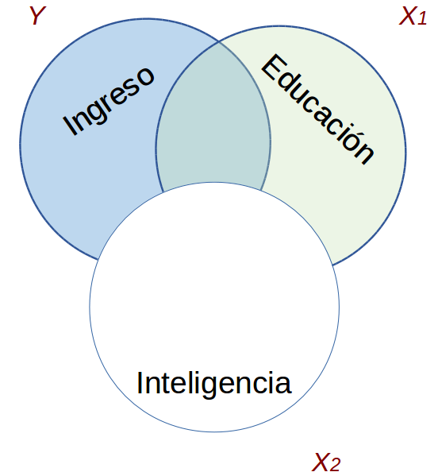
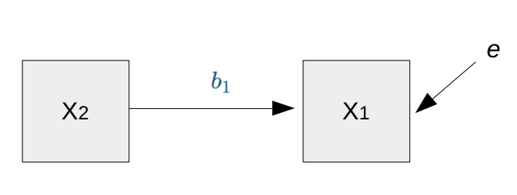
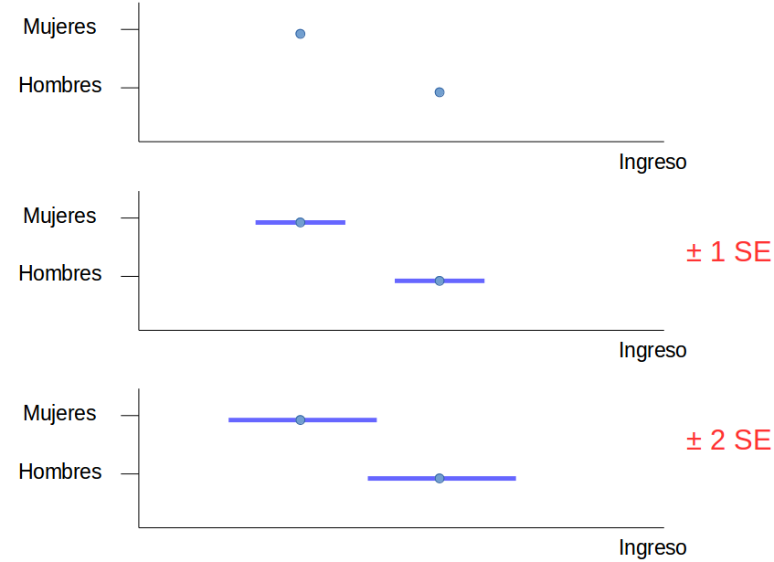
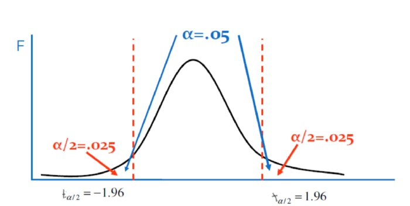

class: front

```{r eval=FALSE, include=FALSE}
# Correr esto para que funcione el infinite moonreader, el root folder debe ser static para si dirigir solo "bajndo" en directorios hacia el bib y otros

xaringan::inf_mr('/static/docpres/02_bases/2mlmbases.Rmd')

o en RStudio:
  - abrir desde carpeta root del proyecto
  - Addins-> infinite moon reader
```


```{r setup, include=FALSE, cache = FALSE}
require("knitr")
options(htmltools.dir.version = FALSE)
pacman::p_load(RefManageR)
# bib <- ReadBib("../../bib/electivomultinivel.bib", check = FALSE)
opts_chunk$set(warning=FALSE,
             message=FALSE,
             echo=FALSE,
             cache = FALSE, fig.width=7, fig.height=5.2)
pacman::p_load(flipbookr, tidyverse)
```


```{r xaringanExtra, include=FALSE}
xaringanExtra::use_xaringan_extra(c("tile_view", "animate_css"))
xaringanExtra::use_scribble()
```


<!---
Para correr en ATOM
- open terminal, abrir R (simplemente, R y enter)
- rmarkdown::render('static/docpres/07_interacciones/7interacciones.Rmd', 'xaringan::moon_reader')

About macros.js: permite escalar las imágenes como [scale 50%](path to image), hay si que grabar ese archivo js en el directorio.
--->


.pull-left[
# Métodos estadísticos para Ciencias Sociales III
## **Kevin Carrasco**
## Sociología - UNAB
## 2do semestre 2025
## .green[[metod3-unab.netlify.app](metod3-unab.netlify.app)] 
]

.pull-right[
.right[
<br>
## .yellow[Sesión 6: Regresión múltiple y estimación de valores predichos]


]

]
---

layout: true
class: animated, fadeIn

---
class: inverse, bottom, right, animated, slideInRight


# .red[Sesión 6]
<br>

Repaso sesión anterior

Estimación de valores predichos

<br>
<br>
<br>
<br>
---
class: inverse, bottom, right


# .red[Sesión 6]
<br>

.yellow[Repaso sesión anterior]

Estimación de valores predichos

<br>
<br>
<br>
<br>

---
# Regresión simple vs múltiple

```{r echo=FALSE, results='hide'}
pacman::p_load(dplyr,
               corrplot,
               ggplot2,
               scatterplot3d,
               texreg,
              stargazer
)
datos=read.csv("ingedexp.csv", sep=",")
```

.small[
```{r}
reg_y_x1=lm(ingr ~ educ, data=datos)
reg_y_x2=lm(ingr ~ intelig, data=datos)
reg_y_x1_x2=lm(ingr ~ educ + intelig , data=datos)
```
]
.small[
```{r echo=FALSE, results='asis'}
htmlreg(list(reg_y_x1,reg_y_x2,reg_y_x1_x2), booktabs = TRUE, dcolumn = TRUE, doctype = FALSE, caption=" ")
```
]


---
# Parcialización

_¿Cómo se despeja la regresión de $Y$ en $X_1$ del efecto de $X_2$?_

.pull-left[
.center[]
]

--

.pull-right[
.center[]
]

---
.pull-left[
# Parcialización

.medium[
¿Como obtenemos una variable $X_1$ parcializada de $X_2$?
]

.center[
]
]
--

.pull-right[

<br>
<br>

.medium[
- Pensemos en que $X_1$ parcializada (de $X_2$ ) es todo lo de $X_1$ (varianza) que no tiene que ver con $X_2$

- En otras palabras, en un modelo donde $X_1$ es la variable dependiente y $X_2$ la independiente, $X_1$ parcializada equivale al **residuo** de esta regresión
]
]

---
class: inverse

## RESUMEN

- Si hay correlación entre predictores, el valor de los coeficientes de regresión será **distinto** en modelos simples y en modelos múltiples

- Esta diferencia se relaciona con el concepto de  **parcialización**: se extrae la varianza común entre predictores

- La parcialización permite el **control estadístico**: *limpiar* o despejar los efectos de la influencia de otras variables

---

### ejemplo
.small[

| Caso    | X (años educación)  | Y (nivel de ingresos)    | X - X̄ | Y - Ȳ  | (X - X̄) * (Y - Ȳ) |  (X - X̄)² |
|---------|---------------------|--------------------------|--------|--------|--------------------|------------|
| Caso 1  | 1                   | 250                      |    |   |              |     |
| Caso 2  | 2                   | 200                      |    |  |              |        |
| Caso 3  | 3                   | 250                      |    |   |              |        |
| Caso 4  | 4                   | 300                      |    |   |               |        |
| Caso 5  | 5                   | 400                      |    |    |               |        |
| Caso 6  | 6                   | 350                      |     |   |               |        |
| Caso 7  | 7                   | 400                      |     |    |              |        |
| Caso 8  | 8                   | 350                      |     |    |              |       |
| **Promedios / Sumas** | **X̄ = **| **Ȳ = **      |        |        | **Σ = **       | **Σ = ** |

]

---

### Otro ejemplo
.small[

| Caso    | X (años educación)  | Y (nivel de ingresos)    | X - X̄ | Y - Ȳ  | (X - X̄) * (Y - Ȳ) |  (X - X̄)² |
|---------|---------------------|--------------------------|--------|--------|--------------------|------------|
| Caso 1  | 1                   | 250                      | -3.5   | -62.5  | 218.75             | 12.25      |
| Caso 2  | 2                   | 200                      | -2.5   | -112.5 | 281.25             | 6.25       |
| Caso 3  | 3                   | 250                      | -1.5   | -62.5  | 93.75              | 2.25       |
| Caso 4  | 4                   | 300                      | -0.5   | -12.5  | 6.25               | 0.25       |
| Caso 5  | 5                   | 400                      | 0.5    | 87.5   | 43.75              | 0.25       |
| Caso 6  | 6                   | 350                      | 1.5    | 37.5   | 56.25              | 2.25       |
| Caso 7  | 7                   | 400                      | 2.5    | 87.5   | 218.75             | 6.25       |
| Caso 8  | 8                   | 350                      | 3.5    | 37.5   | 131.25             | 12.25      |
| **Promedios / Sumas** | **X̄ = 4.5**| **Ȳ = 312.5**      |        |        | **Σ = 1050**       | **Σ = 42** |

]
---

### Cálculo de coeficiente de regresión

$$b_{1}=\frac{\sum_{i=1}^{n}(x_i - \bar{x})(y_i - \bar{y})} {\sum_{i=1}^{n}(x_i - \bar{x})(x_i - \bar{x})}=\frac{1050} {42}=25$$

---
### Estimación de los coeficientes de la ecuación:

$$\bar{Y}=b_{0}+b_{1}\bar{X}$$
Reemplazando:

$$\bar{Y}=b_{0}+25\bar{X}$$

Despejando el valor de $b_{0}$

$$b_{0}=312.5-25*4.5=200$$
  - Una propiedad de la recta de regresión es que siempre pasa por las coordenadas X̄Ȳ. Esto es, pasa por los valores promedios de X e Y 

---
class: inverse

## Hasta ahora deberíamos saber:

--

1- Modelo de regresión como una **representación simplificada** de la relación compleja entre variables

--

2- El $\beta$ de regresión nos dice **cuanto aumenta $Y$ ** (variable dependiente) *en promedio* por ** cada punto que aumenta** $X$ (variable independiente).

--

3- El modelo nos permite **estimar** el puntaje de $Y$ para cada valor de $X$

---

# ¿Qué tan bueno es nuestro modelo?

- El cálculo del $\beta$ busca minimizar los residuos (de ahí "mínimos cuadrados ordinarios")

- Una vez minimizados los residuos, se puede evaluar el ajuste
  - qué tan bien representa nuestro modelo la realidad
  
  - cuánto error (de predicción) estamos cometiendo con nuestro modelo


---
class: inverse, right

## Un modelo es mejor mientras **mejor refleje** lo que sucede con los datos

--

## En otras palabras, cuando se parece o **ajusta** mejor a los datos

--

## ... y en otras: cuando los **residuos** son menores

---

# Varianza explicada de Y

¿Qué parte de la varianza de ingreso (Y) se asocia a educación? 

.center[]

---
# Varianza explicada de Y: $R^2$

- ¿Cuánto de los ingresos puedo predecir con educación (regresión) y cuánto me estoy equivocando (residuos)?

--

- el $R^2$
  - es la proporción de la varianza de Y que se asocia a X
  - varía entre 0 y 1, y se puede expresar en porcentaje

--

- Entonces, podemos descomponer la varianza de Y en 2: aquella asociada a X (regresión) y la que no se asocia a X (residuos) 

---

# Inferencia: la otra mitad de la regresión


- hasta ahora hemos interpretado solo la magnitud de los $\beta$ de regresión. Pero,

  - ¿son estos $\beta$ **_estadísticamente_** significativos?

  - es algo que podemos extrapolar de nuestra muestra a la población?

  - ... o es algo que se debe simplemente al azar?


---
# Bases de inferencia:

- dispersión: varianza y desviación estandar

- curva normal

- error estándar

---
# Inferencia y significación estadística

- ¿Con qué nivel de **probabilidad** estamos dispuest_s a aceptar que las diferencias (entre promedios) son distintas de 0?

- Por convención, una probabilidad de error (o valor *p*) de menos de 0.05 (1 de 20 veces)

- Esto significa una probabilidad de acierto/nivel de confianza de 95% (2 SE)

---

.center[]

---

## Volviendo a regresión

- el error estándar del promedio nos sirve como referencia cálculo de significación estadística de los coeficientes de regresión

--

- en regresión, las variables independientes poseen distintos niveles/valores, y queremos saber si las diferencias en Y de los valores de X son significativas = **estadísticamente distintas de 0**.

  - Ej: diferencias de ingreso (Y) entre hombres y mujeres (X)

---
# Inferencia y prueba de hipótesis

- La hipótesis nula (o $H_0$ ) se refiere a que las diferencias son = 0

- En regresión, $H_0$ dice que nuestro beta no es distinto de cero

- Por eso, queremos rechazar $H_0$ y para eso tenemos que establecer un nivel de probabilidad aceptable (al menos p<0.05)

---
## Prueba de hipótesis en regresión

Contrastamos la *hipótesis nula* (no hay asociación entre el predictor y la variable dependiente):

$$H_{0}: \beta_{j} = 0$$

En relación a la siguiente hipótesis alternativa:

$$H_{a}: \beta_{j} \neq 0$$

---
# Prueba T

- para **mayor precisión**, la prueba T nos permite establecer el nivel de error que estamos cometiendo al rechazar $H_0$

- para ello, T se ajusta por la cantidad de sujetos en la muestra (N), pero para un N>120 se aproxima a la distribución normal.


---
# Valor crítico de T




---
class: inverse

## Resumen: inferencia en regresión

- conceptos centrales: error estándar del $\beta$ y **valor T**

- el valor T se obtiene dividiendo el beta por el error estándar

- para muestras grandes, un T > 1.96 permite rechazar $H_0$ a un p<0.05, y T > 2.58 a un p>0.01

---
class: roja, bottom, right, slideInRight

# 4. Tabla de regresión


---
## Reporte de regresión múltiple

- en ocasiones se representa el modelo como una ecuación (opcional), y los resultados en una Tabla de Regresión

- la tabla posee ciertas características y contenidos mínimos que deben ser considerados en el reporte

- en R es posible automatizar el reporte en tablas, pero hay que agregar especificaciones para una visualización adecuada

---
.pull-left-narrow[
# Tabla de regresión

## con sjPlot
]

.pull-right-wide[
.smally[

```{r include=FALSE, echo=FALSE}
pacman::p_load(dplyr,readxl, summarytools, stargazer, equatiomatic, jtools)
data <- read.csv("https://multivariada.netlify.app/assignment/data/hsb2.csv")
data <- data %>% select (science,math,female, socst, read)
data <- data %>% rename(ciencia=science, matematicas =math, mujer=female, status=socst, lectura=read)
reg1 <- lm(ciencia ~ matematicas + lectura, data=data)
reg2 <- lm(ciencia ~ matematicas + lectura + mujer + status, data=data)
```


```{r}
sjPlot::tab_model(list(reg1,reg2),
                  show.se=TRUE,
                  show.ci=FALSE,
                  digits=3,
                  p.style = "stars",
                  dv.labels = c("Modelo 1", "Modelo 2"),
                  string.pred = "Predictores",
                  string.est = "β",
                  collapse.se = TRUE,
                  title = "Modelos de regresión para puntaje en ciencia <br> (Errores estándar entre paréntesis)")

```
]]

---


---
## Beta estandarizado o no estandarizado

- Betas: 
  - pueden aparecer en puntaje bruto (no estandarizado) o estandarizado

  - beta estandarizado: se interpreta como cuantas unidades de desviación estándar aumenta Y por cada aumento de una desviación estándar de X

 - betas estandarizados permiten comparar el efecto de cada variable independiente en una misma escala (desviaciones estándar)


---
class: inverse, bottom, right

# .red[Sesión 5]
<br>

Repaso sesión anterior


.yellow[estimación de valores predichos]

---
## ¿Cuáles son los objetivos de un modelo de regresión?

--

* Es un modelo estadístico que se usa para:

  - **Conocer**: La relación de una variable dependiente de acuerdo a una/otras independiente(s)
  - **Predecir**: Estimar el valor de una variable dependiente de acuerdo al valor de otras
  - **Inferir**: si estas relaciones son estadísticamente significativas

---
```{r echo=FALSE}
data <- cbind(Educacion=c(1,2,3,4,5,6,7,8),
              Ingreso=c(250,240,230,220,300,380,450,520))
data <- as.data.frame(data)
```


.pull-left-narrow[
### Ejemplo ]

.pull-right-wide[
```{r}
data
```

]

---
.pull-left-narrow[
### Ejemplo ]

.pull-right-wide[
```{r echo=FALSE}
plot1<- ggplot2::ggplot(data, aes(x=Educacion, y=Ingreso))+
  geom_point(size=3)+
  scale_x_continuous(breaks = seq(0, 8, by = 1)) +
  scale_y_continuous(breaks = seq(0, 700, by = 100))+
  ylim(0,700)+
  xlim(0,8)

ggsave(plot1, file="../../files/img/plot1.png")
```

.pull-right-wide[]

]


---

.pull-left-narrow[
### Ejemplo ]

.pull-right-wide[
```{r warning=FALSE, message=FALSE}
plot2<- ggplot2::ggplot(data, aes(x=Educacion, y=Ingreso))+
  geom_point(size=3)+
  geom_smooth(method = "lm", se=FALSE)+
  scale_x_continuous(breaks = seq(0, 8, by = 1)) +
  scale_y_continuous(breaks = seq(0, 700, by = 100))+
  ylim(0,700)+
  xlim(0,8)

ggsave(plot2, file="../../files/img/plot2.png")
```

.pull-right-wide[]
]

---

### La recta de regresión


$$\widehat{Y}=b_{0} +b_{1}X$$

.small[
Donde

- $\widehat{Y}$ es el valor estimado de $Y$ (que se puede predecir)

- $b_{0}$ es el intercepto de la recta 
  - el valor de Y cuando X es 0
  - Debido a que es una estimación, es común que sea un valor sin sentido analítico (incluso negativo)

- $b_{1}$ es el coeficiente de regresión (pendiente de la recta), que nos dice cuánto aumenta Y por cada punto que aumenta X

]

---
### Estimación de los coeficientes de la ecuación:

$$\bar{Y}=b_{0}+b_{1}\bar{X}$$
Reemplazando:

$$\bar{Y}=b_{0}+25\bar{X}$$

Despejando el valor de $b_{0}$

$$b_{0}=200-0\bar{X}$$
---

.pull-left-narrow[
### Ejemplo 


*Por cada unidad que aumenta educación, ingreso aumenta en 25 unidades*
]

.pull-right-wide[
]

---

```{r}
reg1<-lm(Ingreso~Educacion, data=data)
```


```{r echo=FALSE}
data <- cbind(data,
              edad = c(25, 40, 20, 30, 25, 35, 45, 55))

reg2 <- lm(Ingreso~Educacion+edad, data = data)
```


```{r echo=FALSE}
data <- as.data.frame(cbind(data,
              Educacion_rec=c("Basica","Basica","Media","Media","Superior","Superior","Superior","Superior")))
reg3 <-lm(Ingreso~Educacion_rec, data=data)
```

¿y la interpretación para variables categóricas?

.pull-left[
.small[
```{r results='asis'}
texreg::knitreg(reg3, caption="",
                custom.coef.names = c("Intercepto",
                                     "Educación media",
                                     "Educación superior"))
```
]
]
--
.pull-right[
*Las personas que tienen educación superior ganan $167.5mil más en comparación con quienes tienen educación básica, efecto que es estadísticamente significativo (p<0.05)*

]

---
¿Cómo podemos predecir el valor esperado de una variable para una persona en particular?

.pull-left-narrow[
.small[
```{r results='asis'}
texreg::htmlreg(reg3, caption="",
                custom.coef.names = c("Intercepto",
                                     "Educación media",
                                     "Educación superior"))
```
]
]

.pull-right-wide[
$$\bar{Y}=b_{0}+b_{1}\bar{X}$$

Reemplazando:

$$\bar{Y}=245+b_{1}\bar{X}$$

¿Si una persona tuviera un nivel de educación superior?

$$\bar{Y}=245+167.5$$
$$\bar{Y}=412.5$$
]

---
.pull-left-narrow[
## Graficando
]

```{r}
plot3 <- ggeffects::ggpredict(reg3, terms = c("Educacion_rec")) %>%
  ggplot(aes(x=x, y=predicted)) +
  geom_bar(stat="identity", color="grey", fill="grey")+
  geom_errorbar(aes(ymin = conf.low, ymax = conf.high), width=.1) +
  labs(title="Educación", x = "", y = "") +
  theme_bw()

ggsave(plot3, file="../../files/img/plot3.png")

```

.pull-right-wide[


]

---
## Variables numéricas

```{r results='asis'}
reg4 <- lm(Ingreso~edad, data = data)
texreg::htmlreg(reg4, caption="")
```

---
.pull-left[
```{r}
plot4 <- ggeffects::ggpredict(reg2, terms="edad") %>%
  ggplot(mapping=aes(x = x, y=predicted)) +
  labs(title="Edad", x = "", y = "")+
  theme_bw() +
  geom_smooth()+
  geom_ribbon(aes(ymin = conf.low, ymax = conf.high), alpha = .2, fill = "black")

ggsave(plot4, file="../../files/img/plot4.png")
```


]


.pull-right[
$$\bar{Y}=b_{0}+b_{1}\bar{X}$$

Reemplazando:

$$\bar{Y}=52.51+b_{1}*7.89$$


¿Una persona de edad 40?

$$\bar{Y}=52.51+40*7.89$$
$$\bar{Y}=368.11$$
]
---
## Tips para la prueba

- Definiciones de conceptos clave: ¿Qué es el coeficiente de regresión? ¿Qué es parcialización? ¿Qué es el intercepto?

- Estimación (cálculo) del coeficiente de regresión

- Interpretación de tabla de regresión (intercepto, coeficientes de regresión, inferencia, control estadístico, R2)

---

### Ejemplos para estimar el coeficiente de regresión

.small[

| Caso    | X  |    | X - X̄ | Y - Ȳ  | (X - X̄) * (Y - Ȳ) |  (X - X̄)² |
|---------|---------------------|--------------------------|--------|--------|--------------------|------------|
| Caso 1  | 1                   | 2                     |    |   |              |     |
| Caso 2  | 2                   | 4                      |    |  |              |        |
| Caso 3  | 3                   | 6                      |    |   |              |        |
| Caso 4  | 4                   | 8                      |    |   |               |        |
| Caso 5  | 5                   | 10                     |    |    |               |        |
| **Promedios / Sumas** | **X̄ = **| **Ȳ = **      |        |        | **Σ = **       | **Σ = ** |

]

---


### Ejemplos para estimar el coeficiente de regresión

.small[

| Caso    | X  | Y    | X - X̄ | Y - Ȳ  | (X - X̄) * (Y - Ȳ) |  (X - X̄)² |
|---------|---------------------|--------------------------|--------|--------|--------------------|------------|
| Caso 1  | 1                   | 3                     |    |   |              |     |
| Caso 2  | 2                   | 6                      |    |  |              |        |
| Caso 3  | 3                   | 9                      |    |   |              |        |
| Caso 4  | 4                   | 12                      |    |   |               |        |
| Caso 5  | 5                   | 15                     |    |    |               |        |
| **Promedios / Sumas** | **X̄ = **| **Ȳ = **      |        |        | **Σ = **       | **Σ = ** |

]

---


### Ejemplos para estimar el coeficiente de regresión

.small[

| Caso    | X   | Y    | X - X̄ | Y - Ȳ  | (X - X̄) * (Y - Ȳ) |  (X - X̄)² |
|---------|---------------------|--------------------------|--------|--------|--------------------|------------|
| Caso 1  | 0                   | 5                     |    |   |              |     |
| Caso 2  | 1                   | 8                      |    |  |              |        |
| Caso 3  | 2                   | 11                      |    |   |              |        |
| Caso 4  | 3                   | 14                      |    |   |               |        |
| Caso 5  | 4                   | 17                     |    |    |               |        |
| **Promedios / Sumas** | **X̄ = **| **Ȳ = **      |        |        | **Σ = **       | **Σ = ** |

]

---

class: front

.pull-left[
# Métodos estadísticos para ciencias sociales III
## **Kevin Carrasco**
## Sociología - UNAB
## 2do Semestre 2025
## .green[[metod3-unab.netlify.com](metod3-unab.netlify.com)]
] 
    

.pull-right[
.right[
<br>
## .yellow[Sesión 6: Regresión múltiple y estimación de valores predichos]


]

]


