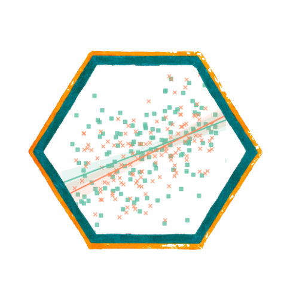
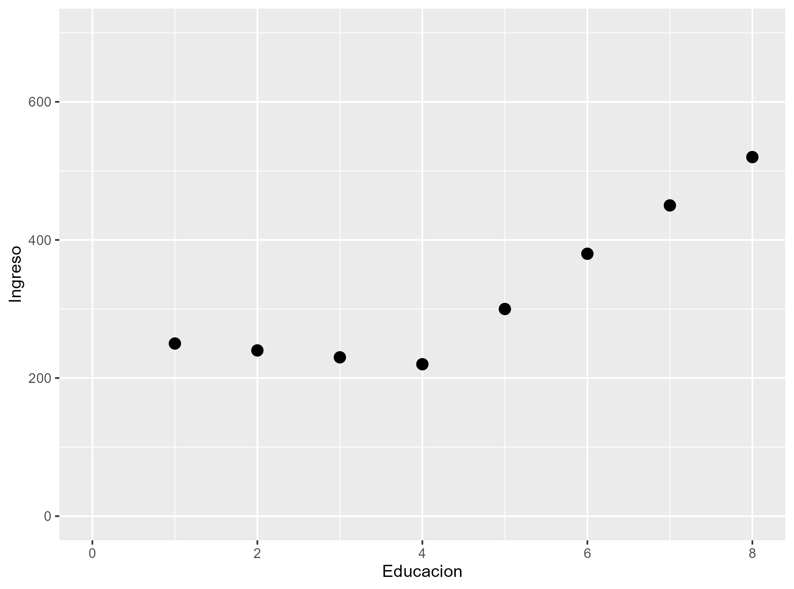
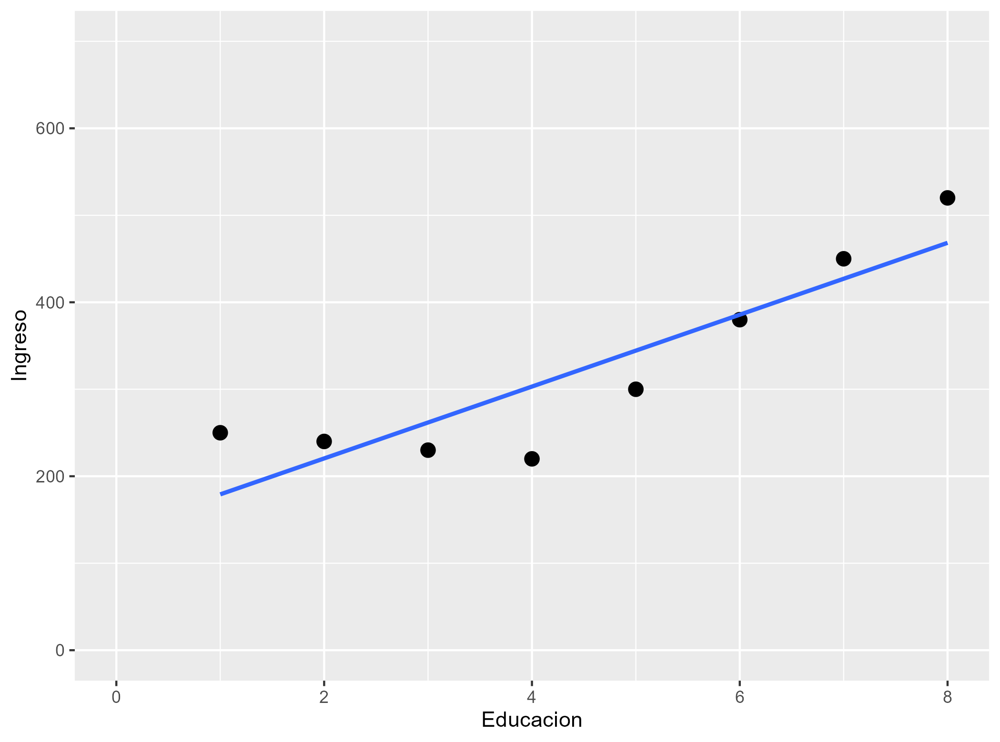
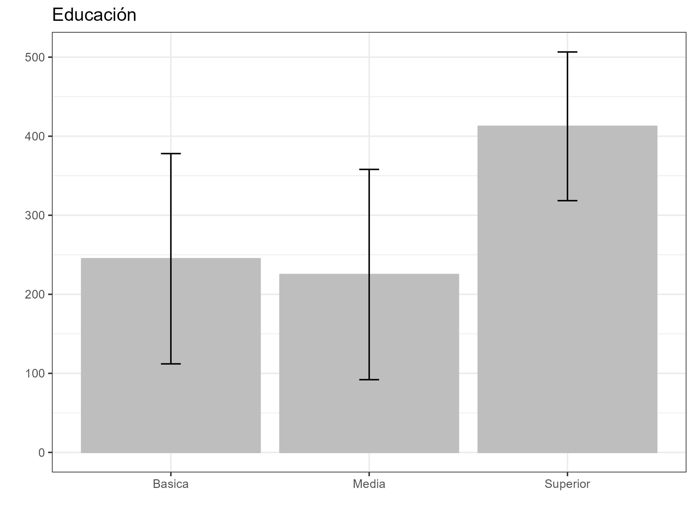
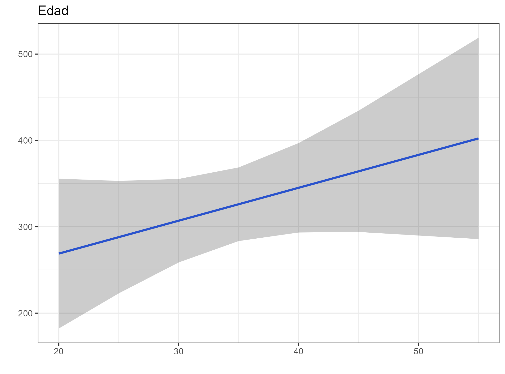
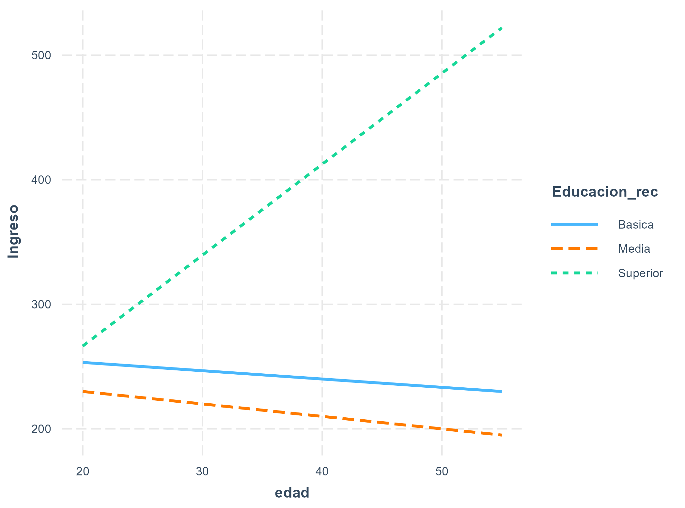
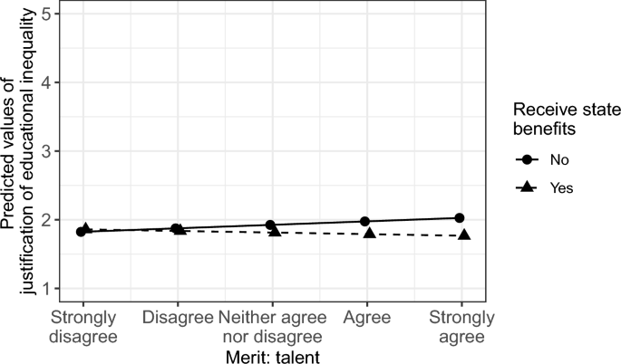

class: front

```{r eval=FALSE, include=FALSE}
# Correr esto para que funcione el infinite moonreader, el root folder debe ser static para si dirigir solo "bajndo" en directorios hacia el bib y otros

xaringan::inf_mr('/static/docpres/02_bases/2mlmbases.Rmd')

o en RStudio:
  - abrir desde carpeta root del proyecto
  - Addins-> infinite moon reader
```


```{r setup, include=FALSE, cache = FALSE}
require("knitr")
options(htmltools.dir.version = FALSE)
pacman::p_load(RefManageR)
# bib <- ReadBib("../../bib/electivomultinivel.bib", check = FALSE)
opts_chunk$set(warning=FALSE,
             message=FALSE,
             echo=FALSE,
             cache = FALSE, fig.width=7, fig.height=5.2)
pacman::p_load(flipbookr, tidyverse)
```


```{r xaringanExtra, include=FALSE}
xaringanExtra::use_xaringan_extra(c("tile_view", "animate_css"))
xaringanExtra::use_scribble()
```


<!---
Para correr en ATOM
- open terminal, abrir R (simplemente, R y enter)
- rmarkdown::render('static/docpres/07_interacciones/7interacciones.Rmd', 'xaringan::moon_reader')

About macros.js: permite escalar las imágenes como [scale 50%](path to image), hay si que grabar ese archivo js en el directorio.
--->


.pull-left[
# Métodos estadísticos para Ciencias Sociales III
## **Kevin Carrasco**
## Sociología - UNAB
## 2do semestre 2025
## .green[[metod3-unab.netlify.app](metod3-unab.netlify.app)] 
]

.pull-right[
.right[
<br>
## .yellow[Sesión 7: Estimación de valores predichos e interacciones]



]

]
---

layout: true
class: animated, fadeIn

---
class: inverse, bottom, right, animated, slideInRight


# .red[Sesión 7]
<br>

Revisión prueba

Repaso sesión anterior

Estimación de valores predichos

<br>
<br>
<br>
<br>

---
class: inverse, bottom, right


# .red[Sesión 7]
<br>

.yellow[Revisión prueba]

Repaso sesión anterior

Estimación de valores predichos

<br>
<br>
<br>
<br>

---
## 1a. ¿Cuáles son los tres objetivos de un modelo de regresión?

--

  - **Conocer**: La relación de una variable dependiente de acuerdo a una/otras independiente(s)
  - **Predecir**: Estimar el valor de una variable dependiente de acuerdo al valor de otras
  - **Inferir**: si estas relaciones son estadísticamente significativas
  
---
## 1b. ¿Qué se entiende por parcialización estadística en un modelo de regresión y cuál es su utilidad? (2p)

--

- La parcialización es el proceso mediante el cual se extrae la varianza común entre predictores en un modelo de regresión múltiple.

- Al parcializar, nos permite conocer el **efecto neto** que tiene una variable independiente sobre la dependiente.

---
## 1c. ¿Qué rol cumple la inferencia estadística en regresión, y qué nos permite concluir respecto a los coeficientes estimados? (2p)

--

- Extrapolar resultados desde la muestra a la población.

- En el contecto específico de los coeficientes estimados: con qué probabilidad de error podemos afirmar si las diferencias expresadas a partir del coeficiente de regresión son distintas de cero (si esque existen diferencias estadísticamente significativas)

---

.small[
| Caso    | X  | Y  | X - X̄ | Y - Ȳ | (X - X̄)(Y - Ȳ) | (X - X̄)² |
|---------|----|----|--------|-------|-----------------|-----------|
| Caso 1  | 2  | 6  | -3     | -6    | 18              | 9         |
| Caso 2  | 7  | 16 | 2      | 4     | 8               | 4         |
| Caso 3  | 4  | 10 | -1     | -2    | 2               | 1         |
| Caso 4  | 9  | 20 | 4      | 8     | 32              | 16        |
| Caso 5  | 1  | 4  | -4     | -8    | 32              | 16        |
| Caso 6  | 6  | 14 | 1      | 2     | 2               | 1         |
| Caso 7  | 3  | 8  | -2     | -4    | 8               | 4         |
| Caso 8  | 8  | 18 | 3      | 6     | 18              | 9         |
| **Promedios / Sumas** | **X̄ = 5** | **Ȳ = 12** |    |   | **Σ = 120**   | **Σ = 60** |
]

Y = 2 + 2X

---
2a. Estima el coeficiente de regresión e intercepto del modelo de regresión presentado anteriormente (2p)

--

Coeficiente: 2

Intercepto: 2

--

2b. Interpreta los valores obtenidos para el coeficiente de regresión y para el intercepto (2p)

--

Coeficiente: por cada unidad que aumenta X, Y aumenta en 2 unidades

Intercepto: Cuando X=0, el valor de Y es 2

---

.small[
|                         | Modelo 1   | Modelo 2   | Modelo 3   | 
|-------------------------|------------|------------|------------|
| **Intercepto**          | 8.60***    | 10.71***   | 8.19***    |
|                         | (0.21)     | (0.16)     | (0.29)     |
| **Edad**                | 0.12***    | 0.1***     | 0.1***     |
|                         | (0.00)     | (0.00)     | (0.00)     |
| **Educación media**     |            | -0.16      | 0.33       |
| *(Ref. Ed. básica)*     |            | (0.16)     | (0.17)     |
| **Educación superior**  |            | -0.38**    | 0.33       |
|                         |            | (0.17)     | (0.18)     |
| **Mujer**               |            |            | -0.33**    |
| *(Ref. Hombre)*         |            |            | (0.13)     |
| **R²**                  | 0.10       | 0.12       | 0.15       |
| **Adj. R²**             | 0.09       | 0.11       | 0.13       |
| **Num. obs.**           | 2915       | 2915       | 2915       |

***p < 0.001; **p < 0.01; *p < 0.05***
]

---
class: inverse, bottom, right


# .red[Sesión 7]
<br>

Revisión prueba

.yellow[Repaso sesión anterior]

Estimación de valores predichos

<br>
<br>
<br>
<br>

---
## ¿Cuáles son los objetivos de un modelo de regresión?

--

* Es un modelo estadístico que se usa para:

  - **Conocer**: La relación de una variable dependiente de acuerdo a una/otras independiente(s)
  - **Predecir**: Estimar el valor de una variable dependiente de acuerdo al valor de otras
  - **Inferir**: si estas relaciones son estadísticamente significativas

---
```{r echo=FALSE}
data <- cbind(Educacion=c(1,2,3,4,5,6,7,8),
              Ingreso=c(250,240,230,220,300,380,450,520))
data <- as.data.frame(data)
```


.pull-left-narrow[
### Ejemplo ]

.pull-right-wide[
```{r}
data
```

]

---
.pull-left-narrow[
### Ejemplo ]

.pull-right-wide[
```{r echo=FALSE}
plot1<- ggplot2::ggplot(data, aes(x=Educacion, y=Ingreso))+
  geom_point(size=3)+
  scale_x_continuous(breaks = seq(0, 8, by = 1)) +
  scale_y_continuous(breaks = seq(0, 700, by = 100))+
  ylim(0,700)+
  xlim(0,8)

ggsave(plot1, file="../../files/img/plot1.png")
```

.pull-right-wide[]

]


---

.pull-left-narrow[
### Ejemplo ]

.pull-right-wide[
```{r warning=FALSE, message=FALSE}
plot2<- ggplot2::ggplot(data, aes(x=Educacion, y=Ingreso))+
  geom_point(size=3)+
  geom_smooth(method = "lm", se=FALSE)+
  scale_x_continuous(breaks = seq(0, 8, by = 1)) +
  scale_y_continuous(breaks = seq(0, 700, by = 100))+
  ylim(0,700)+
  xlim(0,8)

ggsave(plot2, file="../../files/img/plot2.png")
```

.pull-right-wide[]
]

---
### Estimación de los coeficientes de la ecuación:

$$\bar{Y}=b_{0}+b_{1}\bar{X}$$
Reemplazando:

$$\bar{Y}=b_{0}+25\bar{X}$$

Despejando el valor de $b_{0}$

$$b_{0}=200-0\bar{X}$$
---

.pull-left-narrow[
### Ejemplo 


*Por cada unidad que aumenta educación, ingreso aumenta en 25 unidades*
]

.pull-right-wide[
]

---

```{r}
reg1<-lm(Ingreso~Educacion, data=data)
```


```{r echo=FALSE}
data <- cbind(data,
              edad = c(25, 40, 20, 30, 25, 35, 45, 55))

reg2 <- lm(Ingreso~Educacion+edad, data = data)
```


```{r echo=FALSE}
data <- as.data.frame(cbind(data,
              Educacion_rec=c("Basica","Basica","Media","Media","Superior","Superior","Superior","Superior")))
reg3 <-lm(Ingreso~Educacion_rec, data=data)
```

¿y la interpretación para variables categóricas?

.pull-left[
.small[
```{r results='asis'}
texreg::knitreg(reg3, caption="",
                custom.coef.names = c("Intercepto",
                                     "Educación media",
                                     "Educación superior"))
```
]
]
--
.pull-right[
*Las personas que tienen educación superior ganan $167.5mil más en comparación con quienes tienen educación básica, efecto que es estadísticamente significativo (p<0.05)*

]

---
¿Cómo podemos predecir el valor esperado de una variable para una persona en particular?

.pull-left-narrow[
.small[
```{r results='asis'}
texreg::htmlreg(reg3, caption="",
                custom.coef.names = c("Intercepto",
                                     "Educación media",
                                     "Educación superior"))
```
]
]

.pull-right-wide[
$$\bar{Y}=b_{0}+b_{1}\bar{X}$$

Reemplazando:

$$\bar{Y}=245+b_{1}\bar{X}$$

¿Si una persona tuviera un nivel de educación superior?

$$\bar{Y}=245+167.5$$
$$\bar{Y}=412.5$$
]

---
.pull-left-narrow[
## Graficando
]

```{r}
plot3 <- ggeffects::ggpredict(reg3, terms = c("Educacion_rec")) %>%
  ggplot(aes(x=x, y=predicted)) +
  geom_bar(stat="identity", color="grey", fill="grey")+
  geom_errorbar(aes(ymin = conf.low, ymax = conf.high), width=.1) +
  labs(title="Educación", x = "", y = "") +
  theme_bw()

ggsave(plot3, file="../../files/img/plot3.png")

```

.pull-right-wide[


]

---
## Variables numéricas

```{r results='asis'}
reg4 <- lm(Ingreso~edad, data = data)
texreg::htmlreg(reg4, caption="")
```

---
.pull-left[
```{r}
plot4 <- ggeffects::ggpredict(reg2, terms="edad") %>%
  ggplot(mapping=aes(x = x, y=predicted)) +
  labs(title="Edad", x = "", y = "")+
  theme_bw() +
  geom_smooth()+
  geom_ribbon(aes(ymin = conf.low, ymax = conf.high), alpha = .2, fill = "black")

ggsave(plot4, file="../../files/img/plot4.png")
```


]


.pull-right[
$$\bar{Y}=b_{0}+b_{1}\bar{X}$$

Reemplazando:

$$\bar{Y}=52.51+b_{1}*7.89$$


¿Una persona de edad 40?

$$\bar{Y}=52.51+40*7.89$$
$$\bar{Y}=368.11$$
]

---
## Interacciones

- Útil para analizar en qué medida el efecto de una variable (ej. edad) sobre otra (ingresos) *cambia* al interactuar con otra variable (ej. Educación superior).

  - Efectos de interacción también llamados efectos de moderación
  - En este caso, Educación sería variable "moderadora"
  
- Matemáticamente: un efecto de interacción es resultado de una multiplicación entre dos variables

---
## Interacciones

- **Hipótesis**: En las personas con educación superior, el impacto de la edad sobre los ingresos será mayor

--

- Se busca, por tanto, evaluar la interacción entre
  
  Edad * Educación


---

.pull-left[
.small[
```{r results='asis'}
reg4 <-lm(Ingreso~as.numeric(edad)*Educacion_rec, data=data)

texreg::knitreg(reg4, caption="",
                custom.coef.names = c("Intercepto",
                                      "Edad",
                                     "Educación media",
                                     "Educación superior",
                                     "Edad * Educación media",
                                     "Edad * Educación superior"))
```
]

]

--

.pull.right[
*Entre quienes tienen educación superior, por cada año que aumenta la edad, los ingresos aumentan en $7.97*
]

---

```{r}
plot_interact<-interactions::interact_plot(reg4, pred=edad, modx=Educacion_rec)
ggsave(plot_interact, file="../../files/img/plot_interact.png")
```

.center[

]


---
## ¿Y en la fórmula?

.pull-left[
.small[
```{r results='asis'}
reg4 <-lm(Ingreso~as.numeric(edad)*Educacion_rec, data=data)

texreg::knitreg(reg4, caption="",
                custom.coef.names = c("Intercepto",
                                      "Edad",
                                     "Educación media",
                                     "Educación superior",
                                     "Edad * Educación media",
                                     "Edad * Educación superior"))
```
]]

.pull-right[

1. Educación básica (educación=0)

$$\bar{Y}=266.67-067*{edad}+b_{basica}\\-b*(edad*basica)$$

$$\bar{Y}=266.67-0.67*{edad}+0-0$$

Persona de 40 años

$$\bar{Y}=266.67-0.67*{40}+0-0$$
$$\bar{Y}=239.87$$

]
---

.pull-left[
.small[
```{r results='asis'}
reg4 <-lm(Ingreso~as.numeric(edad)*Educacion_rec, data=data)

texreg::knitreg(reg4, caption="",
                custom.coef.names = c("Intercepto",
                                      "Edad",
                                     "Educación media",
                                     "Educación superior",
                                     "Edad * Educación media",
                                     "Edad * Educación superior"))
```
]]

.pull-right[

2. Educación media (educacion=1)

$$\bar{Y}=266.67-0.67*{edad}+b_{media}\\-0.33*(edad*media)$$

$$\bar{Y}=266.67-0.67*{edad}-16.67\\-0.33*(edad*1)$$

Persona de 40 años

$$\bar{Y}=266.67-0.67*{40}-16.67\\-0.33*(40*1)$$
$$\bar{Y}=210$$

]
---

.pull-left[
.small[
```{r results='asis'}
reg4 <-lm(Ingreso~as.numeric(edad)*Educacion_rec, data=data)

texreg::knitreg(reg4, caption="",
                custom.coef.names = c("Intercepto",
                                      "Edad",
                                     "Educación media",
                                     "Educación superior",
                                     "Edad * Educación media",
                                     "Edad * Educación superior"))
```
]]

.pull-right[

3. Educación superior (educacion=1)

$$\bar{Y}=266.67-0.67*{edad}+b_{superior}\\+7.97*edad*superior$$

$$\bar{Y}=266.67-0.67*{edad}-146.17\\+7.97*(edad*1)$$

Persona de 40 años

$$\bar{Y}=266.67-0.67*{40}-146.17\\+7.97*(40*1)$$
$$\bar{Y}=412.5$$

]

---
## Ejemplos



.small[fuente: Castillo, J. C., Iturra, J., & Carrasco, K. (2025). Changes in the Justification of Educational Inequalities: The Role of Perceptions of Inequality and Meritocracy During the COVID Pandemic. Social Justice Research. https://doi.org/10.1007/s11211-025-00458-0
]

---
## Ejemplos

.pull-left[


]

.pull-right[
.small[fuente: Castillo, J. C., Laffert, A., & Carrasco, K. (2025). Perceptions of inequality and meritocracy: Their interplay in shaping preferences for market justice in Chile (2016–2023). Frontiers in Sociology, 10, 1634219. https://doi.org/10.3389/fsoc.2025.1634219]
]

---
## Ejemplos


.pull-left-wide[

]

.pull-right-narrow[

.small[fuente: Pérez-Ahumada P, Carrasco K. Política de clases y confianza en los sindicatos en América Latina. Latin American Research Review. 2025;60(2):410-433. doi:10.1017/lar.2024.64]
]
---

class: front

.pull-left[
# Métodos estadísticos para ciencias sociales III
## **Kevin Carrasco**
## Sociología - UNAB
## 2do Semestre 2025
## .green[[metod3-unab.netlify.com](metod3-unab.netlify.com)]
] 
    


.pull-right[
.right[
<br>
## .yellow[Sesión 7: Estimación de valores predichos e interacciones]


]

]


