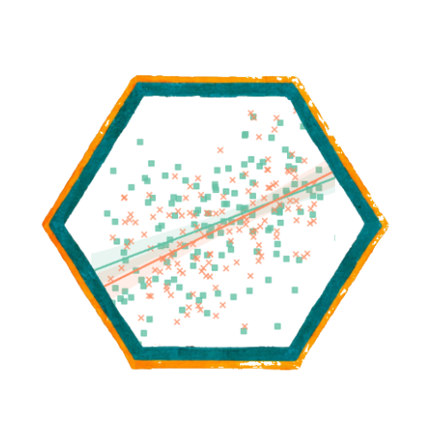

```{r}
#| label: setup
#| include: false
library(ggplot2)
library(knitr)
library(sjPlot)
library(dplyr)
library(sjmisc)
library(ggeffects)

azul <- "#04245f"
azul_claro <- "#4f97ff"
rojo <- "#c0392b"

theme_set(theme_minimal(base_size = 16))

load(url("https://github.com/Kevin-carrasco/metod3-unab/raw/refs/heads/main/files/data/elsoc16-22.RData"))

elsoc <- elsoc_long_2016_2022.2 %>%
  filter(ola == 1) %>%
  select(d01_01, m01, m29, m0_edad, m0_sexo) %>%
  set_na(., na = c(-999, -888, -777, -666)) %>%
  rename("estatus" = d01_01,
         "educacion" = m01,
         "ingreso" = m29,
         "edad" = m0_edad,
         "sexo" = m0_sexo) %>%
  na.omit() %>%
  filter(ingreso >= 50000, ingreso <= 5000000) %>%
  mutate(ing100 = ingreso / 100000,
         mujer = ifelse(sexo == 2, 1, 0),
         sexo_f = factor(mujer, levels = c(0, 1),
                         labels = c("Hombre", "Mujer")),
         educ_cat = case_when(
           educacion <= 3 ~ "Básica",
           educacion <= 5 ~ "Media",
           educacion <= 7 ~ "Técnica",
           TRUE ~ "Universitaria"),
         educ_cat = factor(educ_cat,
                           levels = c("Básica", "Media",
                                      "Técnica", "Universitaria")))

# Modelos
m_sexo <- lm(estatus ~ sexo_f, data = elsoc)
m_educ <- lm(estatus ~ educ_cat, data = elsoc)
m_full <- lm(estatus ~ sexo_f + educ_cat + ing100 + edad, data = elsoc)
m_cont <- lm(estatus ~ educacion + ing100 + edad, data = elsoc)
m_cat  <- lm(estatus ~ educ_cat + ing100 + edad, data = elsoc)

medias_sexo <- elsoc %>%
  group_by(sexo_f) %>%
  summarise(media = mean(estatus), n = n())

medias_educ <- elsoc %>%
  group_by(educ_cat) %>%
  summarise(media = mean(estatus), n = n())

n_elsoc <- nrow(elsoc)
```

##  {data-background-color="black"}

::: {.columns .v-center-container}
::: {.column width="20%"}
{width="100%" fig-align="center"}
:::

::: {.column width="80%"}
### Métodos estadísticos para 
### Ciencias Sociales III

------------------------------------------------------------------------

### **Kevin Carrasco**
### Sociología - UNAB
### 2do Sem 2026
### [https://metod3-unab.netlify.app/](https://metod3-unab.netlify.app/)
:::
:::

# Sesión 7 {data-background-color="black"}

El problema de las variables categóricas

Variables dummy

Predictores con más de dos categorías

Valores predichos

## ¿Dónde quedamos?

::: {.incremental}

- Sabemos estimar, interpretar, evaluar el ajuste y hacer inferencia sobre un modelo de regresión

- Sabemos además **predecir**: obtener el valor esperado de $Y$ para un perfil determinado de características

- Pero todos nuestros predictores han sido **variables continuas**

:::

## Repaso: escalas de medición

En la primera sesión revisamos la clasificación NOIR

::: {.small}

| Tipo | Características | Propiedad de números | Ejemplo |
|------|-----------------|----------------------|---------|
| *Nominal* | Uso de números en lugar de palabras | Identidad | Nacionalidad |
| *Ordinal* | Números se usan para ordenar series | + ranking | Nivel educacional |
| *Intervalar* | Intervalos iguales entre números | + igualdad | Temperatura |
| *Razón* | Cero real | + aditividad | Distancia |

:::

::: {.fragment .fade-up}

Esa distinción, que hasta ahora era una advertencia teórica, hoy se vuelve un problema práctico

:::

## Lo que hemos usado hasta ahora

::: {.incremental}

- Nuestros predictores han sido **edad** (razón), **ingreso** (razón) y **nivel educacional** (ordinal, tratado como continuo)

- En los tres casos, sumar una unidad tiene un significado claro: un año más, cien mil pesos más, un nivel más

- ¿Qué ocurre con una variable **nominal**, donde los números solo identifican grupos?

:::

## Hoy

::: {.incremental}

- ¿Qué hacemos con variables que no son numéricas, como sexo, zona de residencia u ocupación?

- ¿Cómo se incorporan al modelo y cómo se interpretan sus coeficientes?

- ¿Y cuando tienen **más de dos** categorías?

:::

# El problema {data-background-color="black"}

## Muchas variables sociales son categóricas

::: {.incremental}

- Sexo, nacionalidad, religión, zona de residencia, situación laboral, tipo de establecimiento educacional

- Buena parte de las variables con que trabaja la sociología **no se miden en una escala numérica**

- Sus valores identifican grupos, no cantidades

:::

## ¿Qué pasa si las tratamos como continuas?

Supongamos una variable de zona de residencia codificada así:

::: {.small}

| Código | Zona |
|---|---|
| 1 | Norte |
| 2 | Centro |
| 3 | Sur |

:::

::: {.fragment .fade-up}

Un coeficiente de 0,4 diría: "por cada unidad adicional de zona, el estatus aumenta 0,4 puntos"

:::

::: {.fragment .fade-up}

### ¿Qué significa "una unidad adicional de zona"?

:::

##  {data-background-color="black"}

### Nada

### Los números de una variable nominal son **etiquetas**, no cantidades

## El supuesto que estaríamos imponiendo

::: {.incremental}

- Tratar la variable como continua supone que las categorías están **ordenadas** y **equidistantes**

- Que pasar del Norte al Centro equivale exactamente a pasar del Centro al Sur

- Y que el efecto es **constante** a lo largo de toda la escala

- Ninguno de esos supuestos tiene sentido para una variable nominal

:::

# Variables dummy {data-background-color="black"}

## La solución

::: {.incremental}

- Una **variable dummy** (o dicotómica, o binaria) toma solo dos valores: **0 y 1**

- El 1 indica pertenencia a una categoría, y el 0 su ausencia

- No representan cantidades sino **condiciones**: se pertenece o no se pertenece al grupo

:::

## Un ejemplo

Partamos por el caso más simple, una variable con solo dos categorías:

::: {.small}

| Sexo | Codificación original | Variable dummy `mujer` |
|---|---|---|
| Hombre | 1 | 0 |
| Mujer | 2 | 1 |

:::

::: {.fragment .fade-up}

El nombre de la variable indica qué representa el valor 1. Por eso conviene llamarla `mujer` y no `sexo`

:::

## En R

```{r}
#| label: dummy-r
#| echo: true
#| eval: false

elsoc <- elsoc %>%
  mutate(mujer = ifelse(sexo == 2, 1, 0),
         sexo_f = factor(mujer,
                         levels = c(0, 1),
                         labels = c("Hombre", "Mujer")))
```

::: {.incremental}

- Con `factor()` R reconoce la variable como categórica y construye las dummy automáticamente

- La **primera** categoría del factor pasa a ser la de referencia

:::

## La categoría de referencia

::: {.incremental}

- Al codificar en 0 y 1, uno de los dos grupos queda representado por el **cero**

- Ese grupo es la **categoría de referencia**: no tiene coeficiente propio, porque queda absorbido en el intercepto

- Todo lo que el modelo estima se expresa **en comparación con él**

- En nuestro ejemplo, los hombres son la referencia, y el coeficiente de `mujer` responde a la pregunta: ¿cuánto difieren las mujeres respecto de los hombres?

:::

##  {data-background-color="black"}

### La categoría de referencia no desaparece del modelo

### Está en el **intercepto**, y es el punto de comparación de todos los coeficientes

## El modelo

```{r}
#| label: tab-sexo
#| echo: false
#| results: asis

tab_model(m_sexo,
          show.se = TRUE,
          show.ci = FALSE,
          digits = 3,
          p.style = "stars",
          dv.labels = c("Estatus subjetivo"),
          string.pred = "Predictores",
          string.est = "β")
```

## Interpretación

$$\widehat{estatus} = b_{0} + b_{1}(mujer)$$

::: {.incremental}

- Para un **hombre**, la variable vale 0: $\widehat{Y} = b_0$

- Para una **mujer**, vale 1: $\widehat{Y} = b_0 + b_1$

- Por lo tanto, $b_1$ es la **diferencia** entre ambos grupos

:::

##  {data-background-color="black"}

### El coeficiente de una variable dummy es una **diferencia de promedios** entre dos grupos

### El intercepto es el promedio del grupo de **referencia**

## Comprobémoslo

```{r}
#| label: medias-sexo
#| echo: true

elsoc %>%
  group_by(sexo_f) %>%
  summarise(media = mean(estatus), n = n())
```

::: {.fragment .fade-up}

```{r}
#| label: coef-sexo
#| echo: true

coef(m_sexo)
```

El intercepto es el promedio de los hombres, y el coeficiente es exactamente la diferencia respecto de las mujeres

:::

## La lectura sustantiva

::: {.incremental}

- Las mujeres se ubican, en promedio, `r abs(round(coef(m_sexo)[2], 3))` puntos más abajo en la escalera social que los hombres

- El coeficiente **no** alcanza significación estadística al 95%, de modo que la diferencia observada podría deberse al azar muestral

- Note que la interpretación es la misma de siempre: cuánto cambia $Y$ al pasar de 0 a 1, solo que aquí ese cambio significa cambiar de grupo

:::

# Más de dos categorías {data-background-color="black"}

## El problema de las politómicas

::: {.incremental}

- Con dos categorías basta una dummy. ¿Y si son cuatro?

- Una sola variable codificada 1, 2, 3, 4 nos devuelve al problema inicial

- La solución: construir **una dummy por cada categoría, menos una**

:::

## Categorizando la educación

Hasta ahora tratamos el nivel educacional como una variable continua de 1 a 10. Agrupémoslo en cuatro categorías:

```{r}
#| label: recode-educ
#| echo: true
#| eval: false

elsoc <- elsoc %>%
  mutate(educ_cat = case_when(
    educacion <= 3 ~ "Básica",
    educacion <= 5 ~ "Media",
    educacion <= 7 ~ "Técnica",
    TRUE ~ "Universitaria"),
    educ_cat = factor(educ_cat,
                      levels = c("Básica", "Media",
                                 "Técnica", "Universitaria")))
```

```{r}
#| label: frq-educ
#| echo: false

kable(elsoc %>% count(educ_cat) %>%
        mutate(porcentaje = round(n / sum(n) * 100, 1)),
      col.names = c("Nivel educacional", "N", "%"))
```

## La codificación

Cuatro categorías se representan con **tres** dummy:

::: {.small}

| Categoría | `Media` | `Técnica` | `Universitaria` |
|---|---|---|---|
| Básica | 0 | 0 | 0 |
| Media | 1 | 0 | 0 |
| Técnica | 0 | 1 | 0 |
| Universitaria | 0 | 0 | 1 |

:::

::: {.fragment .fade-up}

La categoría **Básica** queda identificada por tener cero en todas las demás: es la **categoría de referencia**

:::

## ¿Por qué una menos?

::: {.incremental}

- Con cuatro dummy, la cuarta sería completamente redundante: conociendo las tres primeras ya sabemos a qué grupo pertenece cada caso

- El modelo no podría estimarse, porque una variable sería combinación exacta de las otras

- La regla general: con $k$ categorías se incluyen $k-1$ variables dummy

:::

## El modelo

```{r}
#| label: tab-educ
#| echo: false
#| results: asis

tab_model(m_educ,
          show.se = TRUE,
          show.ci = FALSE,
          digits = 3,
          p.style = "stars",
          dv.labels = c("Estatus subjetivo"),
          string.pred = "Predictores",
          string.est = "β")
```

## Interpretación

::: {.incremental}

- **Cada coeficiente** es la diferencia respecto de la categoría de referencia, no respecto de la categoría anterior

- Quienes tienen educación media se ubican `r round(coef(m_educ)[2], 2)` puntos más arriba que quienes tienen educación básica

- Quienes tienen educación universitaria, `r round(coef(m_educ)[4], 2)` puntos más arriba **que el grupo de educación básica**

- El intercepto, `r round(coef(m_educ)[1], 2)`, es el promedio del grupo de referencia

:::

## Comprobación

```{r}
#| label: medias-educ
#| echo: true

elsoc %>%
  group_by(educ_cat) %>%
  summarise(media = mean(estatus))
```

::: {.fragment .fade-up}

Cada promedio equivale al intercepto más el coeficiente correspondiente. Por ejemplo, para educación media: `r round(coef(m_educ)[1], 3)` + `r round(coef(m_educ)[2], 3)` = `r round(coef(m_educ)[1] + coef(m_educ)[2], 3)`

:::

## Comparaciones entre categorías

::: {.incremental}

- La tabla nos dice cuánto difiere cada grupo respecto de **Básica**

- ¿Y si queremos comparar Técnica con Universitaria?

- La diferencia se obtiene restando ambos coeficientes: `r round(coef(m_educ)[4], 3)` − `r round(coef(m_educ)[3], 3)` = `r round(coef(m_educ)[4] - coef(m_educ)[3], 3)`

- Pero la tabla **no entrega** la significación de esa comparación, porque no está estimada en el modelo

:::

## Cambiar la categoría de referencia

```{r}
#| label: relevel
#| echo: true
#| eval: false

# Para que Universitaria sea la referencia
elsoc$educ_cat2 <- relevel(elsoc$educ_cat, ref = "Universitaria")

lm(estatus ~ educ_cat2, data = elsoc)
```

::: {.incremental}

- La elección de la referencia **no cambia** el modelo: ni el $R^2$, ni los valores predichos, ni las diferencias entre grupos

- Solo cambia respecto de qué grupo se expresan los coeficientes

- Se elige según la pregunta de investigación, o bien la categoría más numerosa o la teóricamente más relevante

:::

# El modelo completo {data-background-color="black"}

## Con controles

```{r}
#| label: tab-full
#| echo: false
#| results: asis

tab_model(m_full,
          show.se = TRUE,
          show.ci = FALSE,
          digits = 3,
          p.style = "stars",
          dv.labels = c("Estatus subjetivo"),
          string.pred = "Predictores",
          string.est = "β")
```

## Interpretación conjunta

::: {.incremental}

- Los coeficientes de educación mantienen su lectura: diferencia respecto del grupo de educación básica, **manteniendo constantes** sexo, ingreso y edad

- El coeficiente de sexo se reduce prácticamente a cero y sigue sin ser significativo: la diferencia bruta entre hombres y mujeres se explica por las otras variables

- Los predictores continuos se interpretan como siempre

- El intercepto corresponde ahora a un hombre, con educación básica, sin ingreso y de cero años: no tiene interpretación sustantiva

:::

# ¿Por qué categorizar? {data-background-color="black"}

## Continua o categórica

```{r}
#| label: tab-comp
#| echo: false
#| results: asis

tab_model(list(m_cont, m_cat),
          show.se = FALSE,
          show.ci = FALSE,
          digits = 3,
          p.style = "stars",
          dv.labels = c("Educación continua", "Educación categórica"),
          string.pred = "Predictores",
          string.est = "β")
```

## Lo que revela la versión categórica

::: {.incremental}

- Con la versión continua, el modelo impone que cada nivel educacional adicional aporta **lo mismo**

- Con la versión categórica podemos ver los incrementos reales entre grupos consecutivos:

    - De Básica a Media: `r round(coef(m_cat)[2], 3)`
    - De Media a Técnica: `r round(coef(m_cat)[3] - coef(m_cat)[2], 3)`
    - De Técnica a Universitaria: `r round(coef(m_cat)[4] - coef(m_cat)[3], 3)`

- Los incrementos **disminuyen**: el salto más grande ocurre al comienzo de la trayectoria educativa

:::

##  {data-background-color="black"}

### Ese hallazgo es invisible en el modelo continuo

### Categorizar permite que los datos muestren una relación **no lineal**

## Qué se gana y qué se pierde

::: {.columns}
::: {.column width="45%"}

**Se gana**

- No se impone linealidad
- Permite detectar umbrales
- Interpretación intuitiva por grupos

:::
::: {.column width="10%"}
:::
::: {.column width="45%"}

**Se pierde**

- Información dentro de cada categoría
- Grados de libertad (más coeficientes)
- Parsimonia del modelo

:::
:::

::: {.small}
En este caso el $R^2$ es prácticamente idéntico en ambas versiones, de modo que el costo es bajo
:::

# Valores predichos {data-background-color="black"}

## Con predictores categóricos

La lógica es la misma de la sesión anterior, pero ahora el resultado son **valores por grupo** y no una línea continua

```{r}
#| label: ggpredict-educ
#| echo: true
#| eval: false

library(ggeffects)

ggpredict(m_full, terms = "educ_cat")
```

```{r}
#| label: tab-pred-educ
#| echo: false

pred_educ <- ggpredict(m_full, terms = "educ_cat")

kable(as.data.frame(pred_educ)[, c("x", "predicted", "conf.low", "conf.high")],
      digits = 3,
      col.names = c("Nivel educacional", "Predicho", "IC inferior", "IC superior"))
```

## El gráfico

```{r}
#| label: fig-pred-educ
#| echo: false
#| fig-width: 9
#| fig-height: 4.2

ggplot(as.data.frame(pred_educ), aes(x = x, y = predicted)) +
  geom_col(fill = azul_claro, alpha = 0.85, width = 0.6) +
  geom_errorbar(aes(ymin = conf.low, ymax = conf.high), width = 0.12) +
  scale_y_continuous(limits = c(0, 10), breaks = 0:10) +
  labs(x = NULL, y = "Estatus subjetivo predicho")
```

::: {.small}
Las barras de error corresponden al intervalo de confianza al 95%. El eje recorre la escala completa de la variable
:::

## Cómo leerlo

::: {.incremental}

- Cada barra es el estatus esperado de ese grupo educacional, con las demás variables fijadas en su promedio

- Si los intervalos de confianza de dos grupos **no se superponen**, la diferencia entre ellos es claramente significativa

- La distancia entre el grupo más bajo y el más alto es de aproximadamente un peldaño, en una escala de 0 a 10

:::

# Volvamos al ejemplo publicado {data-background-color="black"}

## El artículo de la sesión pasada

### [Revista de Sociología, Universidad de Chile](https://revistadesociologia.uchile.cl/index.php/RDS/article/view/47884/50543)

::: {.small}
Sección de resultados, desde la página 43. Variable dependiente: participación en protestas
:::

::: {.fragment .fade-up}

La semana pasada quedó un cabo suelto: uno de los predictores era una variable **dicotómica**, y dijimos que su interpretación la veríamos más adelante

:::

## El predictor pendiente

*Identificación política de izquierda (referencia: distinto de izquierda)*

::: {.incremental}

- Es una **variable dummy**: vale 1 para quienes se identifican con la izquierda y 0 para el resto

- Su coeficiente es positivo y significativo: quienes se identifican con la izquierda participan más en protestas que el resto

- El paréntesis del nombre indica explícitamente cuál es la **categoría de referencia**, que es una buena práctica de reporte

:::

## Qué observar ahora

::: {.incremental}

- ¿Cómo está construida la categoría de referencia? ¿Es un grupo homogéneo o agrupa posiciones muy distintas?

- El coeficiente está **estandarizado**: ¿tiene sentido interpretar una desviación estándar de una variable que solo toma los valores 0 y 1?

- ¿Qué habría cambiado si el artículo hubiese usado la escala completa de posición política en lugar de una dicotómica?

:::

##  {data-background-color="black"}

### Una advertencia sobre dicotomizar

::: {.fragment .fade-up}

### Convertir una variable con muchas categorías en una dummy simplifica la interpretación

:::

::: {.fragment .fade-up}

### Pero agrupa en la referencia a personas que pueden ser muy distintas entre sí

:::

##  {data-background-color="black"}

### Hasta ahora deberíamos saber

::: {.incremental}

1. Los números de una variable categórica son **etiquetas**, y tratarlos como cantidades impone supuestos falsos

2. Una **dummy** toma valores 0 y 1, y su coeficiente es una **diferencia de promedios** entre grupos

3. Con $k$ categorías se incluyen $k-1$ dummy; la categoría omitida es la de **referencia**, y el intercepto corresponde a ella

4. Cada coeficiente compara con la referencia, **no** con la categoría anterior

:::

## Para la próxima sesión

- **Lectura**: el artículo revisado hoy en la [Revista de Sociología](https://revistadesociologia.uchile.cl/index.php/RDS/article/view/47884/50543), sobre todo sección de resultados.

- Wooldridge, *Introducción a la econometría*: secciones 3.2 y 6.3

- En el práctico aplicaremos esto a un nuevo ejemplo, con la construcción de una escala de participación

##  {data-background-color="black"}

::: {.columns .v-center-container}
::: {.column width="20%"}
{width="80%" fig-align="right"}
:::

::: {.column width="80%"}
### Métodos estadísticos para Ciencias Sociales III

------------------------------------------------------------------------

### **Kevin Carrasco**
### Sociología - UNAB
### 2do Sem 2026
### [https://metod3-unab.netlify.app/](https://metod3-unab.netlify.app/)
:::
:::
